# 自定义渲染管线

## 1 新的渲染管线

+ 当进行渲染的时候， `Unity` 需要决定把它画成什么样子，以及画在哪里，什么时候画，用什么样的设定去画等等。它的复杂度取决于涉及到多少效果。灯光，阴影，透明度，图像效应（后处理），体积效应等等。所有的效果都需要按照正确的顺序叠加到最后的图像上，这就是我们说的渲染管线所做的事情。

+ 过去 `Unity` 只支持一些内置的方式来渲染物体。`Unity 2018` 引入了 `scriptable render pipeline` ，使我们可以做任何我们想做的事情，同时仍然能够依赖 `Unity` 进行基本操作，例如剔除。`Unity 2018` 还添加了两个使用这种新方法制作的实验性 `RP`，`LWRP` 和 `HDRP` 。在 `Unity 2019` 中，`LWRP` 不再是实验性的，并在 `Unity 2019.3` 中更名为 `URP`。

+ `URP` 注定要取代当前的传统 `RP` 。这个想法是，他是一个合适的 `RP`，也很容易定制。

> 1.1 项目设置

+ 使用 `2019.2.6` 或更高版本创建新的 3D 项目。项目打开后，可以转到包管理器并删除所有不需要的包。本教程中，将仅使用 `Unity UI` 包来尝试绘制 `UI`，因此需要保留他。

+ 我们只在线性 [色彩空间](ColorSpace.md) 中工作，但 `Unity 2019.2` 仍使用伽马空间作为默认值。通过 `Edit/Project Setting` 进入 `Player` 设置。然后将 `Other Setting` 下的 `Color Space` 切换为线性。

    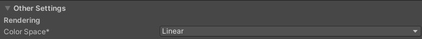

+ 使用 `Unity` 自带的标准着色器，着色一些对象然后填充默认场景。因为 `Unlit/Transparent` 着色器仅适用于纹理，因此这里看到的是一个球体的 `UV` 贴图。

    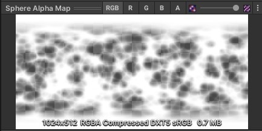

+ 在测试场景中放置了几个立方体，他们都是不透明的。红色的使用 `Standard` 着色器材质，而绿色和黄色使用 `Unlit/Color` 着色器材质。蓝色球体使用 `Rendering Mode` 为 `Transparent` 的 `Standard` 着色器，而白色球体使用 `Unlit/Transparent` 着色器。

    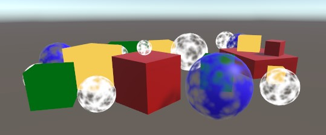

> 1.2 管线资产

+ 目前，`Unity` 使用默认渲染管线。如果要使用自定义渲染管线替代它，首先必须为其创建一个资产类型。我们将使用与 `Unity URP` 大致相同的文件夹结构。使用 `Runtime` 作为子文件夹创建自定义 `RP` 的资产文件夹。创建一个类型为 [CustomRenderPipelineAsset](CustomRenderPipelineAsset.md) 的 `C#` 脚本。

    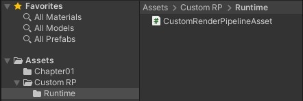

+ 资产类型必须继承自 `UnityEngine.Rendering` 命名空间下的 [RenderPipelineAsset](RenderPipelineAsset.md) 。

    ```C#
    using UnityEngine;
    using UnityEngine.Rendering;

    public class CustomRenderPipelineAsset : RenderPipelineAsset {}
    ```

+ `RP` 资产的主要目的就是为 `Unity` 提供一种方法来获取负责渲染的管线对象实例。资产本身只是一个 `handle` 和存储设置的地方。我们还没有任何设置，所以我们要做的就是给 `Unity` 提供一种方法来获取我们的管线对象实例。这是通过重写抽象的 `CreatePipeline` 方法来完成的，该方法应该返回一个 `RenderPipeline` 实例。但是现在还没有定义自定义的 `RP` 类型，所以从返回 `null` 开始。

    ```C#
    protected override RenderPipeline CreatePipeline() {
        return null;
    }
    ```

+ 现在我们需要将这种类型的资产添加到我们的项目中。为此，请将 `CreateAssetMenu` 属性添加到 [CustomRenderPipelineAsset](CustomRenderPipelineAsset.md) 类上。

    ```C#
    [CreateAssetMenu]
    public class CustomRenderPipelineAsset : RenderPipelineAsset {}
    ```

+ 这会在 `Asset/Create` 菜单中添加一个菜单条目。如果要保持菜单整洁，并将其放在呈现的子菜单中的话，可以将属性的 `menuName` 属性设置为 `Rendering/Custom Render Pipeline` 。在属性类型之后，圆括号内直接设置此属性。

    ```C#
    [CreateAssetMenu(menuName = "Rendering/Custom Render Pipeline")]
    public class CustomRenderPipelineAsset : RenderPipelineAsset {}
    ```

+ 使用刚刚添加的菜单将资源添加到项目中，然后转到 `Graphic` 项目设置并在 `Scriptable Render Pipeline Setting` 下选择它。

    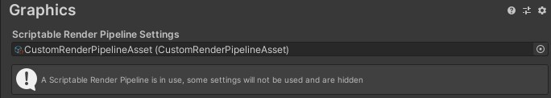

+ 替换默认 `RP` 改变了一些事情。首先，许多选项从图形设置中消失了，这在信息面板中有所提及。其次，我们没有提供有效替换的情况下禁用了默认 `RP`，并且还没有提供有效的替换，因此不再渲染任何内容。游戏窗口、场景窗口和材质预览不再起作用。如果通过 `Window/Analysis/Frame Debugger` 打开 `Frame Debugger` 并启用他，将看到游戏窗口中确实没有绘制任何内容。

> 1.3 渲染管线实例

+ 创建一个 `CustomRenderPipeline` 类并将其脚本文件放在与 [CustomRenderPipelineAsset](CustomRenderPipelineAsset.md) 相同的文件夹中，这将用于我们资产返回的 `RP` 实例类型，因此他必须继承 [RenderPipeline](RenderPipeline.md) 。

    ```C#
    using UnityEngine;
    using UnityEngine,Rendering;

    public class CustomRenderPipeline : RenderPipeline {}
    ```

+ `RenderPipeline` 定义了一个 `protected abstract Render` 方法，我们必须重写它才能创建一个具体的管线，他有两个参数，一个 [ScriptableRenderContext](ScriptableRenderContext.md) 和一个 `Camera` 数组。

    ```C#
    protected override void Render(ScriptableRenderContext context, Camera[] cameras) {}
    ```

+ 使 `CustomRenderPipeline.CreatePipeline` 返回一个新的 `CustomRenderPipeline` 实例。这将为我们提供一个有效且功能强大的管线，尽管他还没有渲染任何东西。

    ```C#
    protected override RenderPipeline CreatePipeline() {
        return new CustomRenderPipeline();
    }
    ```

## 2 渲染

+ 每一帧 `Unity` 都会在 `RP` 实例上调用 `Render` 。他传递一个上下文结构，该结构提供与本地引擎的连接，我们可以将其用于渲染。它也需要传递一组摄像机，因为场景中可以有多个活动的摄像机。`RP` 有责任按照提供的顺序渲染所有这些摄像机。

> 2.1 相机渲染

+ 每个摄像机都独立渲染。因此，与其让 `CustomRenderPipeline` 渲染所有相机，我们将把这个责任交给一个专门渲染单个摄像机的新类，把他命名为 `CameraRenderer`，并给他一个公共的 `Render` 方法，有一个上下文参数和一个相机参数，为了方便起见，我们把这些参数存储在字段中。

    ```C#
    using UnityEngine;
    using UnityEngine.Rendering;

    public class CameraRenderer {

        ScriptableRenderContext context;
        
        Camera camera;

        public void Render(ScriptableRenderContext context, Camera camera) {
            this.context = context;
            this.camera = camera;
        }
    }
    ```

+ 让 `CustomRenderPipeline` 在创建渲染器时创建一个实例，然后使用它在一个循环渲染所有摄像机。

    ```c#
    CameraRenderer renderer = new CameraRenderer();

    protected override void Render(ScriptableRenderContext context, Camera[] cameras) {
        foreach (Camera camera in cameras) {
            renderer,Render(context, camera);
        }
    }
    ```

+ `CameraRenderer` 大致相当于 `URP` 的 [ScriptableRenderers](ScriptableRenderers.md) 。这种方法使将来支持每个相机的不同渲染变得简单。例如一个渲染第一人称视图，一个渲染三维地图，或前向和延迟渲染的区别。但现在会用同样的方式渲染所有的摄像机。

> 2.2 渲染天空盒

+ `CameraRenderer.Render` 的工作是绘制其相机可以看到的所有几何图形。为了方便起见，在单独的 `DrawVisibleGeometry` 方法中隔离该特定任务。我们将首先让他绘制默认的天空盒，这可以通过在上下文上调用 `DrawSkybox` 并将相机作为参数来完成。

    ```C#
    public void Render(ScriptableRenderContext context, Camera camera) {
        this.context = context;
        this.camera = camera;

        DrawVisibleGeometry();
    }

    void DrawVisibleGeometry() {
        context.DrawSkybox(camera);
    }
    ```

+ 这还没有使天空出现，那是因为我们向上下文发出的命令是缓冲的。我们必须通过在上下文上调用 `Submit` 来提交排队的工作以供执行。让我们在一个单独的 `Submit` 方法中执行此操作，在 `DrawVisibleGeometry` 之后调用。

    ```C#
    public void Render(ScriptableRenderContext context, Camera camera) {
        this.context = context;
        this.camera = camera;

        DrawVisibleGeometry();
        Submit();
    }

    void Submit() {
        context.Submit();
    }
    ```

+ 天空盒终于出现在游戏和场景窗口中了。当你启用它时，你还可以在 `Frame Debugger` 中查看到他的条目。他被列为 `Camera.RenderSkybox`，他下面有一个 `Draw Mesh` 项，他代表实际的绘制调用，这对应于游戏窗口的渲染，`Frame Debugger` 不报告其他窗口中的绘制。

    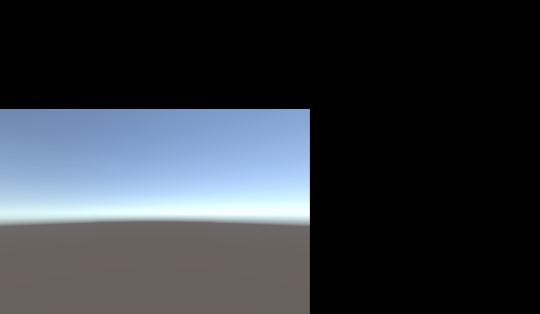

    此时的游戏窗口似乎不太对劲，他只显示的一部分。

    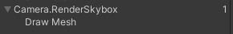

+ 请注意，当前相机不会影响天空盒的渲染方式。我们将相机传递给 `DrawSkybox`，但这仅用于确定是否应该绘制天空盒，这是通过相机的 `clear` 标记控制的。

+ 为了正确渲染天空盒以及整个场景，我们必须设置视图投影矩阵。这个变换矩阵结合了摄像机的位置和方向（视图矩阵）与摄像机的透视或正交投影（投影矩阵）。在着色器中被称为 `unity_MatrixVP`，是绘制几何图形时使用的着色器属性之一。选择一个 `Draw Call` 后，可以在 `Frame Debugger` 的 `ShaderProperties` 部分检查这个矩阵。

+ 目前，`unity_MatrixVP` 矩阵始终相同。我们必须通过 `SetupCameraProperties` 方法将相机的属性应用于上下文中。这设置了矩阵以及其他一些属性。在调用 `DrawVisibleGeometry` 之前，创建一个单独的 `Setup` 方法中执行此操作。

    ```C#
    public void Render(ScriptableRenderContext context, Camera camera) {
        this.context = context;
        this.camera = camera;

        Setup();
        DrawVisibleGeometry();

        Submit();
    }

    void Setup() {
        context.SetupCameraProperties(camera);
    }
    ```

    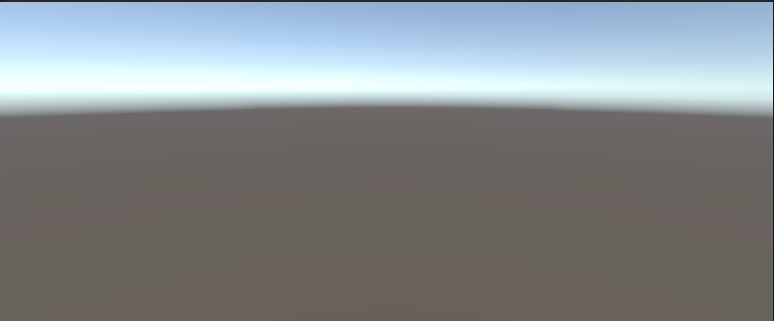

> 2.3 Command Budders

+ 上下文会推迟实际的渲染，直到我们提交他。在此之前，我们对其进行配置，并向他添加命令，以便后续执行。一些任务（比如绘制天空盒）可以通过一个专门的方法来执行，但是其他的命令不许通过一个单独的命令缓冲区间接发布。我们需要这样一个缓冲区来绘制场景中的其他几何体。

+ 为了得到一个缓冲区，我们必须创建一个新的 [CommandBuffer](CommandBuffer.md) 对象实例。我们只需要一个缓冲区，所以默认为 [CommandBuffer](CommandBuffer.md) 创建一个，并在一个字段中存储他的引用。这样我们就可以在 `Frame Debugger` 中识别它，就叫 `Render Camera` 好了。

    ```C#
    const string bufferName = "Render Camera";

    CommandBuffer buffer = new CommandBuffer {
        name = bufferName
    };
    ```

+ 我们可以使用 `Command buffer` 给 `Profiler` 注入样本，这些样本将同时显示在 `Profiler` 和 `Frame Debugger` 中。这是通过在适当的地方调用 `BeginSample` 和 `EndSample` 来实现的，在我们的例子中，这是在 `Setup` 和 `Submit` 的开头。这两个方法必须提供相同的样本名称，为此我们将使用缓冲区的名称。

    ```C#
    void Setup() {
        buffer.BeginSample(bufferName);
        context.SetupCameraProperties(camera);
    }

    void Submit() {
        buffer.EndSample(bufferName);
        context.Submit(); 
    }
    ```

+ 要执行缓冲区，需要调用 `ExecuteCommandBuffer`，并把缓冲区作为参数，这是从缓冲区中复制命令，但并不清除它，如果我们想重新使用它，我们必须在事后明确地这样做。因为执行和清除总是在一起执行的，所以添加一个方法来做这件事。

    ```C#
    void Setup() {
        buffer.BeginSample(bufferName);
        ExecuteBuffer();
        context.SetupCameraProperties(camera);
    }

    void Submit() {
        buffer.EndSample(bufferName);
        ExecuteBuffer();
        context.Submit();
    }

    void ExecuteBuffer() {
        context.ExecuteCommandBuffer(buffer);
        buffer.Clear();
    }
    ```

    现在 `Camera.RenderSkybox` 样本被嵌套在 `Render Camera` 里面。

    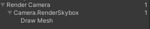

> 2.4 清除渲染目标

+ 我们所画的东西最终被渲染到摄像机的渲染目标上，默认情况下是帧缓冲区，但也可能是渲染纹理。之前绘制到该目标上的东西仍然存在，这可能会干扰我们现在正在渲染的图像。为了保证正常的渲染，我们必须清除渲染目标，以剔除旧的内容。这可以通过在命令缓冲区上调用 `ClearRenderTarget` 来实现，他属于 `Setup` 方法。

+ `CommandBuffer.ClearRenderTarget` 至少需要三个参数。前两个表明深度和颜色数据是否被清除，这对两者来说都是 `true`。第三个参数是用于清除的颜色，对此我们将使用 `Color.clear`。
  
    ```C#
    void Setup() {
        buffer.BeginSample(bufferName);
        buffer.ClearRenderTarget(true, true, Color.clear);
        ExecuteBuffer();
        context.SetupCameraProperties(camera);
    }
    ```

    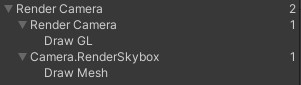

+ `Frame Debugger` 现在显示了清除动作的 `Draw GL` 条目，它显示嵌套在 `Render Camera` 的一个额外层次中。这是因为 `ClearRenderTarget` 用命令缓冲的名字将清除动作包裹在一个样本中。我们在开始自己的样本之前进行清除操作来剔除多余的嵌套。这导致了两个相邻的 `Render Camera` 样本范围，他们被合并了。

    ```C#
    void Setup() {
        buffer.ClearRenderTarget(true, true, Color.clear);
        buffer.BeginSamp(bufferName);
        ExecuteBuffer();
        context.SetupCameraProperties(camera);
    }
    ```

    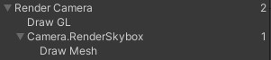

+ `Draw GL` 条目表示用 `Hidden/InternalClear` 着色器绘制全屏四边形，该着色器会写入渲染目标，这不是最有效的清除方式。使用这种方法是因为我们是在设置摄像机属性之前进行了清除。如果我们把这两个步骤顺序对调一下，就可以得到快速的清除方式。

    ```C#
    void Setup() {
        context.SetupCameraProperties(camera);
        buffer.ClearRenderTarget(true, true, Color.clear);
        buffer.BeginSample(bufferName);
        ExecuteBuffer();
        //context.SetupCameraProperties(camera);
    }
    ```

    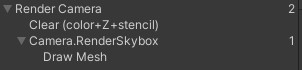

    现在我们看到了 `Clear(color+Z+stencil)` 这表明颜色和深度缓冲区都被清除了。`Z` 表示深度缓冲区，模板数据是同一个缓冲区的一部分。

> 2.5 剔除

+ 我们目前看到的是天空盒，但没有看到我们放置在场景中的任何对象，我们不会绘制每个对象，而是只渲染那些对相机可见的对象。我们首先从场景中具有渲染组件所有对象开始，然后剔除那些落在相机视锥体之外的对象。

+ 要弄清楚哪些东西可以被剔除，需要我们跟踪多个摄像机设置和矩阵，为此我们可以使用 [ScriptableCullingParameters](ScriptableCullingParameters.md) 结构。我们可以在摄像机上调用 `TryGetCullingParameters` 而不是自己填充它。它返回是否被成功检索该参数，因为它可能获取失败。要获取参数数据，我们必须提供一个 out 参数。在一个返回成功或者失败的 `Cull` 方法中执行此操作。

    ```C#
    bool Cull() {
        if (camera.TryGetCullingParameters(out ScriptableCullingParameters p)) {
            return true;
        }
        return false;
    }
    ```

    在 `Render` 中的 `Setup` 之前调用 `Cull`，如果失败则终止。

    ```C#
    public void Render(ScriptableRenderContext context, Camera camera) {
        this.context = context;
        this.camera = camera;

        if (!Cull()) {
            return;
        }

        Setup();
        DrawVisibleGeometry();
        Submit();
    }
    ```

+ 实际的剔除是通过在上下文中调用 `Cull` 来完成的，这会产生一个 [CullingResults](CullingResults.md) 结构。如果成功，请在 `Cull` 中执行此操作并将结果存储在字段中。这种情况下，我们必须将剔除参数作为引用传入。

    ```C#
    CullingResults cullingResults;

    ...

    bool Cull() {
        if (camera.TryGetCullingParameters(out ScriptableCullingParameters p)) {
            cullingResults = context.Cull(ref p);
            return true;
        }
        return false;
    }
    ```

> 2.6 渲染多边形

+ 一旦我们知道什么是可见的，我们就可以继续渲染这些东西。这是通过在上下文上调用 `DrawRenderers` 并以剔除结果作为参数来完成的，告诉他要使用那些渲染器。除此之外，我们还必须提供绘制设置和过滤设置。两者都是结构体 [DrawingSetting](DrawingSetting.md) 和 [FilteringSetting](FilteringSetting.md)，我们最初会使用他们的默认构造函数。两者都必须通过引用来传递。在绘制天空盒之前，在 `DrawVisibleGeometry` 中执行此操作。

    ```C#
    void DrawVisibleGeometry() {
        var drawingSettings = new DrawingSettings();
        var filteringSettings = new FilteringSettings();

        context.DrawRenders(cullingResults, ref drawingSettings, ref filteringSettings);

        context.DrawSkybox(camera);
    }
    ```

+ 我们还没有看到任何东西，因为我们还必须指出允许使用哪种着色器 `Pass` 。由于我们在本教程中仅支持 `unlit` 着色器，因此我们必须为 [SRPDefaultUnlit](SRPDefaultUnlit.md) 通道获取着色器标签 `ID` ，我们可以做一次并将其缓冲在一个静态字段中。

    ```C#
    static ShaderTagId unlitShaderTagId = new ShaderTagId("SRPDefaultUnlit");
    ```

+ 将其作为 [DrawingSettings](DrawingSettings.md) 构造函数的第一个参数，同时提供一个新的 [SortingSettings](SortingSettings.md) 结构值。将相机传递给 [SortingSettings](SortingSettings.md) 的构造函数，因为他被用来确定是否使用正交还是透视的排序。

    ```C#
    void DrawVisibleGeometry() {
        var sortingSettings = new SortingSettings(camera);
        var drawingSettings = new DrawingSettings(unlitShaderTagId, sortingSettings);

        ...

    }
    ```

    除此之外，我们还必须指出允许哪些渲染队列。将 [RenderQueueRange](RenderQueueRange.md).all 传递给 [FilteringSettings](FilteringSettings.md) 构造函数，以便我们包含所有内容。

    ```C#
    var filteringSetting = new FilteringSettings(RenderQueueRange.all);
    ```

    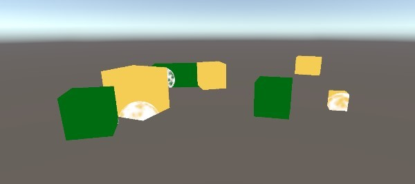

    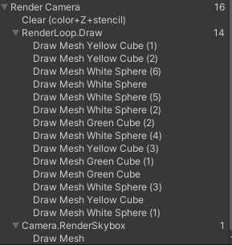

+ 只有使用 `unlit shader` 的可见对象才会被绘制。所有绘制调用都列在 `Frame Debugger` 中，分组在 `RenderLoop.Draw` 下。透明对象发生了一些奇怪的事情，但让我们先看看对象的绘制顺序。这是由 `Frame Debugger` 显示的，你可以通过逐个选择或者使用方向键来浏览绘制调用。

+ 绘制顺序很随意。我们可以通过设置排序设置的条件属性来强制执行特定的绘制顺序。让我们使用 [SortingCriteria](SortingCriteria.md).CommonOpaque 。

    ```C#
    var sortingSettings = new SortingSettings(camera) {
        criteria = SortingCriteria.CommonOpaque
    };
    ```

    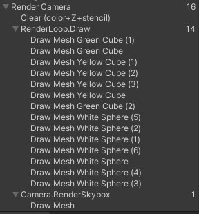

+ 物体现在或多或少地从前往后绘制，这对不透明物体来说是很理想的。如果某个物体最终被绘制在其他东西后面，则可以跳过其隐藏的片段，从而加快渲染速度。常见的不透明排序选项还考虑了一些其他标准，包括渲染队列和材质。

> 2.7 分别绘制不透明和透明几何图形

+ `Frame Debugger` 向我们展示了透明物体的绘制，但是天空盒被绘制在所有没有出现在不透明物体前面的东西上。天空盒被绘制在不透明的几何体之后，因此可以跳过所有的隐藏片段，但他却覆盖了透明的几何体。发生这种情况是因为透明着色器不向深度缓冲区写入。他们不会隐藏后面的任何东西，因为我们可以看穿他们。解决方案是首先绘制不透明物体，然后是天空盒，最后才是透明物体。

+ 我们可以通过切换到 [RenderQueueRange](RenderQueueRange.md).opaque 来消除初始 `DrawRenderers` 调用中的透明对象。

    ```C#
    var filteringSettings = new FilteringSettings(RenderQueueRange.opaque);
    ```

+ 然后在绘制天空盒后再次调用 `DrawRenderers` 。但在这之前，将渲染队列范围改为 [RenderQueueRange](RenderQueueRange.md).transparent 。同时将排序标准修改为 [SortingCriteria](SortingCriteria.md).CommonTransparent ，并再次设置 [DrawingSettings](DrawingSettings.md) 的排序。这就颠倒了透明对象的绘制顺序。

    ```C#
    
    ...

    context.DrawSkybox(camera);

    sortingSettings.criteria = SortingCriteria.CommonTransparent;
    drawingSettings.sortingSettings = sortingSettings;
    filteringSettings.renderQueueRange = RenderQueueRange.transparent;

    context.DrawRenderers(cullingResults, ref drawingSettings, ref filteringSettings);
    ```

    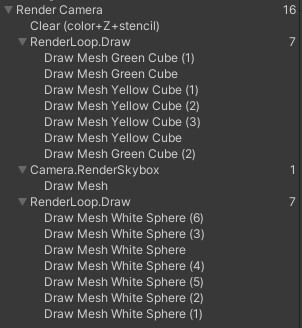

## 3 编辑器渲染

+ 自定义的 `RP` 正确地绘制了 `Unlit` 对象，但我们还可以做一些事情来改进再 `Unity` 编辑器的使用。

> 3.1 使用旧的 `Shaders`

+ 因为我们的管线只支持无光照的着色器通道，所以使用不同 `Pass` 的物体不会被渲染，从而使他们不可见。虽然这是正确的，但隐藏了场景中某些对象使用错误着色器的事实。所以让我们还是对他们进行渲染，但要分开进行。

+ 如果有人从一个默认的 `Unity` 项目开始，然后切换到我们的 `RP` ，那么他们的场景中可能会出现带有错误着色器的对象。为了覆盖所有 `Unity` 的默认着色器，我们必须为 `Always`、`ForwardBase`、`PrepassBase`、`Vertex`、`VertexLMRGBM`、`VertexLM` 通道使用着色器标签 `ID`。在一个静态数组中保存他们。

    ```C#
    static ShaderTagId[] legacyShaderTagIds = {
        new ShaderTagId("Always"),
        new ShaderTagId("ForwardBase"),
        new ShaderTagId("PrePassBase"),
        new ShaderTagId("Vertex"),
        new ShaderTagId("VertexLMRGBM"),
        new ShaderTagId("VertexLM"),
    }
    ```

+ 在可见几何体之后以单独的方法绘制所有不受支持的着色器，从第一个通道开始。由于这些是无效的传递，结果无论如何都是错误的，所以我们并不关心其他的设置。我们可以通过 [FilteringSetting](FilteringSetting.md).defaultValue 属性获取默认值过滤设置。

    ```C#
    public void Render(ScriptableRenderContext context, Camera camera) {

        ...

        Setup();
        DrawVisibleGeometry();
        DrawUnsupportedShaders();
        Submit();
    }

    void DrawUnsupportedShaders() {
        var drawingSettings = new DrawingSettings {
            legacyShaderTagIds[0], new SortingSettings(camera)
        }
        var filterSettings = FilteringSetting.defaultValue;
        context.DrawRenderers(cullingResults, ref drawingSetting, ref filteringSettings);
    }
    ```

+ 我们可以通过在 [DrawingSettings](DrawingSettings.md) 上调用 `SetShaderPassName` 来绘制多个通道，并将会之顺序索引和标记作为参数。对数组中的所有通道执行此操作，从第二个开始，因为我们在构建 [DrawingSettings](DrawingSettings.md) 时已经设置了第一个同道。

    ```C#
    var drawingSettings = new DrawingSettings {
        legacyShaderTagIds[0], new SortingSettings(camera)
    };
    for (int i = 1; i < legacyShaderTagIds.Length; i++) {
        drawingSettings.SetShaderPassName(i, legacyShaderTagIds[i]);
    }
    ```

    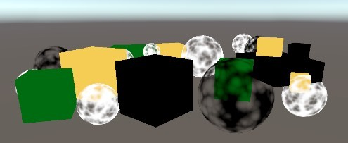

+ 使用标准着色器渲染的对象出现了，但他们现在还是纯黑色的，因为我们的 `RP` 还没有为他们设置所需的着色器属性。

> 3.2 错误的材质

+ 为了清楚地表明哪些对象使用了不受支持的着色器，我们将使用 `Unity` 的错误着色器来绘制他们。使用该着色器作为参数构造一个新材质，我们通过调用 `Shader.Find` 并将 `Hidden/InternalErrorShader` 字符串作为参数。通过静态字段缓存他，因为我们不会每帧创建一个新的。然后将其分配给 [DrawingSettings](DrawingSettings.md) 的 `overrideMaterial` 属性。

    ```C#
    static Material errorMaterial;

    ...

    void DrawUnsupportedShaders() {
        if (errorMaterial == null) {
            errorMaterial = new Material(Shader.Find("Hidden/InternalErrorShader"));
        }
        var drawingSettings = new DrawingSettings(legacyShaderTagIds[0], new SortingSettings(camera)) {
            overrideMaterial = errorMaterial;
        }
    }
    ```

    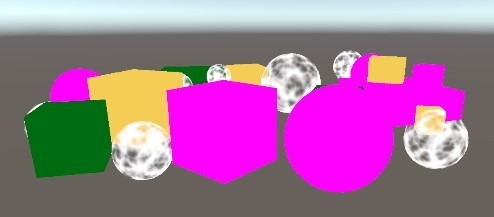

> 3.3 局部类

+ 绘制无效对象对开发很有用，但不适用于以发布的应用程序。因此，让我们将 `CameraRenderer` 的所有仅编辑器代码放在一个单独的局部类中。首先复制原始的 `CameraRenderer` 脚本资源并将其重命名为 `CameraRenderer.Editor`。

    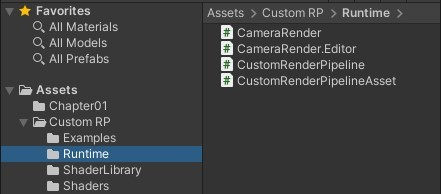

+ 然后把原来的 `CameraRender` 变成一个局部类，并从中去掉 `tag array`、`error material` 和 `DrawUnsupportedShaders` 方法。

    ```C#
    public partial class CameraRenderer { ... }
    ```

+ 清除另一个局部类文件，使其只包含我们从另一个文件中删除的内容。

    ```C#
    using UnityEngine;
    using UnityEngine.Rendering;

    partial class CameraRenderer {

        static ShaderTagId[] legacyShaderTagIds = { ... };

        static Material errorMaterial;

        void DrawUnsupportedShaders() { ... }
    }
    ```

+ 编辑器部分的内容只需要存在于编辑器中，所以在 `UNITY_EDITOR` 条件中定义。

    ```C#
    using UnityEngine;
    using UnityEngine.Rendering;

    partial class CameraRenderer {

    #if UNITY_EDITOR

        static ShaderTagId[] legacyShaderTagIds = { ... };

        static Material errorMaterial;

        void DrawUnsupportedShaders() { ... }
    
    #endif
    }
    ```

+ 但是，此时进行构建会失败，因为另一部分总是包含 `DrawUnsupportedShaders` 的调用，现在仅在编辑器中存在。为了解决这个问题，我们也把这个方法变成局部的。我们通过在声明方法时在前面加上 `partial`，类似于抽象方法声明。我们可以在类定义的任何部分这样做，所以让我们把他放在编辑器部分，完成的方法声明也必须用 `partial` 标记。

    ```C#
        partial void DrawUnsupportedShaders();

    #if UNITY_EDITOR

        ...

        partial void DrawUnsupportedShaders() { ... }

    #endif
    ```

+ 构建的编译工作现在成功了。编译器将剥离所有最终没有完成声明的部分方法的调用。

> 3.4 绘制 `Gizmos`

+ 目前我们的 `RP` 不会在场景窗口或游戏窗口绘制 `Gizmo`

    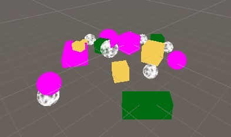

+ 我们可用通过调用 `UnityEditor.Handles.ShouldRenderGizmos` 来检查是否应该绘制 `Gizmos`。如果是这样，我们必须在上下文上调用 `DrawGizmos` ，以相机作为参数，再加上第二个参数，以表示应该绘制哪个 `Gizmos` 子集。有两个子集用于图像效果之前和之后。由于我们目前不支持图像效果，我们将同时调用这两个子集。仅在编辑器新的 `DrawGizmos` 方法中执行此操作。

    ```C#
    using UnityEditor;
    using UnityEngine;
    using UnityEngine.Rendering;

    partial class CameraRender {
        
        partial void DrawGizmos();

        partial void DrawUnsupportedShaders();

        #if UNITY_EDITOR

            ...

            partial void DrawGizmos() {
                if (Handles.ShouldRenderGizmos()) {
                    context.DrawGizmos(camera, GizmosSubset.PreImageEffects);
                    context.DrawGizmos(camera, GizmosSubset.PostImageEffects);
                }
            }

            partial void DrawUnsupportedShaders() { ... }

        #endif
    }
    ```

+ 这些 `Gizmos` 应该在其他所有内容之后绘制。

    ```C#
    public void Render(ScriptableRenderContext context, Camera camera) {

        ...

        Setup();
        DrawVisibleGeometry();
        DrawUnsupportedShaders();
        DrawGizmos();
        Submit();
    }
    ```

    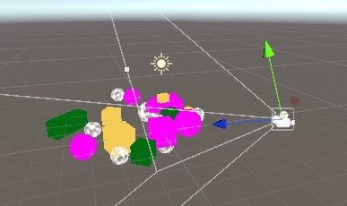

> 3.5 绘制 `Unity UI`

+ 另一个需要我们注意的是 `Unity` 的游戏内用户界面。例如，通过 `GameObject/UI/Button` 添加一个按钮来创建一个简单的用户界面。他将显示在游戏窗口中，但不会显示在场景窗口中。

    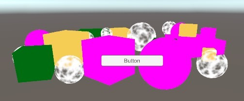

+ `Frame Debugger` 向我们展示了 `UI` 是单独渲染的，而不是我们的 `RP`。

    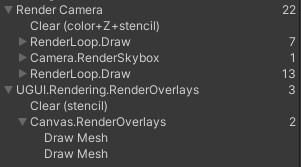

+ 当 `Canvas` 组件的 `Render Mode` 设置为 `Screen Space-Overlay` 时就会这样，这是默认的。将其更改为 `Screen Space-Camera` 并使用主相机作为其渲染相机将使其成为透明几何体的一部分。

    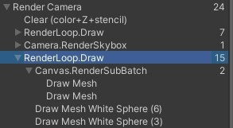

+ `UI` 在场景窗口中渲染时总是使用世界空间模式，这就是为什么他通常最终会非常大。但是，虽然我们可以通过场景窗口编辑 `UI`，但他不会被绘制出来。

    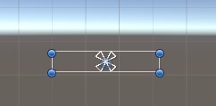

+ 在为场景窗口渲染时，我们必须明确地将用户界面添加到世界几何中，方法是调用 [ScriptableRenderContext](ScriptableRenderContext.md).EmitWorldGeometryForSceneWindow ，将相机作为参数。仅在编辑器新的 `PrepareForSceneWorld` 方法中执行此操作。当其 `cameraType` 属性等于 `CameraType.SceneView` 时，我们使用场景相机进行渲染。

    ```C#
    partial void PrepareForSceneWindow();

    #if UNITY_EDITOR

    ...

    partial void PrepareForSceneWindow() {
        if (camera.cameraType == CameraType,SceneView) {
            ScriptableRenderContext.EmitWorldGeometryForSceneView(camera);
        }
    }
    ```

+ 因为这可能会给场景增加几何体，所以必须在剔除之前完成。

    ```C#
    PrepareForSceneWindow();
    if (!Cull()) {
        return;
    }
    ```

    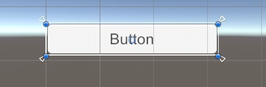

## 4 多摄像机

+ 场景中可能存在不止一个活动的摄像机。如果是这样，我们必须保证他们一起正常工作。

> 4.1 两个摄像机

+ 每个摄像机都有一个深度值，默认主相机的深度值为 `-1`。他们会按深度递增的顺序被渲染。要看到这一点，复制主摄像机，将其命名为 `Secondary Camera` ，并将其深度值设置为 `0`。给他另一个标签也是一个好主意，因为 `MainCamera` 应该只被一个摄像机使用。

    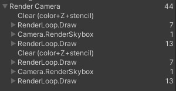

+ 场景现在渲染了两次。结果图像仍然一样的，因为渲染目标在中间被清除了。`Frame Debugger` 显示了这一点，但是由于相邻的具有相同名称的实例作用域被合并，我们最终得到一个单一的 `Render Camera` 作用域。

+ 如果每个摄像机都有自己的范围，那就更清楚了，为了实现这一点，添加一个编辑器专用的 `PrepareBuffer` 方法，使缓冲区的名称与摄像机的名称相同。

    ```C#
    partial void PrepareBuffer();
    
    #if UNITY_EDITOR

    ...

    partial void PrepareBuffer() {
        buffer.name = camera.name;
    }
    ```

+ 在场景窗口之前调用他。

    ```C#
    PrepareBuffer();
    PrepareForSceneWindow();
    ```

    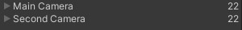

> 4.2 处理更改的缓冲区名称

+ 虽然现在 `Frame Debugger` 中显示了每个摄像机由一个单独的样本层次，但当我们进入游戏模式时，`Unity` 的 `Console` 会充满警告我们 `BeginSample` 和 `EndSample` 数量必须匹配的信息。他感到困惑的是因为我们对样本和他们的缓冲区使用了不同的名字。除此之外，我们每次访问摄像机的名字属性时，也会最终分配内存，所以我们不想在构建中这样做。

+ 为了解决这两个问题，我们将添加一个 `SampleName` 字符串属性。如果我们在编辑器中，我们在 `PrepareBuffer` 中设置他和缓冲区的名称，否则他只是 `Render Camera` 字符串的一个简单别名。

    ```C#
    #if UNITY_EDITOR

        ...

        string SampleName{ get; set; }

        ...

        partial void PrepareBuffer() {
            buffer.name = SampleName = camera.name;
        }
    #else

        const string SampleName = bufferName;

    #endif
    ```

+ 在设置和提交时使用 `SampleName` 作为样本。

    ```C#
    void Setup() {
        context.SetupCameraProperties(camera);
        buffer.ClearRenderTarget(true, true, Color.clear);
        buffer.BeginSample(SampleName);
        ExecuteBuffer();
    }

    void Submit() {
        buffer.EndSample(SampleName);
        ExecuteBuffer();
        context.Submit();
    }
    ```

+ 我们可以通过分析器 `Window/Analysis/Profiler` 在编辑器里看看，就知道有什么不同，切换到 `Hierarchy Mode`，按 `GC Alloc` 列排序。你会看到这些名字显示为样本。`Main Camera` 和 `Second Camera`。

    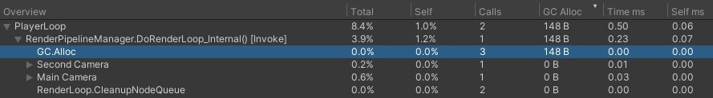

+ 接下来，在启用了 `Development Build` 和 `Autoconnect Profiler` 的情况下进行构建，运行并确保 `Profiler` 以连接并开始录制。在这种情况下，我们没有看到 `100` 字节的分配，得到单一渲染相机样本。

    

    ```C#
    using UnityEditor;
    using UnityEngine;
    using UnityEngine.Profiling;
    using UnityEngine.Rendering;

    partial class CameraRenderer {

        ...

    #if UNITY_EDITOR
    
        ...

        partial void PrepareBuffer() {
            Profiler.BeginSample("Editor Only");
            buffer.name = SampleName = camera.name;
            Profiler.EndSample();
        }
    
    #else
    
        string SampleName => bufferName;

    #endif
    }
    ```

    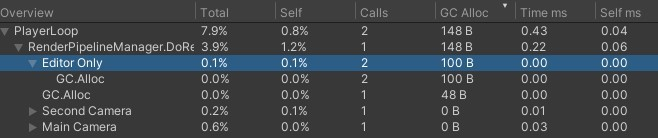

> 4.3 Layers

+ 通过调整他们的 `Culling Mask`，相机也可以配置成只能看到某些层上的东西。想要实验这点的话，可以将使用标准着色器的所有对象移动到 `Ignore Raycast` 层。

    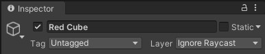

+ 将这一层排除在主摄像机的 `culling mask` 之外。

    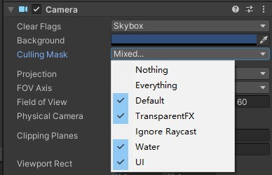

+ 然后让 `Second Camera` 只看这个层。

    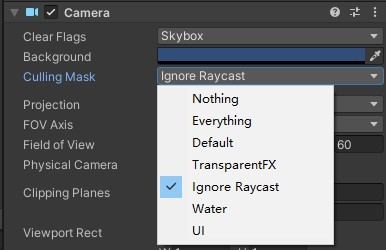

+ 因为第二个摄像机是后渲染的，所以暂时我们是能看到无效的对象。

    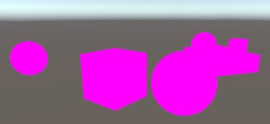

> 4.4 清除标志

+ 我们可以通过调整第二个被渲染的相机的清除标记来结合两个相机的结果。他们是由 [CameraClearFlags](CameraClearFlags.md) 枚举定义的，我们可以通过摄像机的 `clearFlags` 属性检索到。在 `Setup` 函数里，清除渲染目标前执行。

    ```C#
    void Setup() {
        context.SetupCameraProperties(camera);
        CameraClearFlags flags = camera.clearFlags;
        buffer.ClearRenderTarget(true, true, Color.clear);
        buffer.BeginSample(SampleName);
        ExecuteBuffer();
    }
    ```

+ [CameraClearFlags](CameraClearFlags.md) 枚举定义了四个值。从 `1` 到 `4`，他们是 `Skybox` 、 `Color` 、 `Depth` 和 `Nothing`。这些实际上并不是独立的标记值，而是代表一个递减的清除量。深度缓冲区在所有情况下都必须被清除，出了最后一种情况，所以标记值最多设置的是 `Depth`。

    ```c#
    buffer.ClearRenderTarget(flags <= CameraClearFlags.Depth, true, Color.clear);
    ```

+ 我们只有在标记被设置为颜色时才真正需要清除颜色缓冲区，因为在 `Skybox` 的情况下，无论如何我们最终都会替换掉之前所有的颜色数据。

    ```C#
    buffer.ClearRenderTarget(
        flags <= CameraClearFlags.Depth,
        flags == CameraClearFlags.Color,
        Color.clear
    )
    ```

+ 而我们要清除一个纯色，我么必须要使用相机的背景色。但由于我们是在线性色彩空间中渲染，我们必须将带颜色转换为线性空间，所以我们最终需要使用 `camera.backgroundColor.linear`。在所有其他情况下，颜色并不重要，所有我们使用 `Color.clear` 就足够了。

    ```C#
    buffer,ClearRenderTarget(
        flags <= CameraClearFlags.Depth,
        flags == CameraClearFlags.Color,
        flags == CameraClearFlags.Color ? camera,backgroundColor.linear : Color.clear
    )
    ```

+ 因为主摄像机是第一个渲染的，他的清除标记应该被设置为 `Skybox` 或 `Color`。当 `Frame Debugger` 被启用时，我们总是从一个清晰的缓冲区开始，但这在一般情况下是不能保证的。

+ `Second Camera` 的清除标记决定了两个摄像机的渲染如何被结合起来。在 `Skybox` 或 `Color` 的情况下，之前的结果被完全取代。当只有 `Depth` 被清除时，则 `Second Camera` 将正常渲染，但不会绘制 `Skybox`，因此之前的结果显示为背景。当标记时 `Nothing` 时，深度缓冲区将保留，因此 `unlit` 的对象最终将遮挡无效对象，就像他们是由同一个摄像机绘制的一样。但是，前一台摄像机会的透明对象因为没有深度信息，所以被画过去了，就像之前的 `Skybox` 一样。

    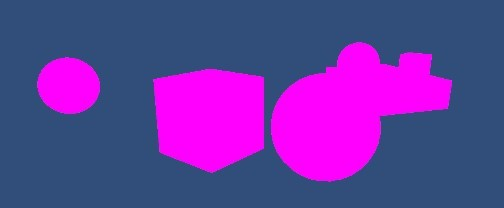

    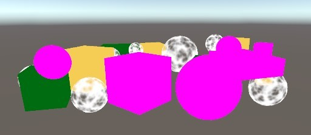

    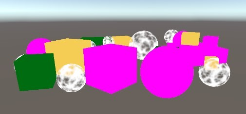

+ 通过调整相机的视口矩形，也可以将渲染区域缩小到整个渲染目标的一小部分。渲染目标的其余部分仍然不受影响。在这种情况下，通过 `Hidden/InternalClear` 着色器进行清除。模板缓冲区被用来限制渲染在时空区域内。

    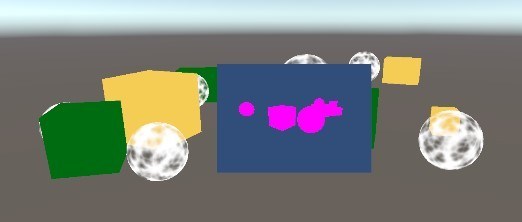

+ 请注意，每帧渲染一个以上的摄像机意味着删减，设置，排序等也要进行多次。每个独特的视点使用一个摄像机通常是最有效的方法。
