# Draw Calls Shaders and Batches

## 1 Shaders

+ 为了绘制东西， `CPU` 必须告诉 `GPU` 绘制什么东西以及如何绘制。绘制的东西通常是一个网格。如何绘制是由着色器定义的，他是一组给 `GPU` 的指令。除了网络，着色器还需要额外的信息来完成某些工作，包括物体的变换矩阵和材质属性。

+ `Unity` 的 `LW/Universal` 和 `HD` `RP` 允许你用 `Shader Graph` 包来设计着色器，它可以为你生成着色器代码。但是我们的定制 `RP` 不支持这个，所以我们必须自己编写着色器代码。这使我们能够完全控制和理解着色器的作用。

> 1.1 Unlit Shader

+ 我们的第一个着色器将简单地绘制一个纯色的网格，没有任何照明。着色器资产可以通过 `Assets/Create/Shader` 菜单中的一个选项创建。 `Unlit Shader` 是最合适的，但我们要从新开始，从创建的 `shader` 文件中删除所有的默认代码。将资产命名为 `Unit` ，并放在 `Custom RP` 下的一个新的 `Shaders` 文件夹中。

    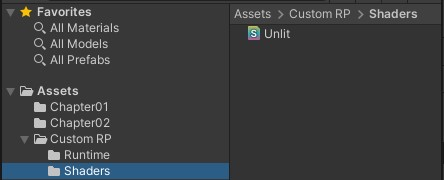

+ 着色器代码在大多数情况下看起来像 `C#` 代码，但它有不同的方法组成，包括一些在过去有用但现在废弃的。

+ 着色器的定义就像一个类，但是只有着色器这个关键词，后面跟着一个字符串，用来在材质的着色器下拉菜单中为它创建一个条目。让我们使用 `Custom RP/Unlit` 。接下来是一个代码块，它包含了更多带有关键字的块。有一个 `Properties` 块来定义材质属性，接着是 `SubShader` 块，它需要有一个 `Pass` ，`Pass` 定义了渲染东西的一种方式。使用空块创建这个结构。

    ```C#
    Shader "Custom RP/Unlit" {
        Properties {}

        SubShader {

            Pass{}
        }
    }
    ```

+ 这定义了一个最小的着色器，它可以编译通过并允许我们创建一个使用他的 `material` 。

    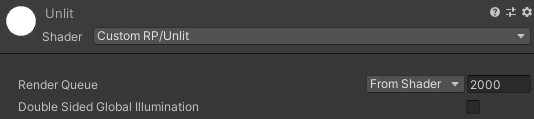

+ 默认的着色器实现将网格渲染成纯白色。材质显示了渲染队列的默认属性，他自动从着色器中获取该属性，并设置为 `2000` 这是不透明几何体的默认值。它也有一个切换按钮来启用双面全局照明，但这对于我们来说并不重要。

> 1.2 `HLSL` 程序

+ 我们用来编写着色器代码的语言是高级着色语言，简称 `HLSL` 。我们必须把他放在 `Pass` 块中，在 `GLSLPROGRAM` 和 `ENDHLSL` 关键字之间。我们必须这样做，因为在 `Pass` 块中也有可能放入其他非 `HLSL` 代码。

    ```C#
    Pass {
        HLSLPROGRAM
        ENDHLSL
    }
    ```

+ 为了绘制一个网格，`GPU` 必须将其所有的三角形光栅化，将其坐标转化为像素数据。它通过将顶点坐标从 `3D` 空间转化到 `2D` 可视化空间，然后填充所有被生成的三角形覆盖的像素。这两个步骤由独立的着色器程序控制，我们必须定义这两个程序。第一个被称为顶点着色器，第二个被称为片段着色器。一个片段对应于一个显示像素或纹理文本，尽管它可能不代表最终的结果，因为它可能在以后被在他上面渲染的东西被覆盖。

+ 我们必须用一个名字来标识这两个程序，这可以通过 `pragma` 指令来完成。这些是以 `#pragma` 开头的单行语句，后面是顶点或片段和相关名称。我们将使用 `UnlitPassVertex` 和 `UnlitPassFragment` 。

    ```HLSL
    HLSLPROGRAM
    #pragma vertex UnlitPassVertex
    #pragma fragment UnlitPassFragment
    ENDHLSL
    ```

+ 着色器编译器现在会抱怨说他找不到已声明的着色器方法。我们必须用同样的名字编写 `HLSL` 函数来定义实现。我们可以直接在 `pragma` 指令下面这样做，但我们要把所有的 `HLSL` 代码放在一个单独的文件中。具体来说，我们将在同一个资产文件夹中使用一个 `UnlitPass.hlsl` 文件。我们可以通过添加一个 `#include` 指令来只是着色器插入该文件的内容，该指令包含该文件的相对路径。

    ```HLSL
    HLSLPROGRAM
    #pragma vertex UnlitPassVertex
    #pragma fragment UnlitPassFragment
    #include "UnlitPass.hlsl"
    ENDHLSL
    ```

> 1.3 Include 保护

`HLSL` 文件用来分组代码，就像 `C#` 类一样，尽管 `HLSL` 没有类的概念。除了代码块的局部作用域，只有一个全局作用域。所以所有的东西都可以在任何地方访问。 `including` 一个文件也和使用一个 `namespace` 不一样。他在 `include` 指令的位置插入了文件的全部内容，所以如果你多次包含同一个文件，就会得到重复的代码，这很可能会导致编译器错误。为了防止这种情况，我们将在 `UnlitPass.hlsl` 中添加一个 `include` 保护。

+ 可以使用 `#define` 指令来定义任何标识符，通常是用大写字母。我们将用他来定义文件顶部的 `CUSTOM_UNLIT_PASS_INCLUDED。`

    ```HLSL
    #define CUSTOM_UNLIT_PASS_INCLUDED
    ```

+ 这是一个简单宏的例子，他只是定义了一个标志符。如果它存在，那么就意味着我们的文件已经被包含了。所以我们不想再包含他的内容。换句话说，我们只想在他还没有被定义时插入代码。我们可以用 `#ifndef` 指令检查。在定义宏之前要这样做。

    ```HLSL
    #ifndef CUSTOM_UNLIT_PASS_INCLUDED
    #define CUSTOM_UNLIT_PASS_INCLUDED
    ```

+ 如果宏已经定义，那么在 `#ifndef` 之后的所有代码都将被跳过。同时还要在文件尾添加一个 `#endif` 指令来终止它的作用域。

    ```HLSL
    #ifndef CUSTOM_UNLIT_PASS_INCLUDED
    #define CUSTOM_UNLIT_PASS_INCLUDED
    #endif
    ```

+ 现在我们可以确定，文件的所有相关代码永远不会被多次插入，即使我们最终包含他不止一次。

> 1.4 Shader 函数

+ 我们在 `include` 保护的范围内定义我们的着色器函数。他们就像 `C#` 方法一样编写，没有任何访问修饰符。从简单的无效函数开始，什么都不做。

    ```HLSL
    #ifndef CUSTOM_UNLIT_PASS_INCLUDED
    #define CUSTOM_UNLIT_PASS_INCLUDED

    void UnlitPassVertex () {}

    void UnlitPassFragment () {}

    #endif
    ```

+ 这就足以让我们的着色器得到编译。结果可能是一个默认的青色着色器，如果有任何东西显示出来的话。

    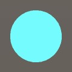

    $\color{red}{Ps: 青色着色器会一闪而过，这是因为设置了异步着色器编译导致的。}$

+ 为了产出有效的输出，我们必须使片段函数返回一个颜色。颜色是用一个包含了 `r` 、 `g` 、 `b` 和 `alpha` 分量的四分量 `float4` 向量定义的。我们可以通过 `float4(0.0, 0.0, 0.0, 0.0)` 来定义纯黑色，但我们也可以写一个单独的 `0` ，因为单一的值会自动扩展为一个完整的向量。 `alpha` 值并不重要，因为我们要创建一个不透明的着色器，所以 `0` 就可以了。

    ```HLSL
    float4 UnlitPassFragment() {
        return 0.0;
    }
    ```

+ 此时， `shader` 编译器会失败，因为我们的函数缺少 [语义](Semantic.md) ，我们必须明确说明我们返回的值是什么意思，因为我们有可能产生很多具有不同含义的数据。在这种情况下，我们为渲染目标提供默认的系统值，通过在 `UnityPassFragment` 的参数列表后面加上 `SV_TARGET` 来表示。

    ```HLSL
    float4 UnlitPassFragment() : SV_TARGET {
        return 0.0;
    }
    ```

+ `UnityPassVertex` 负责转换顶点的位置，所以应该返回一个位置。这也是一个 `float4` 的向量，因为它必须被定义为相同的裁剪空间位置，但是稍后我们将进行介绍。同样，我们从零向量开始，在这种情况下，我们需要指出其含义是 `SV_POSITION`。

    ```HLSL
    float4 UnlitPassVertex() : SV_POSITION {
        return 0.0;
    }
    ```

> 1.5 转换空间

+ 当所有的顶点都被设置为零时，网格会坍缩成一个点，没有任何东西被渲染出来。顶点函数的主要工作是将原始顶点位置转换到正确的空间。当被调用时，如果我们要求的话，该函数会提供可用的顶点数据。我们通常向 `UnityPassVertex` 添加参数来做到这一点。我们需要顶点位置，他是在对象空间中定义的，所以我们将他命名为 `positionOS` ，使用与 `Unity` 的新 `RP` 相同的约定。这个位置的类型是 `float3` ，因为他是一个三维点。让我们首先返回它，通过 `float4(positionOS, 1.0)` 添加 `1` 作为第四个需要的分量。

    ```HLSL
    float4 UnlitPassVertex(float3 positionOS) : SV_POSITION {
        return float4(positionOS, 1.0);
    }
    ```

+ 我们还必须为输入添加 [语义](Semantic.md) ，因为顶点数据可以包含不止一个位置。在这种情况下，我们需要 `POSITION` ，在参数名后面直接加上。

    ```HLSL
    float4 UnlitPassVertex(float3 positionOS : POSITION) : SV_POSITION {
        return float(positionOS, 1.0);
    }
    ```

    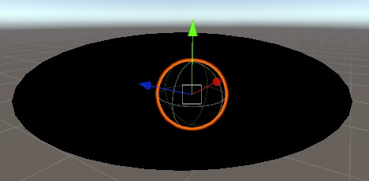

+ 网格显示出来了，但不正确，因为我们输出的位置是在错误的空间。空间的转换需要矩阵，当有东西被绘制出来的时候，这些矩阵被送到 `GPU` 上。我们必须将这些矩阵添加到我们的着色器中，但由于他们总是相同的，我们将把 `Unity` 提供的标准输入放在一个单独的 `GLSL` 文件中，这既是为了保存代码的结构化，也是为了能够在其他着色器中包含这些代码。添加一个 `UnityInput.hlsl` 文件，把他放在 `ShaderLibrary` 文件夹中，直接放在 `Custom RP` 下面，以反映 `Unity RP` 的文件夹结构。

    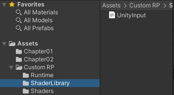

+ 用 `CUSTOM_UNITY_INPUT_INCLUDED` 开始文件，然后在全局范围内定义一个名为 `unity_ObjectToWorld` 的 `float4x4` 矩阵。在 `C#` 类中，这将定义一个字段，但在这里他被称为一个 `uniform` 值。他在每次绘制时由 `GPU` 设置一次，在绘制过程中所有顶点和片段函数的调用中保持不变。

    ```HLSL
    #ifndef CUSTOM_UNITY_INPUT_INCLUDED
    #define CUSTOM_UNITY_INPUT_INCLUDED

    float4x4 unity_ObjectToWorld;

    #endif
    ```

+ 我们可以使用矩阵来从物体空间转换到世界空间。由于这是常见的功能，让我们创建一个函数并把它放在另一个文件中，这正是同一个 `ShaderLibrary` 文件夹中的 `Common.hlsl` 。我们在其中包含 `UnityInput` ，然后声明一个 `TransformObjectToWorld` 函数，用一个 `float3` 作为输入和输出。

    ```HLSL
    #ifndef CUSTOM_COMMON_INCLUDED
    #define CUSTOM_COMMON_INCLUDED
    
    #include "UnityInput.hlsl"

    float3 TransformObjectToWorld(float3 positionOS) {
        return 0.0;
    }

    #endif
    ```

    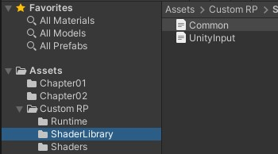

+ 空间转换时通过调用 `mul` 函数与一个矩阵和一个矢量来完成的。在这种情况下，我们确实需要一个 `4D` 向量，但由于他的第四个分量总是 `1` ，我们可以通过使用 `float4(positionOS, 1.0)` 来添加他。结果还是一个 `4D` 向量，其第四个分量总是 `1` 。我们通过访问向量的 `xyz` 属性来提取前三个分量，这就是所谓的 `swizzle` 操作。

    ```HLSL
    float3 TransformObjectToWorld(float3 positionOS) {
        return mul(unity_ObjectToWorld, float4(positionOS, 1.0)).xyz;
    }
    ```

+ 我们现在可以在 `UnityPassVertex` 中转换到世界空间。首先将 `Common.hlsl` 包含在函数的正上方。因为他们存在与不同的文件夹中，我们可以通过相对路径 `../ShaderLibrary/Common.hlsl` 来获取它。然后使用 `TransformObjectToWorld` 来计算一个 `positionWS` 变量并返回他而不是对象空间位置。

    ```HLSL
    #include "../ShaderLibrary/Common.hlsl"

    float4 UnlitPassVertex (float3 positionOS : POSITION) : SV_POSITION {
        float3 positionWS = TransformObjectToWorld(positionOS.xyz);
        return float4(positionWS, 1.0);
    }
    ```

+ 结果仍然是错误的，因为我们需要一个其次空间的位置。这个空间定义了一个立方体，包含了摄像机视野中的一切，如果是透视摄像机，则扭曲成一个梯形。从世界空间到这个空间的转换可以通过乘以视图投影矩阵来完成，该矩阵考虑了摄像机位置、方向、投影、视场和近远裁剪平面。他是由 `unity_ObjectToWorld` 矩阵提供的，所以把他添加到 `UnityInput.hlsl`

    ```HLSL
    float4x4 unity_ObjectToWorld;

    float4x4 unity_MatrixVP;
    ```

+ 在 `Common.hlsl` 中添加一个 `TransformWorldToHClip` ，其工作原理与 `TransformObjectToWorld` 相同，只是它的输入是在世界空间，使用其他矩阵，并产生一个 `float4` 。

    ```HLSL
    float3 TransformObjectToWorld (float3 positionOS) {
        return mul(unity_ObjectToWorld, float4(positionOS, 1.0)).xyz;
    }

    float4 TransformWorldToHClip (float3 positionWS) {
        return mul(unity_MatrixVP, float4(positionWS, 1.0));
    }
    ```

+ 让 `UnityPassVertex` 使用该函数来返回正确空间中的位置。

    ```HLSL
    float4 UnlitPassVertex (float3 positionOS : POSITION) : SV_POSITION {
        float3 positionWS = TransformObjectToWorld(positionOS.xyz);
        return TransformWorldToHClip(positionWS);
    }
    ```

   

> 1.6 核心库

+ 我们刚才定义的两个函数非常常见，以至于他们也被包含在 `Core RP Pipeline` 软件包中。核心库定义了更多有用的和必要的东西，所以我们安装这个包，删除我们的自己的定义，然后包含相关文件，在这里是 `Packages/com.unity.render-pipeline.core/ShaderLibrary/SpaceTransform.hlsl` 。

    ```HLSL
    //float3 TransformObjectToWorld (float3 positionOS) {
    //  return mul(unity_ObjectToWorld, float4(positionOS, 1.0)).xyz;
    //}

    //float4 TransformWorldToHClip (float3 positionWS) {
    //  return mul(unity_MatrixVP, float4(positionWS, 1.0));
    //}

    #include "Packages/com.unity.render-pipelines.core/ShaderLibrary/SpaceTransforms.hlsl"
    ```

+ 这就无法编译了，因为 `SpaceTransform.hlsl` 中代码并没有假定 `unity_ObjectToWorld` 存在。相反，他希望相关的矩阵被一个宏定义为 `UNITY_MATRIX_M` ，所以让我们在包含文件之前，在单独一行加上 `#define UNITY_MATRIX_M unity_ObjectToWorld` 。 之后，所有出现的 `UNITY_MATRIX_M` 将被 `unity_ObjectToWorld` 取代。这是有原因的，我们以后会发现。

    ```HLSL
    #define UNITY_MATRIX_M unity_ObjectToWorld

    #include "Packages/com.unity.render-pipelines.core/ShaderLibrary/SpaceTransforms.hlsl"
    ```

+ 这对于逆矩阵 `unity_WorldToObject` 也是如此，他应该通过 `UNITY_MATRIX_I_M` 定义， `unity_MatrixV` 通过 `UNITY_MATRIX_V` 定义， `unity_MatrixVP` 通过 `UNITY_MATRIX_VP` 。 最后，还有一个通过 `UNITY_MATRIX_P` 定义的投影矩阵，他可以作为 `glstate_matrix_projection` 使用。我们不需要这些额外的矩阵，但如果我们不包括他们，代码就不会被编译。

    ```HLSL
    #define UNITY_MATRIX_M unity_ObjectToWorld
    #define UNITY_MATRIX_I_M unity_WorldToObject
    #define UNITY_MATRIX_V unity_MatrixV
    #define UNITY_MATRIX_VP unity_MatrixVP
    #define UNITY_MATRIX_P glstate_matrix_projection
    ```

    将额外的矩阵在加载到 `UnityInput` 中。

    ```HLSL
    float4x4 unity_ObjectToWorld;
    float4x4 unity_WorldToObject;

    float4x4 unity_MatrixVP;
    float4x4 unity_MatrixV;
    float4x4 glstate_matrix_projection;
    ```

+ 最后缺少的是一个矩阵以外的东西。他是 `unity_WorldTransformParams` ， 他包含了一些我们在这里不需要的变换信息。他是一个定义为 `real4` 的向量，它本身不是一个有效的类型，而是对 `float4` 或 `half4` 的别名，取决于目标平台。

    ```HLSL
    float4x4 unity_ObjectToWorld;
    float4x4 unity_WorldToObject;
    real4 unity_WorldTransformParams;
    ```

+ 这个别名和其他很多基本的宏都是按图形 `API` 定义的，我们可以通过包含 `Packaged/com.unity.render-pipeline.core/ShaderLibrary/Common.hlsl` 之前，在我们的 `UnityInput.hlsl` 之前，在我们的 `Common.hlsl` 文件中这样做。如果你对这些文件的内容感到好奇，你可以在导入包中检查这些文件。

    ```HLSL
    #include "Packages/com.unity.render-pipelines.core/ShaderLibrary/Common.hlsl"
    #include "UnityInput.hlsl"
    ```

> 1.7 颜色

+ 渲染对象的颜色可以通过调整 `UnlitPassFragment` 来改变。例如，我们可以通过返回 `float(1.0, 1.0, 0.0, 1.0)` 而不是 `0` 来使他变成黄色。

    ```HLSL
    float4 UnlitPassFragment() : SV_TARGET {
        return float4(1.0, 1.0, 0.0, 1.0);
    }
    ```

    

+ 为了使配置每个材质的颜色成可能，我们必须把他定义为一个 `uniform` 值。在 `include` 指令下面，在 `UnlitPassVertex` 函数之前做这个。我们需要一个 `float4` ，并将其命名为 `_BaseColor` 。前面的下划线是表示他代表一个材质属性的标准方式。在 `UnlitPassFragment` 中返回这个值，而不是一个硬编码的颜色。

    ```HLSL
    #include "../ShaderLibrary/Common.hlsl"

    float4 _BaseColor;

    float4 UnlitPassVertex(float3 positionOS : POSITION) : SV_POSITION {
        float3 positionWS = TransformObjectToWorld(positionOS);
        return TransformWorldToHClip(positionWS);
    }

    float4 UnlitPassFragment() : SV_TARGET {
        return _BaseColor;
    }
    ```

+ 我们回到了黑色，因为默认值是 `0` 。为了将其与材质联系起来，我们必须将 `_BaseColor` 添加到 `Unlit Shader` 文件的属性快。

    ```Shader
    Properties {
        _BaseColor
    }
    ···

+ 属性后面必须由一个用于检查器的字符串和一个颜色类型标识符，就像给一个方法提供参数一样。

    ```HLSL
    _BaseColor("Color", Color)
    ```

+ 最后，我们必须提供一个默认值，在这种情况下，要给他分配一个由四个数字组成的列表。让我们使用白色。

    ```HLSL
    _BaseColor("Color", Color) = (1.0, 1.0, 1.0, 1.0)
    ```

    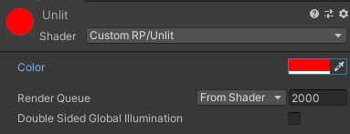

+ 现在可以用我们的着色器创建多个材料，每个材料都有不同的颜色。

## 2 合批

+ 每次绘制调用都需要 `CPU` 和 `GPU` 之间的通信。如果有大量的数据需要发送给 GPU ，那么他可能会因为等待而最终浪费时间。而当 `CPU` 忙于发送数据时，他就不能做其他事情。这两个问题都会降低帧率。目前，我们的方法很直接：每个对象都有自己的绘制调用。这是最糟糕的方法，尽管我们最终发送的数据非常少，所以现在还不错。

+ 举个例子，我做了一个 76 个球体的场景，每个球体使用四种材质中的一种：红、绿、黄、蓝。徐然是需要调用 `78` 次，其中 `76` 次用于球体，一次用于天空盒，还有一次用于清除渲染目标。

    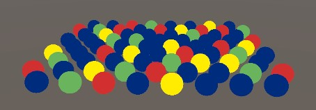

+ 如果你打开游戏窗口的 `Stats` 面板，你可以看到渲染帧的概况。这里有趣的事实是，它显示了 `77` 个批次 其中 `Saved by batching` 的数值是 `0` 。

    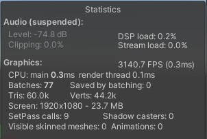

> 2.1 SRP 批处理

+ 批处理是组合绘制调用的过程，减少 `CPU` 和 `GPU` 之间的通信时间。最简单的方法是启用 `SRP batching` ，然而，只有兼容的着色器有效，而我们的 `Unlit` 着色器不是。你可以通过在检视面板查看他来验证这一点。有一行提示 `SRP batching` 不兼容，在他下面给出了一个原因。

    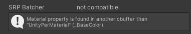

+ 与其说 `SRP` 批次减少了绘制调用的数量，不如说是使其更加精简。它在 `GPU` 上缓存了材质的属性，所以他们不必在每次绘制调用时都被发送。这即减少了必须传达的数据量，也减少了 `CPU` 在每次绘制调用时必须做的工作。但是，这是在着色器遵守统一数据的严格结构时才有效。

+ 所有的材质属性必须被定义在一个具体的内存缓冲区内，而不是在全局层面。这时通过将 `_BaseColor` 声明包裹在一个带有 `UnityPerMaterial` 名称的 `cbuffer` 块中来实现的。这就像一个结构声明，但必须用分号来结束。他通过将 `_BaseColor` 放在一个特定的常量内存缓冲区中来隔离 `_BaseColor` ，尽管他仍然在全局级别上访问。

    ```HLSL
    cbuffer UnityPerMaterial {
        float _BaseColor;
    }
    ```

+ 常量缓冲区并不支持所有的平台，比如 `(OpenGL ES 2.0)` ，所以我们使用从 `Core RP` 库中包含的 `CBUFFER_START` 和 `CBUFFER_END` 宏，而不是直接使用 `cbuffer` 。第一个宏把缓冲区名称作为参数，就像他是一个函数一样。在这种情况下，我们最终得到的结果和之前的完全一致，只是在不支持 `cbuffer` 的平台上 `cbuffer` 代码将不存在。

    ```HLSL
    CBUFFER_START(UnityPerMaterial)
        float4 _BaseColor;
    CBUFFER_END
    ···

+ 对于 `unity_ObjectToWorld` 、 `unity_WorldToObject` 和 `unity_WorldTransformParams` ，我们也必须这样做，只不过他们必须被分组在 `UnityPerDraw` 缓冲区中。

    ```HLSL
    CBUFFER_START(UnityPerDraw)
        float4x4 unity_ObjectToWorld;
        float4x4 unity_WorldToObject;
        real4 unity_WorldTransformParams;
    CBUFFER_END
    ```

+ 在这种情况下，如果我们使用其中的一个，我们就需要定义特定的一组值。对于变换组，我们还需要包括 `float4 unity_LODFade` ，尽管我们并没有使用他。具体的顺序并不重要，但是 `Unity` 把他直接放在 `unity_WorldToObject` 之后，所以我们也要这样做。

    ```HLSL
    CBUFFER_START(UnityPerDraw)
        float4x4 unity_ObjectToWorld;
        float4x4 unity_WorldToObject;
        float4 unity_LODFade;
        real4 unity_WorldTransformParams;
    CBUFFER_END
    ```

    

+ 在我们的着色器兼容的情况下，下一步是启用 `SRP` 批处理。这可以通过设置 `GraphicsSettings.useScriptableRenderPipelineBatching` 为 `true` 来完成。我们只需要做一次，所以让我们在创建管线实例时进行，为 `CustomRenderPipeline` 添加一个构造方法。

    ```C#
    public CustomRenderPipeline() {
        GraphicsSettings.useScriptableRenderPipelineBatching = true;
    }
    ```

    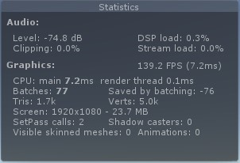

    $\color{red}{2019.2.9}$

    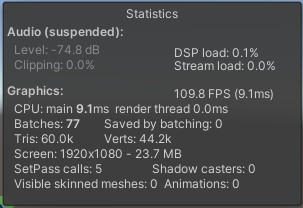

    $\color{red}{2019.4.40}$

    $\color{red}{Ps: 在更高的版本中不再会出现 "Saved by batching" 为负数的情况}$

+ 统计面板显示有 `76` 个批次被保存，尽管他显示的是一个负数。 `Frame Debugger` 现在在 `RenderLoopNewBatcher.Draw` 下显示了一个单一的 `SRP` 批处理条目，不过请记住，这不是一个单一的绘制调用，这是一个优化的序列。

    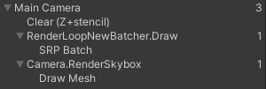

> 2.2 更多的颜色

+ 即使我们使用四种材质，我们也会得到一个批次、这是因为他们的所有数据都被缓存在 `GPU` 上，并且每个绘制调用只需包含到正确内存位置的偏移量。唯一的限制是每个材质内存布局必须相同，这是因为我们对于所有材质使用相同的着色器，每个材质只包含一个颜色属性。 `Unity` 不会比较材质的确切内存布局，他只是对使用完全相同的着色器的绘制调用进行批处理。

+ 如果我们想要集中不同的颜色，这很好用，如果我们向为每个球体赋予自己的颜色，那么我们就必须更多的材质。如果我们可以设置每个对象的颜色会更方便。默认情况下就是不可能的，但我们可以通过创建自定义自建类型来支持它。将其命名为 `PerObjectMaterialProperties` 。因为这是一个例子，所以我将他放在 `Custom RP` 下的 `Example` 文件夹中。

+ 我们的想法是，一个游戏对象可以有一个 `PerObjectMaterialProperties` 组件，该组件具有一个 `BaseColor` 配置选项，用于为其设置 `_BaseColor` 材质属性。他需要知道着色器属性的标识符，我们可以通过 `Shader.PropertyToID` 检索并存储在静态变量中，就像我们在 `CameraRenderer` 中为着色器传递标识符所做的那样，尽管这个例子里它是整数。

    ```C#
    using UnityEngine;

    [DisallowMultipleComponent]
    public class PerObjectMaterialProperties : MonoBehaviour {
        static int baseColorId = Shader.PropertyToID("_BaseColor");

        [SerializeField]
        Color baseColor = Color.white;
    }
    ```

    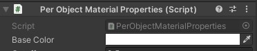

+ 设置每个对象的材质属性是通过 `MaterialPropertyBlock` 对象完成的。我们只需要一个所有 `PerObjectMaterialProperties` 实例都可以重用的对象，所以为他声明一个静态字段。

    ```C#
    static MaterialPropertyBlock block;
    ```

+ 创建一个新的块，如果还没有的话，然后用属性标识符和颜色调用 `SetColor` ，然后通过 `SetPropertyBlock` 将该块应用到游戏对象的 `Renderer` 组件上，从而复制其设置。在 `OnValidate` 中这样做，这样结果会立即显示在编辑器中。

    ```C#
    void OnValidate() {
        if (block == null) {
            block = new MaterialPropertyBlock();
        }
        block.SetColor(baseColorId, baseColor);
        GetComponent<Renderer>().SetPropertyBlock(block);
    }
    ```

+ 我把这个组件添加到 `24` 个任意球体上，并给他们不同的颜色。

    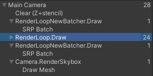

+ 另外， `OnValidate` 在构建中不会被调用。为了使单个颜色出现在那里，我们必须在 `Awake` 中应用他们。我们通过简单地调用 `OnValidate` 来实现。

    ```C#
    void Awake() {
        OnValidate();
    }
    ```

> 2.3 GPU 实例化

+ 还有另一种整合绘制调用的方法，该方法适用于每个对象的材质。他被称为 `GPU` 实例化，通过一次对具有相同网格的多个对象发出单个绘制效用来工作。 `CPU` 收集所有每个对象的变换和材质属性，并将他们放入发送的 `GPU` 的数组中。然后 `GPU` 遍历所有条目并按照他们提供的顺序渲染他们。

+ 因为 `GPU` 实例需要通过数组提供数据，所以我们的着色器目前不支持他。完成这项工作的第一步使在着色器的 `Pass` 块中国的顶点和片段 `pragma` 上方添加 `#pragma multi_compile_instancing` 指令。

    ```Shader
    #pragma multi_compile_instancing
    #pragma vertex UnlitPassVertex
    #pragma fragment UnlitPassFragment
    ```

+ 这将使 `Unity` 生成我们着色器两个变体，一种具有 `GPU` 实例支持，一种不具有 `GPU` 实例支持，材质检查中还出现了一个切换选项，他允许我们选择每种材质使用哪个版本。

    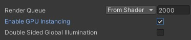

+ 支持 `GPU` 实例化需要改变方法，为此我们必须包含核心着色器库中的 `UnityInstancing.hlsl` 文件。这必须在定义 `UNITY_MATRIX_M` 和其他宏之后以及在包含 `SpaceTransforms.hlsl` 之前完成。

    ```HLSL
    #define UNITY_MATRIX_P glstate_matrix_projection

    #include "Packages/com.unity.render-pipelines.core/ShaderLibrary/UnityInstancing.hlsl"
    #include "Packages/com.unity.render-pipelines.core/ShaderLibrary/SpaceTransforms.hlsl"
    ```

+ `UnityInstancing.hlsl` 所做的是重写定义这些宏以访问实例化数据数组。但要完成这项工作，他需要知道当前正在渲染对象的索引。索引是通过顶点数据提供的，因此我们必须使其可用。 `UnityInstancing.hlsl` 定义了宏来简化此操作，他们假设我们的顶点函数具有 `struct` 参数。

+ 可以声明一个结构，就像 `cbuffer` 一样，并将其用作函数的输入参数。我们还可以在结构中定义语义。这种方法的一个优点使他比长参数列表更加清晰。因此，将 `UnlitPassVertex` 的 `positionOS` 参数包含在一个 `Attributes` 结构中，表示顶点输入数据。

    ```HLSL
    struct Attributes {
        float3 positionOS : POSITION;
    };

    float4 UnlitPassVertex(Attributes input) : SV_POSITION {
        float3 positionWS = TransformObjectToWorld(input.positionOS);
        return TransformWorldToHClip(positionWS);
    }
    ```

+ 当使用 `GPU` 实例化时，对象索引也可用作为顶点属性。我们可以在适当的时候添加它，只需将 `UNITY_VERTEX_INPUT_INSTANCE_ID` 放在 `Attributes` 中。

    ```HLSL
    struct Attributes {
        float3 positionOS : POSITION;
        UNITY_VERTEX_INPUT_INSTANCE_ID
    };
    ```

+ 接下来，添加 `UNITY_SETUP_INSTANCE_ID(input);` 在 `UnlitPassVertex` 的开头。这会从输入中提取索引并将其存储在一个全局静态变量中，其他实例化宏都依赖于此。

    ```HLSL
    float4 UnlitPassVertex (Attributes input) : SV_POSITION {
        UNITY_SETUP_INSTANCE_ID(input);
        float3 positionWS = TransformObjectToWorld(input.positionOS);
        return TransformWorldToHClip(positionWS);
    }
    ```

+ 这足以让 `GPU` 实例化工作，尽管 `SRP batcher` 优先，所以我们现在没有得到想要的结果。但是我们还不支持每个实例的材质数据。为了增加这一点，我们必须在需要时用一个数组引用替换 `_BaseColor` 。这是通过用 `UNITY_INSTANCING_BUFFER_START` 替换 `CBUFFER_START` ，用 `UNITY_INSTANCING_BUFFER_END` 替换 `CBUFFER_END` 来实现的，现在它也需要一个参数。这不需要和开始时一样，但没有令人信服的理由让他们不同。

    ```HLSL
    //CBUFFER_START(UnityPerMaterial)
    //  float4 _BaseColor;
    //CBUFFER_END

    UNITY_INSTANCING_BUFFER_START(UnityPerMaterial)
        float4 _BaseColor;
    UNITY_INSTANCING_BUFFER_END(UnityPerMaterial)
    ```

+ `UNITY_DEFINE_INSTANCED_PROP(float4, _BaseColor)` 替换 `_BaseColor` 的定义。

    ```HLSL
    UNITY_INSTANCING_BUFFER_START(UnityPerMaterial)
        // float4 _BaseColor;
        UNITY_DEFINE_INSTANCED_PROP(float4, _BaseColor)
    UNITY_INSTANCING_BUFFER_END(UnityPerMaterial)
    ```

+ 当使用实例化时，我们现在必须使实例索引在 `UnlitPassFragment` 中可用。为了方便起见，我们将使用一个结构让 `UnlitPassVertex` 同时输出位置和索引，使用 `UNITY_TRANSFER_INSTANCE_ID(input, output);` 在索引存在时复制他。我们像 `Unity` 那样将这个结构命名为 `Varyings` ，因为它包含的数据可以在同一个三角形的片段之间变化。

    ```HLSL
    struct Varyings {
        float4 positionCS : SV_POSITION;
        UNITY_VERTEX_INPUT_INSTANCE_ID
    };

    Varyings UnlitPassVertex(Attributes input) { //: SV_POSITION {
        Varyings output;
        UNITY_SETUP_INSTANCE_ID(input);
        UNITY_TRANSFER_INSTANCE_ID(input, output);
        float3 positionWS = TransformObjectToWorld(input.positionOS);
        output.positionCS = TransformWorldToHClip(positionWS);
        return output;
    }
    ```

+ 将此结构作为参数添加到 `UnlitPassFragment` 。然后像以前一样使用 `UNITY_SETUP_INSTANCE_ID` 来索引可用。现在必须通过 `UNITY_ACCESS_INSTANCED_PROP(UnityPerMaterial, _BaseColor)` 访问材质属性。

    ```HLSL
    float4 UnlitPassFragment (Varyings input) : SV_TARGET {
        UNITY_SETUP_INSTANCE_ID(input);
        return UNITY_ACCESS_INSTANCED_PROP(UnityPerMaterial, _BaseColor);
    }
    ```

    

+ `Unity` 现在能够将 `24` 个球体与每个对象的颜色合并在一起，从而减少了绘制调用的数量。我最终得到了四个实例化的绘制调用，因为这些球体仍然使用其中的四种材质。 `GPU` 实例化仅使用与共享相同材质的对象。当他们覆盖材质颜色时，他们都可以使用相同的材质，这样就可以在一个批次中被绘制。

    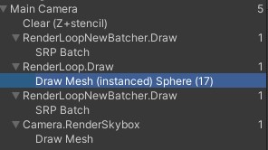

+ 请注意，根据目标平台和每个实例必须提供多少数据，批次大小是有限制的。如果你超过了这个限制，那么你最终会得到不知一批。此外，如果使用多种材质，分类仍任可以分割批次。

> 2.4 绘制更多的网格实例

+ 当数百个对象可以在一次绘制调用中组合起来时， `GPU` 实例化就成为一个显著的优势。但是用手编辑场景中的那么多对象并不实际。所以让我们随机生成一堆。常见一个 `MeshBall` 示例组件，当他调用 Awake 让他缓存 `_BaseColor` 着色器属性，并为网格和材质添加配置选项，这些选项必须支持实例化。

    ```C#
    using UnityEngine;

    public class MeshBall : MonoBehaviour {

        static int baseColorId = Shader.PropertyToID("_BaseColor");

        [SerializeField]
        Mesh mesh = default;

        [SerializeField]
        Material material = default;
    }
    ```

+ 用这个组件创建一个游戏对象。我给了他默认的球体网格。

    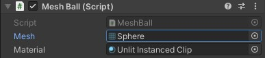

+ 我们可以生成许多新的游戏对象，但我们没有必须要这样做。相反，我们将填充一个变换矩阵和颜色的数组，并告诉 `GPU` 是这些来渲染一个网格。这就是 `GPU` 实例化最有用的地方。我们可以一次性提供多达 `1023` 个实例，所以让我们添加具有这个长度的数组的字段，以及一个我们需要传递颜色数据的 `MaterialPropertyBlock` 。在这种情况下，颜色数组的元素类型必须是 `Vector4` 。

    ```C#
    Matrix4x4[] matrices = new Matrix4x4[1023];
    Vector4[] baseColors = new Vector4[1023];

    MaterialPropertyBlock block;
    ```

+ 创建一个 `Awake` 方法，用半径为 `10` 的随机位置和随机的 `RGB` 颜色数据来填充数组。

    ```C#
    void Awake () {
        for (int i = 0; i < matrices.Length; i++) {
            matrices[i] = Matrix4x4.TRS(
                Random.insideUnitSphere * 10f, Quaternion.identity, Vector3.one
            );
            baseColors[i] =
                new Vector4(Random.value, Random.value, Random.value, 1f);
        }
    }
    ```

+ 在 `Update` 中，我们创建一个新的 `block` ，如果他不存在的话，并对他调用 `SetVectorArray` 来配置颜色。之后调用 `Graphics.DrawMeshInstanced` ，将网格，子网格索引为 `0` 、材质、矩阵、元素数量和属性块作为参数。我们在这里设置 `block` ， 这样 `mesh ball` 就能够支持热重载。

    ```C#
    void Update () {
        if (block == null) {
            block = new MaterialPropertyBlock();
            block.SetVectorArray(baseColorId, baseColors);
        }
        Graphics.DrawMeshInstanced(mesh, 0, material, matrices, 1023, block);
    }
    ```

    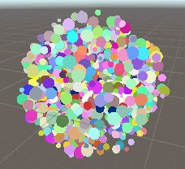

+ 现在进入游戏模式将产生一个密集的用球体围成的球。需要多少次绘制调用取决于平台，因为每次绘制调用的最大缓冲区不同。在我的例子中，他需要三次绘制调用来渲染。

+ 请注意，各个网格时按照我们提供数据的顺序来绘制的，除此之外，没有任何排序或剔除，尽管整个批次处理一旦超出视图范围就会消失。

> 2.5 动态批处理

+ 还有一种减少绘制调用的方法，被称为动态批处理。这是一种古老的技术，他将共享相同材质的多个小网格组成一个较大的网格，然后被绘制。当使用每个对象的材质属性时，这是不可行的。

+ 较大的网格是按需生成的，所以他只对小网格可行。球体太大，但立方体可以使用。要看到他的实际效果，请禁用 `GPU` 实例化，并在 `CameraRenderer.DrawVisibleGeometry` 中设置 `enableDynamicBatching` 为 `true` 。

    ```C#
    var drawingSettings = new DrawingSettings(
                unlitShaderTagId, sortingSettings
            ) {
                enableDynamicBatching = true,
                enableInstancing = false
            };
    ```

+ 同时禁用 `SRP` 批处理，因为他是优先的。

    ```C#
    GraphicsSettings.useScriptableRenderPipelineBatching = false;
    ```

    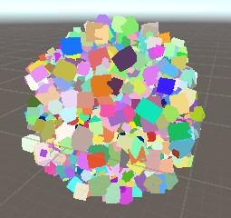

+ 一般来说， `GPU` 实例化比动态批处理效果更好。这种方法也有一些注意事项，例如，当涉及到不同比例时，较大的网格的法向量不能保证是单位长度的。另外，绘制顺序也会发生变化，因为现在是单个网格而不是多个。

+ 还有一种静态合批处理，其工作原理类似，但是会提前标记为静态批处理的对象。除了需要更多的内存和空间之外，他没有任何注意事项。 `RP` 不关心这个，因此使用起来不用过多担心。

> 2.6 配置批处理

+ 哪种方法是最好的，可能会有所不同，所以让我们把他变成可配置。首先，添加布尔参数来控制动态批处理和 `GUI` 实例化是否被用于 `DrawVisibleGeometry` ，而不是硬编码。

    ```C#
    void DrawVisibleGeometry (bool useDynamicBatching, bool useGPUInstancing) {
            var sortingSettings = new SortingSettings(camera) {
                criteria = SortingCriteria.CommonOpaque
            };
            var drawingSettings = new DrawingSettings(
                unlitShaderTagId, sortingSettings
            ) {
                enableDynamicBatching = useDynamicBatching,
                enableInstancing = useGPUInstancing
            };
            
            ...

        }
    ```

+ 渲染器现在必须提供这种配置，然后依靠 `RP` 来提供他。

    ```C#
    public void Render (
            ScriptableRenderContext context, Camera camera,
            bool useDynamicBatching, bool useGPUInstancing
        ) {
            
            ...

            DrawVisibleGeometry(useDynamicBatching, useGPUInstancing);
            
            ...

        }
    ```

+ `CustomRenderPipeline` 将通过字段跟踪选项，在其构造方法中设置，并在 `Render` 中传递他们。同时在构造函数中为 `SRP` 批处理程序添加一个布尔参数，而不总是启用他。

    ```C#
    bool useDynamicBatching, useGPUInstancing;

    public CustomRenderPipeline(
        bool useDynamicBatching, bool useGPUInstancing, bool useSRPBatcher
    ) {
        this.useDynamicBatching = useDynamicBatching;
        this.useGPUInstancing = useGPUInstancing;
        GraphicsSettings.useScriptableRenderPipelineBatching = useGPUBatcher;
    }

    protected override void Render() {
        ScriptableRenderContext context, Camera[] cameras
    } {
        foreach(Camera camera in cameras) {
            renderer.Render(
                context, camera, useDyamicBatching, useGPUInstancing
            );
        }
    }
    ```

+ 最后，将这三个选项作为配置字段添加到 `CustomRenderPipelineAsset` 中，将他们传递给 `CreatePipeline` 的构造函数调用。

    ```C#
    [SerializeField]
    bool useDynamicBatching = true, useGPUInstancing = true, useSRPBatcher = true;

    protected override RenderPipeline CreatePipeline() {
        return new CustomRenderPipeline(useDynamicBatching, useGPUInstancing, useSRPBatcher);
    }
    ```

    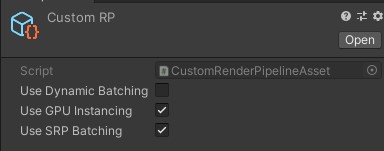

+ 现在可以改变我们的 `RP` 所使用的方法了。切换一个选项将立即生效，因为 `Unity` 编辑器将在检测到资产被修改是创建一个新的 `RP` 实例。

## 3 透明度

+ 我们的着色器可以用于创建不受光照并且不透明材质。我们可以改变颜色的 `alpha` 分量，这通常表示透明度，但目前没有效果。我们也可以将渲染队列设置为透明，但这只能改变物体绘制的时间和顺序，而不能改变绘制方式。

    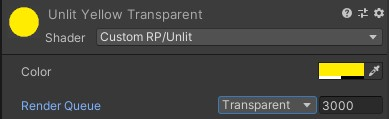

+ 我们不需要写一个单独的着色器来支持透明材质。只要稍加努力，我们的 `Unlit` 着色器就可以同时支持不透明和透明的渲染。

> 3.1 混合模式

+ 不透明和透明渲染的主要区别在于，我们是替换之前绘制的任何东西，还是与之前的结果相结合，产生透明效果。我们可以通过设置源和目标混合模式来控制这一点。这里的源指的事现在被绘制的东西，而目标指的是之前绘制的东西，以及结果最终会在哪里出现。为此添加两个着色器属性。 `_SrcBlend` 和 `_DstBlend` 。他们是混合模式的枚举，但我们可以使用的最好的类型是 `Float` ，默认情况下，源设置为 `1` ，目标设置为 `0` 。

    ```C#
    Properties {
        _BaseColor("Color", Color) = (1.0, 1.0, 1.0, 1.0)
        _SrcBlend("Src Blend", Float) = 1
        _DstBlend("Dst Blend", Float) = 0
    }
    ```

+ 为了使可以更容易编辑，我们可以在属性中添加 `Enum` 属性，用完全限定的 `UnityEngine.Rendering.BlendMode` 枚举类型作为参数。

    ```C#
    [Enum(UnityEngine.Rendering.BlendMode)]_SrcBlend("Src Blend", Float) = 1
    [Enum(UnityEngine.Rendering.BlendMode)]_DstBlend("Dst Blend", Float) = 0
    ```

    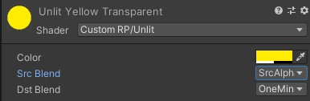

+ 默认值代表我们已经使用的不透明混合配置。来源被设置为 1 ，意味着完全添加，而目标设置为零，表示忽略。

+ 标准透明度的源混合模式是 `SrcAlpha` ，这意味着渲染的颜色的 `RGB` 分量会乘以其 `alpha` 分量。所以 `alpha` 值越低，他就越弱。目标混合模式则被设置为相反的模式。 `OneMinusSrcAlpha` ，得出的总权重为 `1` 。

    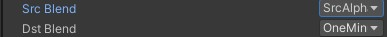

+ 混合模式可以在 `Pass` 块中用 `Blend` 语句定义，后面是两种模式。我们想使用着色器属性，在这里我们可以通过把他们放在方括号里来访问。这是在可编辑渲染管线之前的语法。

    ```C#
    Pass {
        Blend [_SrcBlend] [_DstBlend]

        HLSLPROGRAM
        
        ...

        ENDHLSL
    }
    ```

    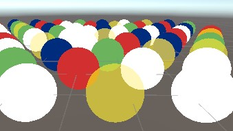

> 3.2 不写入深度

+ 透明渲染通常不向深度缓冲区写入，因为他不会从中受益，甚至可能产生不想要的结果。我们可以通过 `ZWrite` 语句来控制深度是否被写入。我们再次可以使用着色器属性，这次使用 `_ZWrite` 。

    ```C#
    Blend [_SrcBlend] [_DstBlend]
    ZWrite [_ZWrite]
    ```

+ 用一个自定义的 `Enum(Off, 0, On, 1)` 属性来定义着色器属性，以创建一个默认值为 `0` 和 `1` 为开关切换。

    ```C#
    [Enum(UnityEngine.Rendering.BlendMode)]_SrcBlend("Src Blend", Float) = 1
    [Enum(UnityEngine.Rendering.BlendMode)]_DstBlend("Dst Blend", Float) = 0
    [Enum(Off, 0, On, 1)]_ZWrite("Z Write", Float) = 1
    ```

    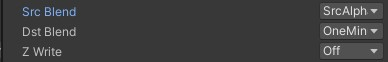

> 3.3 纹理化

+ 之前我们使用 `alpha` 贴图来创建一个非均匀的半透明材质。让我们通过给着色器添加一个 `_BaseMap` 纹理属性来支持他。在这种情况下，类型是 `2D` ，我们将使用 `Unity` 的标准白色纹理作为默认，用 `white` 字符串表示。另外，我们必须用一个空的代码块来结束纹理属性。很久以前，他是用来控制纹理设置的，但今天仍应包括在内，以防止在某种情况下出现奇怪的错误。

    ```Shader
    _BaseMap("Texture", 2D) = "white" {}
    _BaseColor("Color", Color) = (1.0, 1.0, 1.0, 1.0)
    ```

    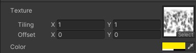

+ 纹理必须被上传到 `GPU` 内存中， `Unity` 为我们做了这个。着色器需要一个相关纹理句柄，我们可以像定义一个 `uniform` 值一样定义这个句柄，只不过我们使用 `TEXTURE2D` 宏，把名称作为一个参数。我们还需要为纹理定义一个纹理采样器状态，考虑到他的 `wrap` 和 `filter` 的模式，控制他应该如何采样，这是用 `SAMPLER` 宏来完成的，就像 `TEXTURE2D` 一样，但名字前加上了 `sampler` 。这与 Unity 自动提供的采样器状态名称一致。

+ 纹理和采样器状态是着色器资源。他们不能被提供给每个实例，必须在全局范围内声明。在 `UnlitPass.hlsl` 中的着色器属性之前做这个。

    ```HLSL
    TEXTURE2D(_BaseMap);
    SAMPLER(sampler_BaseMap);

    UNITY_INSTANCING_BUFFER_START(UnityPerMaterial)
        UNITY_DEFINE_INSTANCED_PROP(float4, _BaseColor)
    UNITY_INSTANCING_BUFFER_END(UnityPerMaterial)
    ```

+ 除此之外， `Unity` 还通过一个 float4 来提供纹理的平铺和偏移，这个 `float4` 的名字与纹理属性相同，但附加了 `_ST` ，他代表缩放和平移。这个属性应该是 `UnityPerMaterial` 缓冲区的一部分，因此可以对每个实例进行设置。

    ```HLSL
    UNITY_INSTANCING_BUFFER_START(UnityPerMaterial)
        UNITY_DEFINE_INSTANCED_PROP(float4, _BaseMap_ST)
        UNITY_DEFINE_INSTANCED_PROP(float4, _BaseColor)
    UNITY_INSTANCING_BUFFER_END(UnityPerMaterial)
    ```

+ 为了对纹理进行采样，我们需要纹理坐标，他是顶点属性的一部分。具体来说，我们需要第一对坐标，因为还可能有更多。这可以通过向 `Attributes` 添加一个具有 `TEXCOORD0` 含义的 `float2` 字段来实现。由于这是我们的基础贴图，二纹理空间的尺寸普遍被命名为 `U` 和 `V` ，我们将其命名为 `baseUV` 。

    ```HLSL
    struct Attributes {
        float3 positionOS : POSITION;
        float2 baseUV : TEXTURE0;
        UNITY_VERTEX_INPUT_INSTANCE_ID
    };
    ```

+ 我们需要将坐标传递给 `fragment` 函数，因为纹理就是在那里被采样的。所以要在 `Varyings` 中添加 `float2 baseUV` 。这一次我们不需要特殊含义，他只是我们传递的数据，不需要 `GPU` 的特别关注。然而，我们仍然要给他附加一些意义。我们可以应用任何不用的标识符，让我们简单地使用 `VAR_BASE_UV` 。

    ```HLSL
    struct Varyings {
        float4 positionCS : SV_POSITION;
        float2 baseUV : VAR_BASE_UV;
        UNITY_VERTEX_INPUT_INSTANCE_ID
    };
    ```

+ 当我们复制 `UnlitPassVertex` 中的坐标时，我们也可以应用存储在 `_BaseMap_ST` 中的比例和偏移。这样我们就可以按照顶点而不是按片段来做。 `scale` 存储在 `XY` ， `offset` 存储在 `ZW` 中，我们可以通过 `swizzle` 属性访问。

    ```HLSL
    Varyings UnlitPassVertex(Attributes input) {

        ...

        float4 baseST = UNITY_ACCESS_INSTANCED_PROP(UnityPerMaterial, _BaseMap_ST);
        output.baseUV = input.baseUV * baseST.xy + baseST.zw;
        return output;
    }
    ```

+ 现在 `UV` 坐标可供 `UnlitPassFragment` 使用，在整个三角形内插值。在这里对纹理进行采样，使用 `SAMPLE_TEXTURE2D` 宏，将纹理、采样器状态和坐标作为参数。最终的颜色通过乘法将纹理和 `uniform` 颜色值结合起来。两个相同大小的向量相乘的结果是所有匹配的分量都被相乘，所以在这种情况下，红色乘以红色，绿色乘以绿色，以此类推。

    ```HLSL
    float4 UnlitPassFragment(Varyings input) : SV_TARGET {
        UNITY_SETUP_INSTANCE_ID(input);
        float4 baseMap = SAMPLE_TEXTURE2D(_BaseMap, sampler_BaseMap, input.baseUV);
        float4 baseColor = UNITY_ACCESS_INSTANCED_PROP(UnityPerMaterial, _BaseColor);
        return baseMap * baseColor;
    }
    ```

    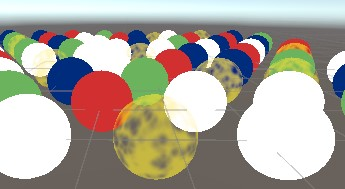

+ 因为我们纹理的 `RGB` 数据是均匀白色的，所以颜色不受影响。但 `alpha` 通道是不同的，所以透明度不再一致。

> 3.4 alpha 裁剪

+ 透明表面的另一种用法是在表面上挖孔。着色器也可以做到这一点，通过丢弃一些他们通常会渲染的碎片。这就产生了坚硬的边缘，而不是我们目前看到的平滑过渡。这种技术被称为 `alpha` 裁剪。做到这一点的通常方式定义一个阈值。 `alpha` 值低于这个阈值的片段将被丢弃其他的则被保留。

+ 添加一个 `_Cutoff` 属性，默认设置为 `0.5` 。由于 `alpha` 总是在 `0` 和 `1` 之间，我们可以使用 `Range(0, 1)` 作为其类型。

    ```Shader
    _BaseColor("Color", Color) = (1.0, 1.0, 1.0, 1.0)
    _Cutoff("Alpha Cutoff", Range(0.0, 1.0)) = 0.5
    ```

+ 把他也添加到 `UnlitPass.hlsl` 的材质属性中。

    ```HLSL
    UNITY_DEFINE_INSTANCED_PROP(float4, _BaseColor)
    UNITY_DEFINE_INSTANCED_PROP(float, _Cutoff)
    ```

+ 我们可以通过调用 `UnlitPassFragment` 中的剪辑函数来丢弃片段。如果我们传递给他的值是零或更少，他就会终止并丢弃这个片段。所以也把最终的 `alpha` 值传递给他（可以通过 `a` 或 `w` 属性访问）减去截止阈值传递给他。

    ```HLSL
    float4 baseMap = SAMPLE_TEXTURE2D(_BaseMap, sampler_BaseMap, input.baseUV);
    float4 baseColor = UNITY_ACCESS_INSTANCED_PROP(UnityPerMaterial, _BaseColor);
    float4 base = baseMap * baseColor;
    clip(base.a - UNITY_ACCESS_INSTANCED_PROP(UnityPerMaterial, _Cutoff));
    return base;
    ```

    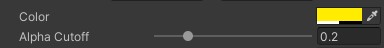

    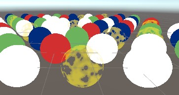

+ 一个材质通常使用透明度混合或者 `alpha` 裁剪，而不是同时使用两者。一个典型的剪辑材质是完全不透明的，除了被丢弃的片段之外，他的却会向深度缓冲区写入数据。他是用 `AlphaTest` 渲染队列，这意味着他在所有完全不透明的对象之后被渲染。之所以这样做，是因为丢弃碎片会使一些 `GPU` 优化变得不可能，因为不能再假设三角形完全覆盖他们后面的物体，他们最终可能会覆盖部分 `alpha-clipped` 物体，这样就不需要梳理他们的隐藏片段了。

    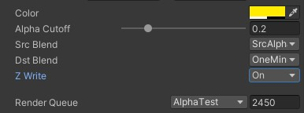

    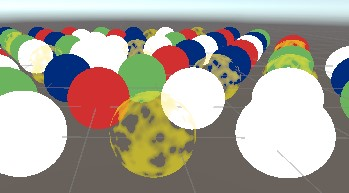

+ 但是，为了使这种优化发挥作用，我们必须确保裁剪只在需要的时候使用。我们将通过添加一个特效切换着色器属性来做到这一点。这是一个默认设置为 `0` 的 `Float` 属性，有一个控制着色器关键字的 `Toggle` 属性，我们将使用 `_CLIPPING` 。属性本身的名字并不重要，所以简单地使用 `_Clipping。`

    ```HLSL
    _Cutoff ("Alpha Cutoff", Range(0.0, 1.0)) = 0.5
    [Toggle(_CLIPPING)] _Clipping ("Alpha Clipping", Float) = 0
    ```

    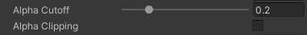

> 3.5 Shader 功能特性

+ 启用该切换键会将 `_CLIPPING` 关键字添加到材料的活动关键字列表中，而被禁用则会将其删除。但这本身并没有什么作用。我们必须告诉 `Unity` 工具关键字是否被定义来编译不同版本的着色器。我们通过在其 `Pass` 中的指令中添加 `#pragma shader_feature _CLIPPING` 来做到这一点。

    ```HLSL
    #pragma shader_feature _CLIPPING
    #pragma multi_compile_instancing
    ```

+ 现在， `Unity` 将编译我们的着色器代码，不管是否定义了 `_CLIPPING` 。他将生成一个或两个变体，这取决于我们如何配置我们的材质。所以我们可以让我们的代码以定义为条件，就像 include 保护一样，但在这种情况下，我们只想在定义了 `_CLIPPING` 的情况下包含裁剪线。我们可以为此使用 `#ifdef _CLIPPING` ，但我更喜欢 `#if defined(_CLIPPING)` 。

    ```HLSL
    #if defined(_CLIPPING)
        clip(base.a - UNITY_ACCESS_INSTANCED_PROP(UnityPerMaterial, _Cutoff));
    #endif
    ```

> 3.6 逐对象裁剪

+ 由于 `cutoff` 是 `UnlitPerMaterial` 缓冲区的一部分。因此可以按实例进行配置。所以让我们把这个功能添加到 `PerObjectMaterialProperties` 中。他与颜色的工作原理相同，只是我们需要在属性块上调用 `SetFloat` 而不是 `SetScale` 。

    ```C#
    static int baseColorId = Shader.PropertyToID("_BaseColor");
    static int cutoffId = Shader.PropertyToID("_Cutoff");

    static MaterialPropertyBlock block;

    [SerializeField]
    Color baseColor = Color.white;

    [SerializeField, Range(0f, 1f)]
    float cutoff = 0.5f;

    ...

    void OnValidate () {
        
        ...

        block.SetColor(baseColorId, baseColor);
        block.SetFloat(cutoffId, cutoff);
        GetComponent<Renderer>().SetPropertyBlock(block);
    }
    ```

    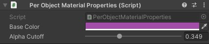

    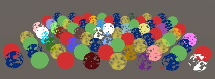

> 3.7 球形 Alpha-Clip 球体

+ MeshBall 的情况也是如此。现在我们可以使用裁剪材质了，但是所有实例最终都具有完全相同的孔。

    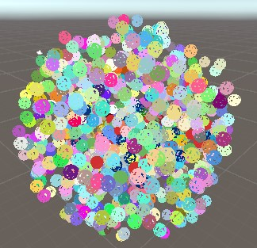

+ 让我们通过给每个实例一个随机的旋转，加上 `0.5-1.5` 范围内的随机统一比例来增加一些变化。但我们不是为了每个实例设置 `cut off` ，而是在 `0.5-1` 范围内改变他们的颜色的 `alpha` 通道。这给了我们不太精确的控制，但无论如何，这是一个随机的例子。

    ```C#
    matrices[i] = Matrix4x4.TRS(
        Random.insideUnitSphere * 10f,
        Quaternion.Euler(
            Random.value * 360f, Random.value * 360f, Random.value * 360f
        ),
        Vector3.one * Random.Range(0.5f, 1.5f)
    );
    baseColors[i] =
        new Vector4(
            Random.value, Random.value, Random.value,
            Random.Range(0.5f, 1f)
        );
    ```

    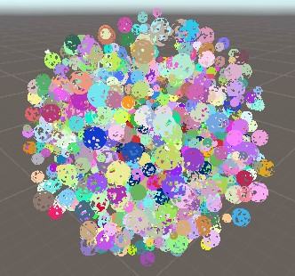

+ 请注意， `Unity` 最终还是向 `GPU` 发送一个数组的 `cut off` 值，每个实例一个，即使他们都是一样的。这个值是材质的副本，所以通过改变这个值，就有可能改变所有球体的孔，尽管他们仍然是不同的。
