# 定向光

## 灯光

+ 如果我们想创建一个更真实的场景，那么我们就必须模拟光线与表面的互动。这就需要一个比我们目前拥有的 `Unlit` 着色器更复杂的着色器。

> 1.1 光照着色器

+ 复制 `UnlitPass` 的 `HLSL` 文件，并将其重命名为 `LitPass` 。调整 `include guard` 定义以及顶点和片段的函数名称，使之相匹配。我们将在后面添加照明计算。

    ```HLSL
    #ifndef CUSTOM_LIT_PASS_INCLUDED
    #define CUSTOM_LIT_PASS_INCLUDED

    ...

    Varyings LitPassVertex (Attributes input) { ... }

    float4 LitPassFragment (Varyings input) : SV_TARGET { ... }

    #endif
    ```

+ 同时复制 `Unlit` 着色器并将其重命名为 `Lit` 。改变它的菜单名称，它所包含的文件，以及它所使用的函数。让我们也把默认染色改为灰色，因为在一个光线充足的场景中，全白的表面会显得非常明亮。通用管线默认也使用灰色。

    ```C#
    Shader "Custom RP/Lit" {

        Properties {
            _BaseMap("Texture", 2D) = "white" {}
            _BaseColor("Color", Color) = (0.5, 0.5, 0.5, 1.0)
            
            ...

        }

        SubShader {
            Pass {
                
                ...

                #pragma vertex LitPassVertex
                #pragma fragment LitPassFragment
                #include "LitPass.hlsl"
                ENDHLSL
            }
        }
    }
    ```

+ 我们将使用一个自定义的照明方法，将通过设置我们的着色器的光照模式为 `CustomLit` 来表示。在 `Pass` 中添加一个 `Tags` 块，包含 `"LightMode" = "CustomLit"` 。

    ```ShaderLab
    Pass {
        Tags {
            "LightMode" = "CustomLit"
        }

        ...
        
    }
    ```

+ 要渲染使用此 `Pass` 的对象，我们必须将其包含在 `CameraRenderer` 中。首先为他添加一个着色器标签标识符。

    ```C#
    static ShaderTagId
        unlitShaderTagId = new ShaderTagId("SRPDefaultUnlit"),
        litShaderTagId = new ShaderTagId("CustomLit");
    ```

+ 然后像我们在 `DrawUnsupportedShaders` 中所做的那样，将其添加到 `DrawVisibleGeometry` 中要渲染的过程。

    ```C#
    var drawingSettings = new DrawingSettings(
        unlitShaderTagId, sortingSettings
    ) {
        enableDynamicBatching = useDynamicBatching,
        enableInstancing = useGPUInstancing
    };
    drawingSettings.SetShaderPassName(1, litShaderTagId);
    ```

+ 现在我们可以创建一个新的不透明的材质，尽管在这一点上它产生的结果和 `Unlit` 材质一样。

    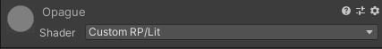

> 1.2 法线向量

+ 一个物体被照亮的程度取决于多种因素，包括光线和表面法线之间的相对角度。要知道表面的方向，我们需要访问表面法线，这是一个单位长度的矢量，指向远离他们的方向。这个向量是顶点数据的一部分，就像位置一样定义在物体空间。所以在 `LitPass` 的 `Attributes` 中添加它。

    ```HLSL
    struct Attributes {
        float3 positionOS : POSITION;
        float3 normalOS : NORMAL;
        float2 baseUV : TEXCOORD0;
        UNITY_VERTEX_INPUT_INSTANCE_ID
    };
    ```

+ 光照是逐片段执行的，所以我们必须把法线向量也加到 `Varyings` 中。我们将在世界空间中进行计算，所以将其命名为 `normalWS` 。

    ```HLSL
    struct Varyings {
        float4 positionCS : SV_POSITION;
        float3 normalWS : VAR_NORMAL;
        float2 baseUV : VAR_BASE_UV;
        UNITY_VERTEX_INPUT_INSTANCE_ID
    };
    ```

+ 我们可以使用 `SpaceTransforms` 中的 `TransformObjectToWorldNormal` 来将 `LitPassVertex` 中的法线转换成世界空间。

    ```HLSL
    float3 positionWS = TransformObjectToWorld(input.positionOS);
    output.positionCS = TransformWorldToHClip(positionWS);
    output.normalWS = TransformObjectToWorldNormal(input.normalOS);
    ```

+ 为了验证我们在 `LitPassFragment` 中得到的法线矢量是否正确，我们可以把他作为一种颜色输出。

    ```HLSL
    base.rgb = input.normalWS;
    return base;
    ```

    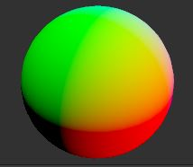

+ 负值不能被视觉化，所以他们被限制为不小于零。

> 1.3 法线插值

+ 尽管法向量在顶点程序中是单位长度的，但跨三角形的线性插值会影响其长度。我们可以通过渲染 `1` 和向量的长度之差，放大十倍以使其更加明显，来直观地看到这个误差。

    ```HLSL
    base.rgb = abs(length(input.normalWS) - 1.0) * 10;
    ```

    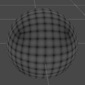

+ 我们可以通过对 `LitPassFragment` 中的法向量进行归一化来平滑插值的失真。当只看法向量时，这种差异其实并不明显，但在用于光照时就比较明显。

    ```HLSL
    base.rgb = normalize(input.normalWS);
    ```

    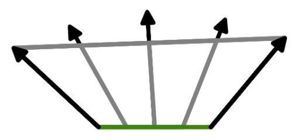

> 1.4 表面属性

+ 着色器中的照明是为了模拟光线与表面的相互作用，这意味着我们必须跟踪表面的属性。现在我们有一个法线矢量和一个基础颜色。我们可以将后者一分为二: `RGB` 颜色和 `alpha` 值。我们将在一些地方使用这些数据，所以让我们定义一个方便的 `Surface` 结构来包含所有相关数据。把他放在 `ShaderLibrary` 文件夹中一个单独的 `Surface.hlsl` 文件中。

    ```HLSL
    #ifndef CUSTOM_SURFACE_INCLUDED
    #define CUSTOM_SURFACE_INCLUDED
    
    struct Surface {
        float3 normal;
        float3 color;
        float alpha;
    };

    #endif
    ```

+ 包括在 `LitPass` 中，在 `Common` 之后。这样我们就可以保持 `LitPass` 的简短。从现在开始，我们将把专门的代码放在自己的 `HLSL` 文件中，以便更容易找到相关功能。

    ```HLSL
    #include "../ShaderLibrary/Common.hlsl"
    #include "../ShaderLibrary/Surface.hlsl"
    ```

+ 在 `LitPassFragment` 中定义一个 `Surface` 变量然后填充它。最终的结果成为 `Surface` 的颜色和 `alpha` 值。

    ```HLSL
    Surface surface;
    surface.normal = normalize(input.normalWS);
    surface.color = base.rgb;
    surface.alpha = base.a;
    
    return float4(surface.color, surface.alpha);
    ```

> 1.5 计算光照

+ 为了计算实际的光照，我们将创建一个 `GetLighting` 函数，它有一个 `Surface` 参数。最初让它返回表面法线的 `Y` 分量。由于这是照明功能，我们将把它放在单独的照明 `HLSL` 文件中。

    ```HLSL
    #ifndef CUSTOM_LIGHTING_INCLUDED
    #define CUSTOM_LIGHTING_INCLUDED

    float3 GetLighting (Surface surface) {
        return surface.normal.y;
    }

    #endif
    ```

+ 把他包括在 `LitPass` 中，在 `Surface` 之后包含它，因为 `Lighting` 依赖于它。

    ```HLSL
    #include "../ShaderLibrary/Surface.hlsl"
    #include "../ShaderLibrary/Lighting.hlsl"
    ```

+ 现在我们可以在 `LitPassFragment` 中获得照明，并将用于片段的 `RGB` 部分。

    ```HLSL
    float3 color = GetLighting(surface);
    return float4(color, surface.alpha);
    ```

    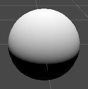

+ 在这一点上，结果是表面法向量的 `Y` 分量，因此它在球体的顶部是 `1` ，在球体的侧面下降到 `0` 。在这之下，结果变成了负数，在底部达到 `-1` . 但我们看不到负值。它与法向量和向上的矢量之间的角度的余弦相匹配。忽略负的部分，这在视觉上与直射向下的定向光的漫反射照明想匹配。点睛之笔是将表面颜色纳入 `GetLighting` 的结果中，将其解释为表面反照率。

    ```HLSL
    float3 GetLighting(Surface surface) {
        return surface.normal.y * surface.color;
    }
    ```

    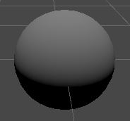

## 2 灯光

+ 为了进行适当的照明，我们还需要了解灯光的属性。在本教程中，我们将只限于定向光。一个定向光代表一个很远的光源，它的位置并不重要，重要的是的方向，这是一种简化，但它足以模拟地球上的太阳光和其他传入的光线或多或少是单向的情况。

> 2.1 灯光结构

+ 我们将使用一个结构来存储灯光数据。现在我们只需要一个颜色和一个方向就够了。把它放在一个单独的 `Light.hlsl` 文件中。同时定义一个 `GetDirectionalLight` 函数，返回一个配置好的方向性灯光。最初使用一个白色的颜色和向上的矢量，与我们目前使用的灯光数据相匹配。注意，灯光的方向因此被定义为灯光的来源方向，而不是它的去向。

    ```HLSL
    #ifndef CUSTOM_LIGHT_INCLUDED
    #define CUSTOM_LIGHT_INCLUDED
    
    struct Light {
        float3 color;
        float3 direction;
    };
    
    Light GetDirectionalLight() {
        Light light;
        light.color = 1.0;
        light.direction = float3(0.0, 1.0, 0.0);
        return light;
    }

    #endif
    ```

+ 在 `Lighting` 之前将文件包含在 `LitPass` 中。

    ```HLSL
    #include "../ShaderLibrary/Light.hlsl"
    #include "../ShaderLibrary/Lighting.hlsl"
    ```

> 2.2 光照函数

+ 在 `Lighting` 中添加一个 `IncomingLight` 函数，计算在给定的表面和光线下有多少入射光。对于一个任意的光线方向，我们必须取表面法线和方向的点积。我们可以使用 `dot` 函数来实现。结果应该是由光的颜色来调控的。

    ```HLSL
    float3 IncomingLight(Surface surface, Light light) {
        return dot(surface.normal, light.direction) * light.color;
    }
    ```

+ 但这是有在表面朝向光线的情况下才是正确的。当点积为负数时，我们必须将其限制为大于零，这一点我们可以通过 `saturate` 函数来实现。

    ```HLSL
    float3 IncomingLight(Surface surface, Light light) {
        return saturate(dot(surface.normal, light.direction)) * light.color;
    }
    ```

+ 添加另一个 `GetLighting` 函数，它返回表面和光的最终照明。现在它是入射光线乘以表面颜色。把它定义在另一个函数的上面。

    ```HLSL
    float3 GetLighting(Surface surface, Light light) {
        return IncomingLight(surface, light) * surface.color;
    }
    ```

+ 最后，调整只有表面参数的 `GetLighting` 函数，使其调用另一个参数，使用 `GetDirectionalLight` 提供光照数据。


    ```HLSL
    float3 GetLighting (Surface surface) {
        return GetLighting(surface, GetDirectionalLight());
    }
    ```


> 2.3 发送灯光数据给 GPU

+ 我们不应该总是使用来自上方的白光，而应该使用当前场景的光线。默认场景由一个代表太阳的定向光，颜色略微偏黄，并且绕 `X` 轴旋转 `50°` ，绕 `Y` 旋转 `-30°` 。如果这样的灯不存在，就创建一个。

+ 为了让灯光的数据能够在着色器中被访问，我们必须为它创建一个 `uniform` 值，就像着色器的属性一样。在这种情况下，我们将定义两个 `float3` 向量。 `_DirectionalLightColor` 和 `_DirectionalLightDirection` 。把它们放在 `Light` 的顶部定义的 `_CustomLight` 缓冲区中。

    ```HLSL
    CBUFFER_START(_CustomLight)
        float3 _DirectionalLightColor;    
        float3 _DirectionalLightDirection;
    CBUFFER_END
    ```

+ 在 `GetDirectionalLight` 中使用这些值而不是常数。

    ```HLSL
    Light GetDirectionalLight() {
        Light light;
        light.color = _DirectionalLightColor;
        light.direction = _DirectionalLightDirection;
        return light;
    }
    ```

+ 现在我们的 `RP` 必须将灯光数据发送到 `GPU` 。我们将为其创建一个新的 `Lighting` 类。它的工作原理与 `CameraRenderer` 类似，但用于灯光。给它一个带有上下文参数的公共 `Setup` 方法，在这个方法中它会调用一个单独的 `SetupDirectionalLight` 方法。虽然不是严格意义上的需要，但我们也给它一个专门的命令缓冲区，在完成后执行，这对调试很方便。另一种方法是添加一个缓冲区参数。

    ```C#
    using UnityEngine;
    using UnityEngine.Rendering;

    public class Lighting {
        const string bufferName = "Lighting";

        CommandBuffer buffer = new CommandBuffer {
            name = bufferName
        };

        public void Setup(ScriptableRenderContext context) {
            buffer.BeginSample(bufferName);
            SetupDirectionalLight();
            buffer.EndSample(bufferName);
            context.ExecuteCommandBuffer(buffer);
            buffer.Clear();
        }

        void SetupDirectionalLight() {}
    }
    ```

+ 跟踪两个着色器属性的标识符。

    ```C#
    static int 
        dirLightColorId = Shader.PropertyToID("_DirectionalLightColor"),
        dirLightDirectionId = Shader.PropertyToID("_DirectionalLightDirection");
    ```

+ 我们可以通过 `RenderSettings.sun` 访问场景的主光源。这可以让我们得到默认的最重要的方向性灯光，也可以通过 `Window/Rendering/Lighting Settings` 明确地配置。使用 `CommandBuffer.SetGlobalVector` 来发送灯光数据到 `GPU` ，颜色是灯光在线性空间中的颜色，而方向是灯光变换的正向向量取反。

    ```C#
    void SetupDirectionalLight() {
        Light light = RenderSettings.sun;
        buffer.SetGlobalVector(dirLightColorId, light.color.linear);
        buffer.SetGlobalVector(dirLightDirectionId, -light.transform.forward);
    }
    ```

+ 灯的颜色属性是其配置的颜色，但灯也有一个单独的强度系数。最终的颜色是二者相乘的。

    ```C#
    buffer.SetGlobalVector(
        dirLightColorId, light.color.linear * light.intensity
    );
    ```

+ 给 `CameraRenderer` 一个 `Lighting` 实例，在绘制可见几何体之前用它来设置照明。

    ```C#
    Lighting lighting = new Lighting();

    public void Render (
        ScriptableRenderContext context, Camera camera,
        bool useDynamicBatching, bool useGPUInstancing
    ) {

        ...

        Setup();
        lighting.Setup(context);
        DrawVisibleGeometry(useDynamicBatching, useGPUInstancing);
        DrawUnsupportedShaders();
        DrawGizmos();
        Submit();
    }
    ```

    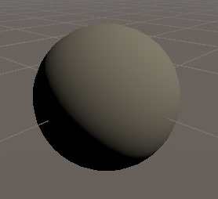

> 2.4 可见光

+ 在剔除时， `Unity` 也会计算出哪些灯光影响摄像机可见的空间。我们可以依靠这些信息而不是全局的灯光。要做到这一点，照明需要访问剔除的结果，所以在 `Setup` 中添加一个参数，并将其存储在一个字段中，以便使用。然后我们可以支持一个以上的灯光，所以用一个新的 `SetupLights` 方法取代 `SetupDirectionalLight` 的调用。

    ```C#
    CullingResults cullingResults;

    public void Setup (
        ScriptableRenderContext context, CullingResults cullingResults
    ) {
        this.cullingResults = cullingResults;
        buffer.BeginSample(bufferName);
        //SetupDirectionalLight();
        SetupLights();

        ...

    }

    void SetupLights () {}
    ```

+ 在 `CameraRenderer.Render` 中调用 `Setup` 时，将裁剪结果作为一个参数加入。

    ```C#
    lighting.Setup(context, cullingResults);
    ```

+ 现在 `Lighting.SetupLights` 可以通过 `culling` 结果的 `visibleLights` 属性来检索所需的数据。它作为 `Unity.Collections.NativeArray` 与 `VisibleLight` 元素类型可用。

    ```C#
    using Unity.Collections;
    using UnityEngine;
    using UnityEngine.Rendering;

    public class Lighting {

        ...

        void SetupLights() {
            NativeArray<VisibleLight> visibleLights = cullingResults.visibleLights;
        }

        ...

    }
    ```

> 2.5 多方向光

+ 使用可见光数据使得支持多个方向灯成为可能，但我们必须将所有这些灯光的数据发送到 `GPU` 。所以我们将使用两个 `Vector4` 数组来代替一堆向量，再加上一个整数来表示灯光数量。我们还将定义一个定向灯光数量，我们可以用它来初始化两个数组字段以缓存数据。让我们把最大数量设置为 `4` 个，这对大多数场景来说应该时足够的。

    ```C#
    const int maxDirLightCount = 4;

    static int
        //dirLightColorId = Shader.PropertyToID("_DirectionalLightColor"),
        //dirLightColorId = Shader.PropertyToID("_DirectionalLightDirection");
        dirLightCountId = Shader.PropertyToID("_DirectionalLightCount"),
        dirLightColorsId = Shader.PropertyToID("_DirectionalLightColors"),
        dirLightDirectionsId = Shader.PropertyToID("_DirectionalLightDirections");
    
    static Vector4[]
        dirLightColors = new Vector4[maxDirLightCount],
        dirLightDirections = new Vector4[maxDirLightCount];
    ```

+ 给 `SetupDirectionalLight` 添加一个 `index` 和 `VisibleLight` 参数。让它用提供的索引来设置颜色和方向元素。在这种情况下，最终的颜色是通过 `VisibleLight.finalColor` 属性提供的。 `forward` 向量可以通过 `VisibleLight.localToWorldMatrix` 属性找到。它是矩阵的第三列，而且必须再取反一次。

    ```C#
    void SetupDirectionalLight(int index, VisibleLight visibleLight) {
        dirLightColors[index] = visibleLight.finalColor;
        dirLightDirections[index] = -visibleLight.localToWorldMatrix.GetColumn(2);
    }
    ```

+ 最后的颜色已经应用了灯光强度，但在默认情况下， `Unity` 不会将其转化为线性空间。我们必须将 `GraphicsSettings.lightsUseLinearIntensity` 设置为 `true` ，我们可以在 `CustomRenderPipeline` 的构造函数中做一次。

    ```C#
    public CustomRenderPipeline(
        bool useDynamicBatching, bool useGPUInstancing, bool useSRPBatcher
    ) {
        this.useDynamicBatching = useDynamicBatching;
        this.useGPUInstancing = useGPUInstancing;
        GraphicsSettings.useScriptableRenderPipelineBatching = useSRPBatcher;
        GraphicsSettings.lightsUseLinearIntensity = true;
    }
    ```

+ 接下来，在 `Lighting.SetupLights` 中循环浏览所有可见的灯光，为每个元素调用 `SetupDirectionalLight` 。然后在 `buffer` 上调用 `SetGlobalInt` 和 `SetGlobalVectorArray` ，将数据发送到 `GPU` 上。

    ```C#
    NativeArray<VisibleLight> visibleLights = cullingResults.visibleLights;
    for (int i = 0; i < visibleLights.Length; i++) {
        VisibleLight visibleLight = visibleLights[i];
        SetupDirectionalLight(i, visibleLight);
    }

    buffer.SetGlobalInt(dirLightCountId, visibleLights.Length);
    buffer.SetGlobalVectorArray(dirLightColorsId, dirLightColors);
    buffer.SetGlobalVectorArray(dirLightDirectionsId, dirLightDirections);
    ```

+ 但是我们最多只能支持 `4` 个定向光，所以当我们达到这个最大值时，我们应该终止循环。让我们把方向灯的索引与循环的迭代器分开跟踪。

    ```C#
    int dirLightCount = 0;
    for (int i = 0; i < visibleLights.Length; i++) {
        VisibleLight visibleLight = visibleLights[i];
        SetupDirectionalLight(dirLightCount++, visibleLight);
        if (dirLightCount >= maxDirLightCount) {
            break;
        }
    }

    buffer.SetGlobalInt(dirLightCountId, dirLightCount);
    ```

+ 因为我们只支持定向光，所以应该忽略其他灯光类型。我们可以通过检查可见光的 `lightType` 属性是否等于 `LightType.Directional` 来做到这一点。

    ```C#
    VisibleLight visibleLight = visibleLights[i];
    if (visibleLight.lightType == LightType.Directional) {
        SetupDirectionalLight(dirLightCount++, visibleLight);
        if (dirLightCount >= maxDirLightCount) {
            break;
        }
    }
    ```

+ 这很有效，但是 `VisibleLight` 结构相当大。理想情况下，我们中从本地数组中检索一次，而不把他作为一个常规参数传递 `SetupDirectionalLight` ，因为那样会复制他。我们可以使用 `Unity` 在 `ScriptableRenderContext.DrawRenderers` 方法中使用同样的技巧，即通过引用传递参数。

    ```C#
    SetupDirectionalLight(dirLightCount++, ref visibleLight);
    ```

+ 这就要求我们把参数也定义为一个引用。

    ```C#
    void SetupDirectionalLight(int index, ref VisibleLight visibleLight) { ... }
    ```

> 2.6 `Shader` 循环

+ 调整 `Light` 中的 `_CustomLight` 缓冲区，使其符合我们新的数据格式。在这种情况下，我们将明确地使用 `float4` 作为数组类型。在着色器中，数组有一个固定的大小。请确保使用我们在 `Lighting` 中定义的最大尺寸。

    ```HLSL
    #define MAX_DIRECTIONAL_LIGHT_COUNT 4

    CBUFFER_START(_CustomLight)
        //float4 _DirectionalLightColor;
        //float4 _DirectionalLightDirection;
        int _DirectionalLightCount;
        float4 _DirectionalLightColors[MAX_DIRECTIONAL_LIGHT_COUNT];
        float4 _DirectionalLightDirections[MAX_DIRECTIONAL_LIGHT_COUNT];
    CBUFFER_END
    ```

+ 增加一个函数来获取方向灯的数量，并调整 `GetDirectionalLight` ，使其检索特定灯光指数的数据。

    ```HLSL
    int GetDirectionalLightCount() {
        return _DirectionalLightCount;
    }

    Light GetDirectionalLight(int index) {
        Light light;
        light.color = _DirectionalLightColors[index].rgb;
        light.direction = _DirectionalLightDirections[index].xyz;
        return light;
    }
    ```

+ 然后为 `Surface` 调整 `GetLight` ，让它使用一个 `for` 循环累计所有方向光的贡献。

    ```C#
    float3 GetLighting(Surface surface) {
        float3 color = 0.0;
        for (int i = 0; i < GetDirectionalLightCount(); i++) {
            color += GetLighting(surface, GetDirectionalLight(i));
        }
        return color;
    }
    ```

    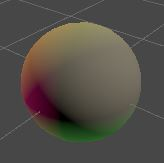

+ 现在我们的着色器最多支持 `4` 个定向光。通常只需要一个方向光表示太阳或者月亮，但也许有一个星球上的场景有多个太阳。定向光可以用来模拟多个大型灯光装置，例如一个大型体育场的灯光装置。

+ 如果你的游戏总是有一个单一的方向光，那么你可以摆脱这个循环，或者制作多个着色器变体。但在本教程中，我们将保持简单，坚持使用一个通用的循环。最好的性能总是通过去掉所有你不需要的东西来实现的，尽管这并不总是有很大的区别。

> 2.7 `Shader` 目标级别

+ 长度可变的循环曾经是着色器的一个问题，但现代的 `GPU` 可以毫无问题地处理它们，尤其是在绘制的所有片段调用以相同方式迭代相同数据时。然而， `OpenGL ES 2.0` 和 `WebGL 1.0` 图形 `API` 默认不能处理这种循环。我们可以通过加入一个硬编码的最大值来使其工作，例如，让 `GetDirectionalLight` 返回 `min(_DirectionalLightCount, MAX_DIRECTIONAL_LIGHT_COUNT)` 。这使得解开循环成为可能，把它变成一串的条件代码块。不幸的是，由此产生的着色器代码是一团糟，而且性能下降的很快。在非常老式的硬件上，所有的代码块都会被执行，它们的贡献可通过条件分配来控制。虽然我们可以让它工作，但它使代码更加复杂，因此我选择忽略这些限制，在构建中关闭对 `WebGL 1.0` 和 `OpenGL ES 2.0` 的支持，以达到简单的目的。反正它们不支持线性照明。我们还可以通过 `#pragma target 3.5` 指令将我们的着色器 `Pass` 的目标级别提高到 `3.5` ，从而避免为它们编译 `OpenGL ES 2.0` 着色器变体。让我们保持一致，对两个着色器都这样做。

    ```Shader
    HLSLPROGRAM
    #pragma target 3.5

    ...

    ENDHLSL
    ```

## 3 `BRDF`

+ 我们目前使用的是一个非常简单的照明模型，只适合完全漫反射表面。我们可以通过应用双向反射函数 `(BRDF)` 来实现更多的变化和真实的照明。有很多这样的函数。我们将使用 `URP` 使用的那个函数，它用一些真实性来换取性能。

> 3.1 入射光

+ 当一束光正面击中一个表面片段时，它的所有能量都会影响这个片段。为了简单起见，我们将假设光束的宽度与片段的宽度一致。这种情况下，光的方向 `L` 和 表面法线 `N` 一致，所以 `N · L = 1` 。当他们不对齐时，至少有一部分光束会错过表面片段，因此较少的能量会影响片段。影响片段的能量部分是 `N · L` 。负的结果意味着该表面的方向远离光线，所以不能受到光线的影响。

    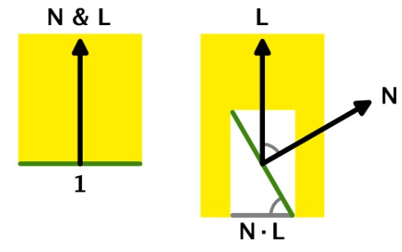

> 3.2 出射光

+ 我们不能直接看到到达表面的光线。我们只看到从表面反弹到相机或我们眼睛的部分。如果这个表面是一面完全平坦的镜子，那么光就会从它上面反射出来，其出射角等于入射角。我们只有在相机对准他的情况下才会看到这种光。这就是所谓的镜面反射。这是对光的相互作用的简化，但足以满足我们的目的。

    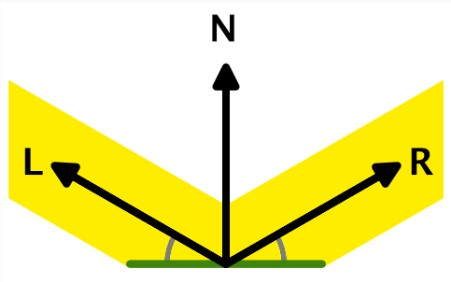

+ 但如果表面不是完全平坦的，那么光就会被散射，因为片段实际上是由许多更小的片段组成的，这些片段有不同的方向。这就把光束分割成不同方向的小光束，这就有效地模糊了镜面反射。我们最终可能会看到一些散射的光，即使没有对准完美的反射方向。

    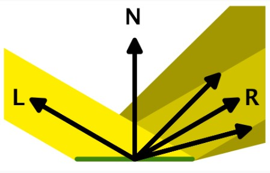

+ 除此之外，光线还会穿透表面，四处反弹，以不同的角度射出，再加上其他我们不需要考虑的事情。极端情况下，我们最终会得到一个完美的漫反射表面，它能将光线均匀地散射到所有可能的方向。这就是我们目前在着色器中计算的照明。

    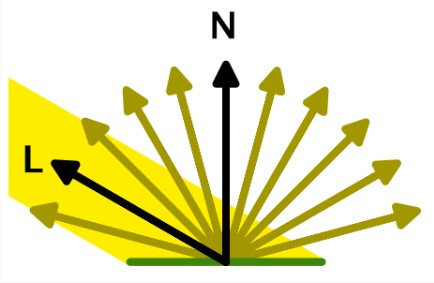

+ 无论相机在哪里，从表面收到的散射光量都是一样的。但这意味着，我们观察到的光能远远小于到达表面片段的量。这表明，我们应该用某个系数来缩放入射光线。然后，由于这个因素总是相同的，我们可以把它烘培到光的颜色和强度中。因此，我们使用的最终光色代表了从正面照亮的完全白色的漫反射表面片段中观察到的光量。这只是实际发出的光总量的极小部分。例如通过指定 `lumen` 或 `lux` ，这使得配置真实的光源更容易，但我们将坚持使用目前的方法。

> 3.3 表面属性

+ 表面可以是完美的漫反射，完美的镜子，或介于两者之间的任何东西。我们有多种方法来控制这一点。我们将使用金属的工作流程，这需要我们在 `Lit shader` 中添加两个表面属性。

+ 第一个属性是表面是金属的还是非金属的，也被称为电介质。因为一个表面可以包含两者的混合，我们将为他添加一个范围为 `0-1` 的滑块， `1` 表示他是全金属的。默认的是全电介质。

    ```C#
    _Metallic("Metallic", Range(0, 1)) = 0
    _Smoothness("Smoothness", Range(0, 1)) = 0.5
    ```

    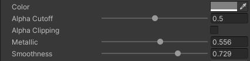

+ 将属性添加到 `UnityPerMaterial` 缓冲区。

    ```HLSL
    UNITY_INSTANCING_BUFFER_START(UnityPerMaterial)
        UNITY_DEFINE_INSTANCED_PROP(float4, _BaseMap_ST)
        UNITY_DEFINE_INSTANCED_PROP(float4, _BaseColor)
        UNITY_DEFINE_INSTANCED_PROP(float, _Cutoff)
        UNITY_DEFINE_INSTANCED_PROP(float, _Metallic)
        UNITY_DEFINE_INSTANCED_PROP(float, _Smoothness)
    UNITY_INSTANCING_BUFFER_END(UnityPerMaterial)
    ```

+ 也对 `Surface` 结构这么做。

    ```HLSL
    struct Surface {
        float3 normal;
        float3 color;
        float alpha;
        float metallic;
        float smoothness;
    };
    ```

+ 把他们赋值到 `LitPassFragment` 中的 `surface` 中。

    ```HLSL
    Surface surface;
    surface.normal = normalize(input.normalWS);
    surface.color = base.rgb;
    surface.alpha = base.a;
    surface.metallic = UNITY_ACCESS_INSTANCED_PROP(UnityPerMaterial, _Metallic);
    surface.smoothness = UNITY_ACCESS_INSTANCED_PROP(UnityPerMaterial, _Smoothness);
    ```

+ 并且在 `PerObjetMaterialProperties` 中添加他们的支持。

    ```C#
    static int
        baseColorId = Shader.PropertyToID("_BaseColor"),
        cutoffId = Shader.PropertyToID("_Cutoff"),
        metallicId = Shader.PropertyToID("_Metallic"),
        smoothnessId = Shader.PropertyToID("_Smoothness");

    ...

    [SerializeField, Range(0f, 1f)]
    float alphaCutoff = 0.5f, metallic = 0f, smoothness = 0.5f;

    ...

    void OnValidate() {

        ...

        block.SetFloat(metallicId, metallic);
        block.SetFloat(smoothnessId, smoothness);
        GetComponent<Renderer>().SetPropertyBlock(block);
    }
    ```

> 3.4 `BRDF` 属性

+ 我们将使用表面属性来计算 `BRDF` 方程。它告诉我们，我们最终会看到多少光从一个表面反射的组合。我们需要将表面的颜色分成漫反射和镜面反射两部分，我们还需要知道表面的粗糙程度。让我们在一个 `BRDF` 结构中跟踪这三个值，放在一个单独的 `BRDF.hlsl` 文件中。

    ```HLSL
    #ifndef CUSTOM_BRDF_INCLUDED
    #define CUSTOM_BRDF_INCLUDED

    struct BRDF {
        float3 diffuse;
        float3 specular;
        float roughness;
    };

    #endif
    ```

+ 添加一个函数来获取一个给定的表面的 `BRDF` 数据。从一个完美的漫反射表面开始，所有漫反射部分等于表面颜色，而镜面为黑色，粗糙度为 `1` 。

    ```HLSL
    BRDF GetBRDF(Surface surface) {
        BRDF brdf;
        brdf.diffuse = surface.color;
        brdf.specular = 0.0;
        brdf.roughness = 1.0;
        return brdf;
    }
    ```

+ 在 `Light` 之后和 `Lighting` 之前包括BRDF。

    ```HLSL
    #include "../ShaderLibrary/Common.hlsl"
    #include "../ShaderLibrary/Surface.hlsl"
    #include "../ShaderLibrary/Light.hlsl"
    #include "../ShaderLibrary/BRDF.hlsl"
    #include "../ShaderLibrary/Lighting.hlsl"
    ```

+ 在两个 `GetLighting` 函数中添加一个 `BRDF` 参数，然后用漫反射部分而不是整个表面的颜色乘以入射光线。

    ```HLSL
    float3 GetLighting(Surface surface, BRDF brdf, Light light) {
        return IncomingLight(surface, light) * brdf.diffuse;
    }

    float3 GetLighting(Surface surface, BRDF brdf) {
        float3 color = 0.0;
        for(int i = 0; i < GetDirectionalLightCount(); i++) {
            color += GetLighting(surface, brdf, GetDirectionalLight(i));
        }
        return color;
    }
    ```

+ 最后，在 `LitPassFragment` 中获得 `BRDF` 数据并将其传递给 `GetLighting` 。

    ```HLSL
    BRDF brdf = GetBRDF(surface);
    float3 color = GetLighting(surface, brdf);
    ```

> 3.5 反射率

+ 表面的反射率是个不相同的，但一般来说，金属通过镜面反射反射所有的光线，漫反射为零。所以我们要声明反射率等于金属表面的属性。被反射的光线不会被漫反射，所以我们应该在 `GetBRDF` 中将漫反射色按 `1` 减去反射率进行缩放。

    ```HLSL
    float oneMinusReflectivity = 1.0 - surface.metallic;

    brdf.diffuse = surface.color * oneMinusReflectivity;
    ```

    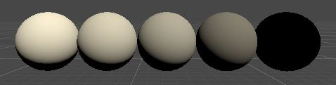
    
    $\color{red}{白色球体， metallic 分别为0,0.25,0.5,0.75,1}$

+ 在现实中，一些光线也会从电介质表面反弹，这使它们有了亮点。非金属的反射率各不相同，但平均来说大约是 `0.04` 。让我们把它定义为最小反射率，并添加一个 `OneMinusReflectivity` 函数，把范围从 `0-1` 调整到 `0-0.96` 。这个范围的调整与 `URP` 的方法相匹配。

    ```HLSL
    #define MIN_REFLECTIVITY 0.04

    float OneMinusReflectivity(float metallic) {
        float range = 1.0 - MIN_REFLECTIVITY;
        return range - metallic * range;
    }
    ```

+ 在 `GetBRDF` 中使用该函数来强制执行最小值。在只渲染漫反射的情况下，这种差距几乎是不明显的，但是当我们加入镜面反射的时候，这种差别就很重要了。没有它，非金属就不会有镜面高光。

    ```HLSL
    float oneMinusReflectivity = OneMinusReflectivity(surface.metallic);
    ```

> 3.6 镜面颜色

+ 被反射到一个方向的光不能同时被反射到另一个方向。这就是所谓的能量守恒，也就是说，流出的光量不能超过流入的光量。这表明，镜面色应该等于表面色减去漫反射色。

    ```HLSL
    brdf.diffuse = surface.color * oneMinusReflectivity;
    brdf.specular = surface.color - brdf.diffuse;
    ```

+ 然而，这忽略了一个事实，即金属会影响镜面反射的颜色，而非金属则不会。电介质表面的镜面颜色应该是白色的，我们可以通过使用金属属性在最小反射率和表面颜色之间进行插值来实现。

    ```HLSL
    brdf.specular = lerp(MIN_REFLECTIVITY, surface.color, surface.metallic);
    ```

> 3.7 粗糙度

+ 粗糙度与光滑相反，所以我们可以简单地用 `1` 减去平滑度。 `Core RP` 库有一个函数可以做到这一点，名为 `PerceptualSmoothnessToPerceptualRoughness` 。我们将使用这个函数，明确光滑度，因此也包括粗糙度被定义为可感知的。我们可以通过 `PerceptualRoughnessToRoughness` 函数转化为实际的粗糙值，该函数将感知值平方。这与迪斯尼的照明模型相匹配。之所以这样做，是因为在编辑材质时，调整感知版本更直观。

    ```HLSL
    float perceptualRoughness = PerceptualSmoothnessToPerceptualRoughness(surface.smoothness);
    brdf.roughness = PerceptualRoughnessToRoughness(perceptualRoughness);
    ```

+ 这些函数被定义在 `Core RP Libary` 的 `CommonMaterial.hlsl` 文件中。在包括的 `Common` 之后，将其包含在我们的 `Common` 文件中。

    ```HLSL
    #include "Packages/com.unity.render-pipelines.core/ShaderLibrary/Common.hlsl"
    #include "Packages/com.unity.render-pipelines.core/ShaderLibrary/CommonMaterial.hlsl"
    #include "UnityInput.hlsl"
    ```

> 3.8 视角方向

+ 为了确定摄像机与完美反射方向的对齐程度，我们需要知道摄像机的位置。 `Unity` 通过 `float3 _WorldSpaceCameraPos` 提供了这个数据，所以把它添加到 `UnityInput` 。

    ```HLSL
    float3 _WorldSpaceCameraPos;
    ```

+ 为了在 `LitPassFragment` 中获得视图方向（从表面到摄像机的方向），我们需要在 `Varyings` 中加入世界空间的表面位置。

    ```HLSL
    struct Varyings {
        float4 positionCS : SV_POSITION;
        float3 positionWS : VAR_POSITION;

        ...

    };

    Varyings LitPassVertex(Attributes input) {
        
        ...

        output.positionWS = TransformObjectToWorld(input.positionOS);
        output.positionCS = TransformWorldToHClip(output.positionWS);

        ...

    }
    ```

+ 我们会认为视图方向是 `Surface` 数据的一部分，所以把他添加到 `Surface` 中。

    ```HLSL
    struct Surface {
        float3 normal;
        float3 viewDirection;
        float3 color;
        float3 alpha;
        float3 metallic;
        float3 smoothness;
    };
    ```

+ 在 `LitPassFragment` 中指定他。他等于摄像机的位置减去片段的位置，经过标准化处理。

    ```HLSL
    surface.normal = normalize(input.normalWS);
    surface.viewDirection = normalize(_WorldSpaceCameraPos - input.positionWS);
    ```

> 3.9 镜面强度

+ 我们观察到镜面反射的强度取决于我们的视角方向与完美反射方向的匹配程度。我们将使用与 `URP` 相同的公式，它是 `Minimalist CookTorrance BRDF` 的一个变种。这个公式包含一些方块，所以我们先给 `Common` 添加一个方便的 `Square` 函数。

    ```HLSL
    float Square(float v) {
        return v * v;
    }
    ```

+ 然后在 `BRDF` 中添加一个 `SpecularStrength` 函数，以 `Surface` 、 `BRDF` 和 `Light` 为参数。它应该计算出 $\cfrac {r^2}{d^2*max(0.1, (L · H)^2)*n}$ ，其中 `r` 是粗糙度，所以点积都应是饱和的。此外，$d=(N · H)^2*(r^2-1)+1.00001$ ， `N` 是表面法线， `L` 是光的方向，而 $H=L+V$ 然后归一化。这是在光和视线方向之间的中间矢量。使用 `SafeNormalize` 函数对该向量进行归一化处理，以避免在向量相反的情况下被零除。最后 $n=4r+2$ ，是一个归一化项。

    ```HLSL
    float SpecularStrength(Surface surface, BRDF brdf, Light light) {
        float3 h = SafeNormalize(light.direction + surface.viewDirection);
        float nh2 = Square(saturate(dot(surface.normal, h)));
        float lh2 = Square(saturate(dot(light.direction, h)));
        float r2 = Square(brdf.roughness);
        float d2 = Square(nh2 * (r2 - 1.0) + 1.00001);
        float normalization = brdf.roughness * 4 + 2.0;
        return r2 / (d2 * max(0.1, lh2) * normalization);
    }
    ```

+ 接下来，添加一个 `DirectBRDF` ，通过给定一个 `Surface` 、 `BRDF` 和 `Light` ，返回通过直接照明获得的颜色。其结果是有镜面强度调制的镜面颜色，加上漫反射颜色。

    ```HLSL
    float3 DirectBRDF(Surface surface, BRDF brdf, Light light) {
        return SpecularStrength(surface, brdf, light) * brdf.specular + brdf.diffuse;
    }
    ```

+ 然后 `GetLighting` 必须用该函数的结果乘以传入的光线。

    ```HLSL
    float3 GetLighting(Surface surface, BRDF brdf, Light light) {
        return SpecularStrength(surface, brdf, light) * DirectBRDF(surface, brdf, light);
    }
    ```

    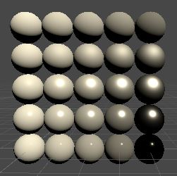

+ 我们现在得到了镜面反射，它为我们的表面增加了高光。对与完全粗糙的表面，高光是模仿漫反射。比较光滑的表面会有一个更集中的高光。一个无限小的亮点，我们看不到。需要一些散射来使其可见。

+ 由于能量守恒，对于光滑的表面来说，高光部分可以变得非常明亮，因为大部分到达表面片段的光线被聚焦。因此，我们最种看到的光线要比高光部分的漫反射所能达到的多得多。你可以通过大量缩小最终渲染的颜色来验证这一点。

    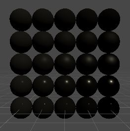

+ 你也可以通过使用白色以外的底色来验证，金属会影响镜面反射的颜色，而非金属则不会。

    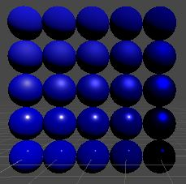

+ 我们现在有功能性的直接照明，是可信的，尽管目前的结果是太暗了（特别是对于金属来说），因为我们还不支持环境反射。在这一点上，一个统一的黑色环境会比默认的天空盒更真实，但这使我们的物体更难看。添加更多的灯光也使如此。

    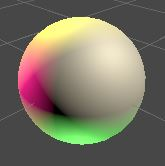

> 3.10 `Mesh Ball`

+ 让我们也为 `MeshBall` 添加对不同金属性和平滑度属性的支持。这需要添加两个浮动数组。

    ```C#
    static int
        baseColorId = Shader.PropertyToID("_BaseColor"),
        metallicId = Shader.PropertyToID("_Metallic"),
        smoothnessId = Shader.PropertyToID("_Smoothness");

    ...

    float[]
        metallic = new float[1023],
        smoothness = new float[1023];

    ...

    void Update() {
        if (block == null) {
            block = new MaterialPropertyBlock();
            block.SetVectorArray(baseColorId, baseColors);
            block.SetFloatArray(metallicId, metallic);
            block.SetFloatArray(smoothnessId, smoothness);
        }
        Graphics.DrawMeshInstanced(mesh, 0, material, matrices, 1023, block);
    }
    ```

+ 让我们把 `25%` 的实例变成金属的，并把 `Awake` 中的平滑度从 `0.05` 变化到 `0.95` 。

    ```C#
    baseColors[i] = new Vector4(
        Random.value, Random.value, Random.value,
        Random.Range(0.5f, 1f)
    );
    metallic[i] = Random.value < 0.25f ? 1f : 0f;
    smoothness[i] = Random.Range(0.05f, 0.95f);
    ```

+ 然后让 `MeshBall` 使用 `Lit` 材质。

    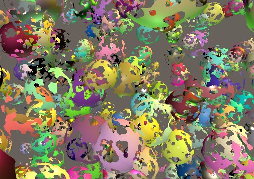

## 4 透明度

+ 让我们再次考虑透明度。物体仍然是根据它们的 `alpha` 值淡入，但现在是反射的光就消失了。这对漫反射来说是有意义的，因为只有部分光线被反射，而其余的光线则穿过表面。

    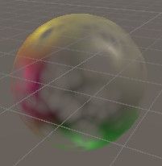

+ 然而，镜面反射也会逐渐消失。在一个完全透明的玻璃中，光线要么通过，要么被反射。镜面反射不会消失。我们不能用目前我们的方法来呈现这一点。

> 4.1 预乘 Alpha

+ 解决方案是只淡化漫反射光，而保持镜面反射的全部强度。由于源混合模式适用于我们无法使用的所有内容，所以让我们把它设置为 `1` ，同时仍然使用目标混合模式的 `1` 减去源 `alpha` 。

    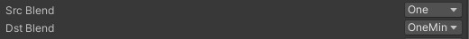

    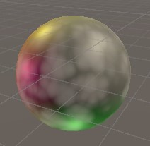

+ 这就恢复了镜面反射，但漫反射不再消退了。我们通过将表面的 `alpha` 系数计入漫反射颜色来解决这个问题。因此，我们将漫反射预乘以 `alpha` ，而不是依靠 `GPU` 后期的混合。这种方法被称为预乘 `alpha` 混合。在 `GetBRDF` 中这样做。

    ```HLSL
    brdf.diffuse = surface.color * oneMinusReflectivity;
    brdf.diffuse *= surface.alpha;
    ```

    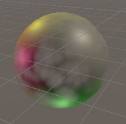

> 4.2 预乘切换

+ 用漫反射预乘 `alpha` 可以有效地将物体变成玻璃，而普通的 `alpha` 混合则使物体只有效地部分存在。让我们支持两者方法，在 `GetBRDF` 中添加一个布尔参数来控制我们是否对 `alpha` 进行预乘，默认设置为 `false` 。

    ```HLSL
    BRDF GetBRDF(inout Surface surface, bool applyAlphaToDiffuse = false) {

        ...

        if (applyAlphaToDiffuse) {
            brdf.diffuse *= surface.alpha;
        }

        ...

    }
    ```

+ 我们可以使用 `_PREMULTIPLY_ALPHA` 关键字来决定在 `LitPassFragment` 中使用那种方式，类似于我们控制 `alpha` 剪切的方式。

    ```HLSL
    #if defined(_PREMULTIPLY_ALPHA)
        BRDF brdf = GetBRDF(surface, true);
    #else
        BRDF brdf = GetBRDF(surface);
    #endif
    float3 color = GetLighting(surface, brdf);
    return float4(color, surface.alpha);
    ```

+ 在 `Lit Pass` 中添加关键词的着色器功能。

    ```C#
    #pragma shader_feature _CLIPPING
    #pragma shader_feature _PREMULTIPLY_ALPHA
    ```

+ 并给着色器也添加一个切换属性。

    ```C#
    [Toggle(_PREMULTIPLY_ALPHA)]_PremulAlpha("Premultiply Alpha", Float) = 0
    ```

    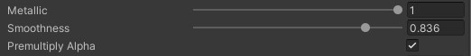

## 5 Shader GUI

+ 我们现在支持多种渲染模式，每种模式都需要特定的设置。为了方便在不同的模式之间进行切换，让我们在材质检视面板中添加一些按钮来应用预设的配置。

> 5.1 自定义 `Shader GUI`

+ 在 `Lit shader` 的主块中添加一个 `CustomEditor "CustomShaderGUI"` 语句。

    ```Shader
    Shader "Custom RP/Lit" {

        ...

        CustomEditor "CustomShaderGUI"
    }
    ```

+ 这将指示 `Unity` 编辑器使用 `CustomShaderGUI` 类的一个实例来绘制使用 `Lit` 着色器的材质的监视面板。为该类创建一个脚本资产，并把它放在一个新的 `Custom RP/Editor` 文件夹中。

    ```C#
    using UnityEditor;
    using UnityEngine;
    using UnityEngine.Rendering;

    public class CustomShaderGUI : ShaderGUI {
        public override void OnGUI(
            MaterialEditor materialEditor, MaterialProperty[] properties
        ) {
            base.OnGUI(materialEditor, properties);
        }
    }
    ```

> 5.2 设置属性和关键字

+ 为了完成我们的工作，我们需要访问三样东西，我们将把它们存储在字段中。首先是材质编辑器，它是负责显示和编辑材质的底层编辑器对象。第二是对正在编辑的材质的引用，我们可以通过编辑器的 `target` 属性来索引。它被定义为一个对象数组，因为 `target` 是通过编辑器类的一个属性。第三是可以被编辑的属性数组。

    ```C#
    MaterialEditor editor;
    Object[] materials;
    MaterialProperty[] properties;

    public override void OnGUI (
        MaterialEditor materialEditor, MaterialProperty[] properties
    ) {
        base.OnGUI(materialEditor, properties);
        editor = materialEditor;
        materials = materialEditor.targets;
        this.properties = properties;
    }
    ```

+ 要设置一个属性，我们首先要在数组中找到它，为此我们可以使用 `ShaderGUI.FindProperty` 方法，传给它一个名称和属性数组。然后我们可以调整为它的值，通过赋值给它的 `floatValue` 属性。将其封装在一个方便的 `SetProperty` 方法中，该方法有一个名称和一个值参数。

    ```C#
    void SetProperty(string name, float value) {
        FindProperty(name, properties).floatValue = value;
    }
    ```

+ 设置一个关键词的过程比较复杂。我们将为此创建一个 `SetKeyword` 方法，它有一个名称和一个布尔参数，用于只是该关键字是应该被启用或禁用。我们必须在所有的材质上调用 `EnableKeyword` 或 `DisableKeyword` ，把关键词的名字传给他们。

    ```C#
    void SetKeyword(string keyword, bool enabled) {
        if (enabled) {
            foreach(Material m in materials) {
                m.EnableKeyword(keyword);
            }
        }
        else {
            foreach(Material m in materials) {
                m.DisableKeyword(keyword);
            }
        }
    }
    ```

+ 让我们也创建一个 `SetProperty` 的变体，来切换一个属性。

    ```C#
    void SetProperty (string name, string keyword, bool value) {
        SetProperty(name, value ? 1f : 0f);
        SetKeyword(keyword, value);
    }
    ```

+ 现在我们可以定义简单的 `Clipping` ， `PremultiplyAlpha` ， `SrcBlend` ， `DstBlend` 和 `ZWrite` 设置器属性。

    ```C#
    bool Clipping {
        set => SetProperty("_Clipping", "_CLIPPING", value);
    }

    bool PremultiplyAlpha {
        set => SetProperty("_PremulAlpha", "_PREMULTIPLY_ALPHA", value);
    }

    BlendMode SrcBlend {
        set => SetProperty("_SrcBlend", (float)value);
    }

    BlendMode DstBlend {
        set => SetProperty("_DstBlend", (float)value);
    }

    bool ZWrite {
        set => SetProperty("_ZWrite", value ? 1f : 0f);
    }
    ```

+ 最后，通过分配给所有材质的 `RenderQueue` 属性来设置渲染队列。我们可以为此使用 `RenderQueue` 枚举。

    ```C#
    RenderQueue RenderQueue {
        set {
            foreach(Material m in materials) {
                m.renderQueue = (int)value;
            }
        }
    }
    ```

> 5.3 预设按钮

+ 一个按钮可以通过 `GUILayout.Button` 方式被创建，传递给它一个标签，这将是一个预设的名字。如果该方法返回 `true` ，那么它就被按下了。在应用预设之前，我们应该在编辑器中注册一个撤销步骤，这可以通过调用 `RegisterPropertyChangedUndo` 来完成。因为这断代码对所有的预设都是一样的，所以把它放在一个 `PresetBuffon` 方法中，该方法返回预设是否应该被应用。

    ```C#
    bool PresetButton(string name) {
        if (GUILayout.Button(name)) {
            editor.RegisterPropertyChangeUndo(name);
            return true;
        }
        return false;
    }
    ```

+ 我们将为每个预设创建一个单独的方法，从默认的不透明模式开始。让它在激活时适当地设置属性。

    ```C#
    void OpaquePreset() {
        if (PresetButton("Opaque")) {
            Clipping = false;
            PremultiplyAlpha = false;
            SrcBlend = BlendMode.One;
            DstBlend = BlendMode.Zero;
            ZWrite = true;
            RenderQueue = RenderQueue.Geometry;
        }
    }
    ```

+ 第二个预设是 `Clip` ，它是 `Opaque` 的一个副本，开启了裁剪功能，队列设置为 `AlphaTest` 。

    ```C#
    void ClipPreset () {
        if (PresetButton("Clip")) {
            Clipping = true;
            PremultiplyAlpha = false;
            SrcBlend = BlendMode.One;
            DstBlend = BlendMode.Zero;
            ZWrite = true;
            RenderQueue = RenderQueue.AlphaTest;
        }
    }
    ```

+ 第三个预设是用于标准的透明度，它淡化了物体，所以我们将他命名为 `Fade` 。它是 `Opaque` 的另一个副本，有调整过的混合模式和队列，另外没有深度写入。

    ```C#
    void FadePreset () {
        if (PresetButton("Fade")) {
            Clipping = false;
            PremultiplyAlpha = false;
            SrcBlend = BlendMode.SrcAlpha;
            DstBlend = BlendMode.OneMinusSrcAlpha;
            ZWrite = false;
            RenderQueue = RenderQueue.Transparent;
        }
    }
    ```

+ 第四个预设是 `Fade` 的一个变体，它应用了预乘的 `alpha` 混合。我们将它命名为 `Transparent` ，因为它适用于具有正确照明的半透明表面。

    ```C#
    void TransparentPreset () {
        if (PresetButton("Transparent")) {
            Clipping = false;
            PremultiplyAlpha = true;
            SrcBlend = BlendMode.One;
            DstBlend = BlendMode.OneMinusSrcAlpha;
            ZWrite = false;
            RenderQueue = RenderQueue.Transparent;
        }
    }
    ```

+ 在 `OnGUI` 的结尾处调用预设方法，这样它们就会显示在默认的检视面板下面。

    ```C#
    public override void OnGIO(
        MaterialEditor materialEditor, MaterialProperty[] properties
    ) {

        ...

        OpaquePreset();
        ClipPreset();
        FadePreset();
        TransparentPreset();
    }
    ```

    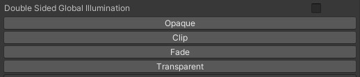

+ 预设按钮不会被经常使用，所以让我们把它们放在一个默认为折叠的折线内。这是通过调用 `EditorGUILayout.Foldout` 与当前的折叠状态，标签和表示点击应该切换器状态的 `true` 来实现的。它返回新的折叠状态，我们应该将其存储在一个字段中。只有折线图打开时才会显示按钮。

    ```C#
    bool showPresets;

    ...

    public override void OnGUI (
        MaterialEditor materialEditor, MaterialProperty[] properties
    ) {
        …

        EditorGUILayout.Space();
        showPresets = EditorGUILayout.Foldout(showPresets, "Presets", true);
        if (showPresets) {
            OpaquePreset();
            ClipPreset();
            FadePreset();
            TransparentPreset();
        }
    }
    ```

    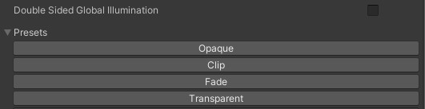

> 5.4 `Unlit` 预设

+ 我们也可以使用自定义的着色器 `GUI` 来实现我们 `Unlit shader` 。

    ```Shader
    Shader "Custom RP/Unlit" {

        ...

        CustomEditor "CustomShaderGUI"
    }
    ```

+ 然而，激活一个预设将导致一个错误，因为我们视图设置一个着色器不具备的属性。我们可以勇敢调整 `SetProperty` 来防止这种情况。让他在调用 `FindProperty` 来防止这种情况。让它在调整 `FindProperty` 时使用 `false` 作为附加参数，表示如果没有找到该属性将是 `null` ，所以只有在这种情况下才设置值。同时返回该属性是否存在。

    ```C#
    bool SetProperty (string name, float value) {
        MaterialProperty property = FindProperty(name, properties, false);
        if (property != null) {
            property.floatValue = value;
            return true;
        }
        return false;
    }
    ```

+ 然后调整 `SetProperty` 的关键字版本，以便它只在相关属性存在的情况下设置关键字。

    ```C#
    void SetProperty (string name, string keyword, bool value) {
        if (SetProperty(name, value ? 1f : 0f)) {
            SetKeyword(keyword, value);
        }
    }
    ```

> 5.5 不透明

+ 现在，预设也适用于使用无光照度的材质，尽管透明模式在这种情况下没有什么意义，因为相关的属性并不存在。让我们在不想管的时候隐藏这个预设。

+ 首先，添加一个 `HasProperty` 方法，返回一个属性是否存在。

    ```C#
    bool HasProperty (string name) =>
        FindProperty(name, properties, false) != null;
    ```

+ 第二，创建一个方便的属性来检查 `_PremultiplyAlpha` 是否存在。

    ```C#
    bool HasPremultiplyAlpha => HasProperty("_PremulAlpha");
    ```

+ 最后，通过在 `TransparentPreset` 中首先检查它，使透明预设的一切都以该属性为条件。

    ```C#
    if (HasPremultiplyAlpha && PresetButton("Transparent")) { ... }
    ```

    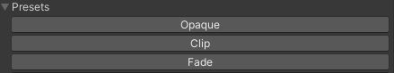