# 方向阴影

## 1 渲染阴影

+ 当绘制某些东西时，表面和光线的信息就足以计算出照明。但两者之间可能有什么东西挡住了光线，在我们绘制的表面上投下了阴影。为了使阴影成为可能，我们必须以某种方式让着色器知道投射阴影对象。这方面有多种技术。最常见的方法是生成一个阴影贴图，该帖图存储光在到达表面之前可以从光源传播多远。在同一方向上更远的东西不能被同样的光照亮。 `Unity` 的 `RP` 使用这种方法，我们也会这样做。

> 1.1 阴影设置

+ 在我们开始渲染阴影之前，我们首先要做一些关于质量的决定，具体到我们要渲染多远的阴影以及阴影贴图的大小。

+ 虽然我们可以在相机能看到的范围内渲染阴影，但这需要大量的绘制和非常大的地图来充分覆盖该区域，这几乎是不现实的。所以我们将为阴影引入一个最大距离，最小值为 `0` 默认设置为 `100` 单位。创建一个新的可序列化的 `ShadowSettings` 类来包含这个选项。这个类纯粹是一个配置选项的容器，所以我们将给他一个公共的 `maxDistance` 字段。

    ```C#
    using UnityEngine;

    [System.Serialization]
    public class ShadowSettings {
        
        [Min(0f)]
        public float maxDistance = 100f;
    }
    ```

+ 对于贴图大小，我们将引入一个嵌套在 `ShadowSettings` 中的 `TextureSize` 枚举类型。用他来定义允许的纹理大小，所有的纹理都是 `256-8192` 范围内的 `2` 次方。

    ```C#
    public enum TextureSize {
        _256 = 256,
        _512 = 512,
        _1024 = 1024,
        _2048 = 2048,
        _4096 = 4096,
        _8192 = 8192,
    }
    ```

+ 然后为阴影贴图添加一个大小字段，将 `1024` 作为默认值。我们将使用一个纹理来包含多个阴影贴图，所以将其命名为 `atlasSize` 。由于我们现在只支持定向光，所以在这一点上我们也使用方向性的阴影贴图。但是我们在未来会支持其他的灯光类型，这些灯光会有自己的阴影设置。所以把 `atlasSize` 放在一个内部的 `Directional` 结构中。这样我们就能在检视面板中自动得到一个分层设置。

    ```C#
    [System.Serializable]
    public struct Directional {
        
        public TextureSize atlasSize;
    }

    public Directional directional = new Directional {
        atlasSize = TextureSize._1024
    };
    ```

+ 为 `CustomRenderPipelineAsset` 添加一个阴影设置的字段。

    ```C#
    [SerializeField]
    ShadowSettings shadows = default;
    ```

    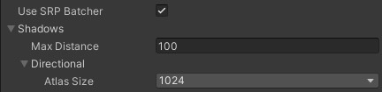

+ 当 `CustomRenderPipeline` 实例被构建时，将这些设置传递给他。

    ```C#
    protected override RenderPipeline() {
        return new CustomRenderPipeline(
            useDynamicBatching, useGPUInstancing, useSRPBatcher, shadows
        );
    }
    ```

+ 并使其保持对他们的跟踪。

    ```C#
    ShadowSettings shadowSettings;

    public CustomRenderPipeline(
        bool useDynamicBatching, bool useGPUInstancing, bool useSRPBatcher, ShadowSettings shadows 
    ) {
        this.shadowSettings = shadowSettings;
        
        ...

    }
    ```

+ 1.2 透传设置

+ 从现在开始，我们将在调用像机渲染器的 `Render` 方法时将这些设置传递给他。这样一来，添加对运行时更改阴影设置的支持就会很容易，但在本教程中我们不会处理这个问题。

    ```C#
    protected override void Render(
        ScriptableRenderContext context, Camera[] cameras
    ) {
        foreach(Camera camera in cameras) {
            renderer,Render(
                context, camera, useDynamicBatching, useGPUInstancing, shadowSettings
            );
        }
    }
    ```

+ 然后将 `CameraRenderer.Render` 传递给 `Lighting.Setup` ，也传递给他自己的 Cull 方法。

    ```C#
    public void Render(
        ScriptableRenderContext context, Camera camera, bool useDynamicBatching, bool useGPUInstancing, ShadowSettings shadowSettings
    ) {

        ...

        if (!Cull(shadowSettings.maxDistance)) {
            return;
        }

        Setup();
        lighting.Setup(context, cullingResults, shadowSettings);

        ...

    }
    ```

+ 我们需要 `Cull` 中的设置，因为阴影距离是通过剔除参数设置的。

    ```C#
    bool Cull(float maxShadowDistance) {
        if (camera.TryGetCullingParameters(out ScriptableCullingParameters p)) {
            p.shadowDistance = maxShadowDistance;
            cullingResults = context.Cull(ref p);
            return true;
        }
        return false;
    }
    ```

+ 渲染比摄像机所能看到更远的阴影是没有意义的，所以要取最大阴影距离和摄像机的远平面中的最小值。

    ```C#
    p.shadowDistance = Mathf.Min(maxShadowDistance, camera.farClipPlane);
    ```

+ 为了使代码能够编译，我们还必须为 `Lighting.Setup` 添加一个阴影设置的参数，但我们现在还不会对他们做任何处理。

    ```C#
    public void Setup(
        ScriptableRenderContext context, CullingResults cullingResults, ShadowSettings shadowSettings
    ) { ... }
    ```

> 1.3 阴影类

+ 虽然阴影在逻辑上是光照的一部分，但他们相当复杂，所以我们创建一个新的阴影类来专门处理他们。他开始时是 `Lighting` 的一个精简的存根副本，有自己的缓存区，上下文字段，剔除结果和设置，一个初始化字段的 `Setup` 方法和一个 `ExecuteBuffer` 方法。

    ```C#
    using UnityEngine;
    using UnityEngine.Rendering;

    public class Shadows {
        
        const string bufferName = "Shadows";

        CommandBuffer buffer = new CommonBuffer {
            name = bufferName
        };
    
        ScriptableRenderContext context;

        CullingResults cullingResults;

        ShadowSettings settings;

        public void Setup(
            ScriptableRenderContext context, CullingResults cullingResults, ShadowSettings settings
        ) {
            this.context = context;
            this.cullingResults = cullingResults;
            this.settings = settings;
        }

        void ExecuteBuffer() {
            context.ExecuteCommandBuffer(buffer);
            buffer.Clear();
        }
    }
    ```

+ 那么 `Lighting` 需要做的就是跟踪 `Shadow` 实例，并在自己的 `Setup` 方法中的 `SetupLights` 之前调用其 `Setup` 方法。

    ```C#
    Shadows shadows = new Shadows();

    public void Setup(...) {
        this.cullingResults = cullingResults;
        buffer.BeginSample(bufferName);
        shadows.Setup(context, cullingResults, shadowSettings);
        SetupLights();

        ...

    }
    ```

> 1.4 带有阴影的光照

+ 由于渲染阴影需要额外的工作，它可能会减少帧率，所以我们将限制有多少阴影的定向灯，与支持多少定向灯无关。在 `Shadows` 中添加一个常量，最初设置为只有一个。

    ```C#
    const int maxShadowedDirLightCount = 1;
    ```

+ 我们不知道哪个可见光会得到阴影，所以我们必须跟踪这个。除此之外，我们还将在以后跟踪每个阴影光线的一些数据，所以我们定义一个内部的 `ShadowedDirectionalLight` 结构，该结构目前只包含索引，并跟踪这些数组。

    ```C#
    struct ShadowedDirectionalLight {
        public int visibleLightIndex;
    }

    ShadowedDirectionalLight[] shadowedDirectionalLights =
        new ShadowedDirectionalLight[maxShadowedDirLightCount];
    ```

+ 为了弄清楚哪个光能得到阴影，我们将添加一个公共的 `ReserveDirectionalShadows` 方法，它有一个光和可见光的索引参数。它的工作是在阴影图集中为灯光的阴影贴图保留空间，并存储渲染它们所需的信息。

    ```C#
    public void ReserveDirectionalShadows(Light light, int visibleLightIndex) {}
    ```

+ 由于阴影灯的数量是有限的，我们必须跟踪有多少已经被保留。在设置中把计算重置为零。然后在 `ReserveDirectionalShadows` 中检查我们是否还没有达到最大值。如果还有空间，那么就存储灯光的可见索引并增加计数。

    ```c#
    int shadowedDirLightCount;

    ...

    public void Setup(...) {

        ...

        shadowedDirLightCount = 0;
    }

    public void ReserveDirectionalShadows(Light light, int visibleLightIndex) {
        if (shadowedDirLightCount < maxShadowedDirLightCount) {
            shadowedDirectionalLights[ShadowDirectionalLightCount++] =
                new ShadowedDirectionalLight {
                    visibleLightIndex = visibleLightIndex
                };
        }
    }
    ```

+ 但是阴影应该只保留给有阴影的灯光。如果一个灯光的阴影模式被设置为无或阴影强度为零，那么它就没有阴影，应该被忽略。

    ```C#
    if (
        shadowedDirLightCount < maxShadowedDirLightCount &&
        light.shadows != LightShadows.None && light.shadowStrength > 0f
    ) { ... }
    ```

+ 除此之外，可见光最终可能不会影响任何投射阴影的物体，要么是因为它们被配置为不投射阴影，要么是因为该光只影响最大阴影距离以外的物体。我们可以通过调用 `GetShadowCasterBounds` 对一个可见光索引的剔除结果进行检查。它的第二个输出参数是关于边界的，并返回边界是否有效。如果不是，那么这个灯就没有阴影需要渲染，则应该被忽略。

    ```C#
    if (
        shadowedDirLightCount < maxShadowedDirLightCount &&
        light.shadows != LightShadows.None && light.shadowStrength > 0f &&
        cullingResults.GetShadowCasterBounds(visibleLightIndex, out Bounds b)
    ) { ... }
    ```

+ 现在我们可以在 `Lighting.SetupDirectionalLight` 中保留阴影。

    ```C#
    void SetupDirectionalLight(int index, ref VisibleLight visibleLight) {
        dirLightColors[index] = visibleLight.finalColor;
        dirLightDirections[index] = -visibleLight.localToWorldMatrix.GetColumn(2);
        shadows.ReserveDirectionalShadows(visibleLight.light. index);
    }
    ```

> 1.5 创建阴影图集

+ 在保留了阴影之后，我们需要渲染他们。我们在 `Lighting.Render` 中的 `SetupLights` 完成后，通过调用一个新的 `Shadows.Render` 方法来完成。

    ```C#
    shadows.Setup(context, cullingResults, shadowSettings);
    SetupLights();
    shadows.Render();
    ```

+ `Shadows.Render` 方法会将方向性阴影的渲染委托给一个 `RenderDirectionalShadows` 方法，但前提是存在任何阴影灯光。

    ```C#
    public void Render() {
        if (shadowedDirLightCount > 0) {
            RenderDirectionalShadows();
        }
    }

    void RenderDirectionalShadows() {}
    ```

+ 通过将阴影投射对象绘制到纹理来创建阴影贴图。我们将使用 `_DirectionalShadowAtlas` 来指代方向性的阴影图集。从设置中检索作为整数的图集大小，然后在命令缓冲区上调用 `GetTemporaryRT` ，将纹理标识符作为参数，加上其宽度和高度的像素大小。

    ```C#
    static int dirShadowAtlasId = Shader.PropertyToID("_DirectionalShadowAtlas");

    ...

    void RenderDirectionalShadows() {
        int atlasSize = (int)setting.directional.atlasSize;
        buffer.GetTemporaryRT(dirShadowAtlasId, atlasSize, atlasSize);
    }
    ```

+ 这声明了一个方形渲染纹理，但默认是一个普通的 `ARGB` 纹理。我们需要一个阴影贴图，我们通过在调用中添加另外三个参数来指定它。首先是深度缓冲区的位数。我们希望这个位数越高越好，所以我们使用 `32` 。第二个是过滤模式，我们使用默认的双线性过滤。第三是渲染纹理类型，它必须是 `RenderTextureFormat.Shadowmap` 。这给了我们一个适合渲染阴影贴图的纹理，尽管具体格式取决于目标平台。

    ```C#
    buffer.GetTemporaryRT(
        dirShadowAtlasId, atlasSize, atlasSize, 32, FilterMode.Bilinear. RenderTextureFormat.Shadowmap
    );
    ```

+ 当我们得到一个临时的渲染纹理时，我们也应该在用完后释放它。我们必须保存它，直到我们用摄像机完成渲染，之后我们可以通过调用 `ReleaseTemporaryRT` 与缓冲的纹理标识符来释放它，然后执行它。我们将在一个新的公共 `Cleanup` 方法中做到这一点。

    ```C#
    public void Cleanup() {
        buffer.ReleaseTemporaryRT(dirShadowAtlasId);
        ExecuteBuffer();
    }
    ```

+ 也给 `Lighting` 一个公共的 `Cleanup` 方法，他将调用转给 `Shadows` 。

    ```C#
    public void Cleanup() {
        shadows.Cleanup();
    }
    ```

+ 然后 `CameraRenders` 可以在提交前直接请求清理。

    ```C#
    public void Render(...) {

        ...

        lighting.Cleanup();
        Submit();
    }
    ```

+ 我们只有在先持有纹理的情况下才能释放它，我们目前只在有方向性的阴影需要渲染时才这样做。显而易见的解决方案是，只有在有阴影时才释放纹理。但是，不声明纹理会导致 `WebGL 2.0` 出现问题，因为他将纹理和采样器绑定在一起。当一个带有我们的着色器的材质在纹理缺失的情况下被加载时，它将失败，因为它将会得到一个默认的纹理，而这个纹理将不会与阴影采样器兼容。我们可以通过引入 `shader` 关键字来避免这种情况，生成缩略阴影采样代码的 `shader` 变体。另一种方法是在不需要阴影的时候得到一个 `1x1` 的虚拟纹理，避免额外的着色器变体。让我们这样做。

    ```C#
    public void Render() {
        if (shadowedDirLightCount > 0) {
            RenderDirectionalShadows();
        }
        else
        {
            buffer.GetTemporaryRT(
                dirShadowAtlasId, 1, 1, 32, FilterMode.Bilinear, RenderTextureFormat.Shadowmap
            );
        }
    }
    ```

+ 在请求渲染后， `Shadow.RenderDirectionalShadows` 还必须指示 `GPU` 渲染到此纹理，而不是相机的目标。这是通过在缓冲上调用 `SetRenderTarget` 来完成的，识别渲染纹理及其数据应如何加载和存储。我们并不关心它的初始状态，因为我们会立即清除它，所以我们会使用 `RenderBufferLoadAction.DontCare` 。而纹理的目的是为了包含阴影数据，所以我们需要使用 `RenderBufferStoreAction.Store` 作为都三个参数。

    ```C#
    buffer.GetTemporaryRT(...);
    buffer.SetRenderTarget(
        dirShadowAtlasId, RenderBufferLoadAction.DontCare, RenderBufferStoreAction.Store
    );
    ```

+ 一旦完成，我们就可以像清除摄像机目标一样使用 `ClearRenderTarget` ，在这种情况下只关心深度缓冲区。通过执行缓冲区完成。如果你至少有一个有阴影的定向光处于活跃状态，那么你会看到阴影图集的 `clear` 动作在 `Frame Debugger` 中显示出来。

    ```C#
    buffer.SetRenderTarget(
        dirShadowAtlasId, RenderBufferLoadAction.DontCare, RenderBufferStoreAction.Store
    );
    buffer.ClearRenderTarget(true, false, Color.clear);
    ExecuteBuffer();
    ```

    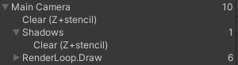

> 1.6 阴影优先

+ 由于我们在阴影图集之前设置了普通相机，我们最终会在渲染普通几何体之前切换到阴影图集，这并不是我们想要的结果。我们应该在 `CameraRenderer,Render` 中调用 `CameraRenderer,Setup` 之前渲染阴影，这样常规渲染就不会受到影响。

    ```C#
    //Setup();
    lighting.Setup(context, cullingResults, shadowSettings);
    Setup();
    DrawVisibleGeometry(useDynamicBatching, useGPUInstancing);
    ```

    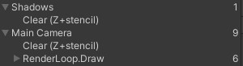

+ 我们可以在 `Frame Debugger` 中保持阴影条目嵌套在摄像机的条目中，方法是在设置灯光之前开始采样，在设置灯光之后立刻结束采样，然后再清除摄像机的目标。

    ```C#
    buffer.BeginSample(SampleName);
    ExecuteBuffer();
    lighting.Setup(context, cullingResults, shadowSettings);
    buffer.EndSample(SampleName);
    Setup();
    ```

    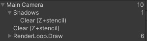

> 1.7 渲染

+ 为了渲染单个灯光的阴影，我们将为 `Shadow` 添加一个变体 `RenderDirectionalShadows` 方法，有两个参数：第一是被阴影的灯光索引，第二是它在图集中的 `Tile` 大小。然后另一个 `RenderDirectionalShadows` 方法中为所有被阴影的灯光调用方法，由 `BeginSample` 和 `EndSample` 调用来包装。因为我们目前只支持一个阴影灯，因此 `Tile` 大小等于图集大小。

    ```C#
    void RenderDirectionalShadows() {
        
        ...

        buffer.ClearRenderTarget(true. false. Color.clear);
        buffer.BeginSample(bufferName);
        ExecuteBuffer();

        for (int i = 0; i < ShadowDirectionalLightCount; i++) {
            RenderDirectionalShadows(i, atlasSize);
        }

        buffer.EndSample(bufferName);
        ExecuteBuffer();
    }

    void RenderDirectionalShadows(int index, int tileSize) {}
    ```

+ 为了渲染阴影，我们需要一个 `ShadowDrawingSettings` 结构值。我们可以通过使用 `culling` 结果调用其构造方法和适当的可见光索引来创建一个正确的配置，我们之前存储了这些结果。

    ```C#
    void RenderDirectionalShadows(int index, int tileSize) {
        ShadowedDirectionalLight light = ShadowedDirectionalLights[index];
        var shadowSettings = new ShadowDrawingSettings(cullingResults, light.visibleLightIndex);
    }
    ```

+ 阴影图的想法是，我们从光线的角度渲染场景，只存储深度信息。结果告诉我们光线在击中某物之前走了多远。

+ 然而，定向灯被认为是无限远的，因此没有一个真实的位置。所以我们要做的是找出与灯光的方向想匹配的视图和投影矩阵，并为我们提供一个裁剪空间立方体，该立方体与相机可见的区域重叠，可以包含光的阴影。我们可以使用裁剪结果中的 `ComputeDirectionalShadowMatricesAndCullingPrimitives` 方法来帮我们做这件事，向他传递九个参数。

+ 第一个参数是可见光指数。接下来的三个参数是两个整数和一个 `Vector3` ，他们控制阴影的级联。我们稍后会处理级联的问题，所以现在使用 `0` 、 `1` 和零矢量。之后是纹理大小，我们需要使用 `Tile` 大小。第六个参数是阴影的近平面，我们忽略这个参数，暂时设置为零。

+ 这些是输入参数，剩下的三个是输出参数。首先是视图矩阵，然后是投影矩阵，最后一个参数是 `ShadowSplitData` 结构。

    ```C#
    var shadowSettings = new ShadowDrawingSettings(cullingResults, light.visibleLightIndex);
    cullingResults.ComputeDirectionalShadowMatricesAndCullingPrimitives(
        light.visibleLightIndex, 0, 1, Vector3.zero, tileSize, 0f, out Matrix4x4 viewMatrix, out Matrix4x4 projectionMatrix,
        out ShadowSplitData splitData
    );
    ```

+ `splitData` 包含了关于如何剔除阴影投射对象的信息，我们必须将其复制到阴影设置中。我们必须通过调用缓冲区上的 `SetProjectionMatrices` 来应用视图和投影矩阵。

    ```C#
    cullingResults.ComputeDirectionalShadowMatricesCullingPrimitives(...);
    shadowSettings.splitData = splitData;
    buffer.SetViewProjectionMatrices(viewMatrix, projectionMatrix);
    ```

+ 我们最后通过执行缓冲区来安排阴影投射的绘制，然后在上下文上调用 `DrawShadows` ，阴影设置通过引用传递给它。

    ```C#
    shadowSettings.splitData = splitData;
    buffer.SetViewProjectionMatrices(viewMatrix, projectionMatrix);
    ExecuteBuffer();
    context.DrawShadows(ref shadowSettings);
    ```

> 1.8 ShadowCaster Pass

+ 此时投影应该被渲染出来，但图集仍然是空的。这是因为 `DrawShadows` 只渲染具有 `ShadowCaster Pass` 的材质对象。因此，在我们的 `Lit Shader` 上添加第二个 Pass 块，将其光照模式设置为 `ShadowCaster` 。使用相同的目标级别，让他支持实例化，以及 _CLIPPING 着色器功能。然后让他使用特殊的 `shadow-caster` 函数，我们将在一个新的 `ShadowCasterPass HLSL` 文件中定义。另外，因为我们只需要写入深度，所以禁用写入颜色数据，在 `HLSL` 程序前加入 `ColorMask0` 。

    ```C#
    SubShader {
        Pass {
            Tags {
                "LightMode" = "CustomLit"
            }

            ...
        }

        Pass {
            Tags {
                "LightMode" = "ShadowCaster"
            }

            ColorMask 0
            
            HLSLPROGRAM
            #pragma target 3.5
            #pragma shader_feature _CLIPPING
            #pragma multi_compile_instancing
            #pragma vertex ShadowCasterPassVertex
            #pragma fragment ShadowCasterPassFragment
            #include "ShadowCasterPass.hlsl"
            ENDHLSL
        }
    }
    ```

+ 创建 `ShadowCasterPass` 文件，复制 `LitPass` 并删除所有不需要的内容。所以我们只需要裁剪空间的位置，以及裁剪的基础颜色。片段函数没有任何东西可以返回，所以将变得无效。它所做的唯一事情就是潜在地裁剪片段。

    ```C
    #ifndef CUSTOM_SHADOW_CASTER_PASS_INCLUDED
    #define CUSTOM_SHADOW_CASTER_PASS_INCLUDED
    
    #include "../ShaderLibrary/Common.hlsl"

    TEXTURE2D(_BaseMap);
    SAMPLE(sampler_BaseMap);

    UNITY_INSTANCING_BUFFER_START(UnityPerMaterial)
        UNITY_DEFINE_INSTANCED_PROP(float4, _BaseMap_ST)    
        UNITY_DEFINE_INSTANCED_PROP(float4, _BaseColor)    
        UNITY_DEFINE_INSTANCED_PROP(float, _Cutoff)    
    UNITY_INSTANCING_BUFFER_END(UnityPerMaterial)

    struct Attributes {
        float3 positionOS : POSITION;
        float2 baseUV : TEXCOORD0;
        UNITY_VERTEX_INPUT_INSTANCE_ID
    }

    struct Varyings {
        float3 positionCS : SV_POSITION;
        float2 baseUV : VAR_BASE_UV;
        UNITY_VERTEX_INPUT_INSTANCE_ID
    }

    Varyings ShadowCasterPassVertex(Attributes input) {
        Varyings output;
        UNITY_SETUP_INSTANCE_ID(input);
        UNITY_TRANSFER_INSTANCE_ID(input, output);
        float3 positionWS = TransformObjectToWorld(input.positionOS);
        output.positionCS = TransformWorldToHClip(positionWS);

        float4 baseST = UNITY_ACCESS_INSTANCED_PROP(UnityPerMaterial, _BaseMap_ST);
        output.baseUV = input.baseUV * baseST.xy + baseST.zw;
        return output;
    }

    void ShadowCasterPassFragment(Varyings input) {
        UNITY_SETUP_INSTANCE_ID(input);
        float4 baseMap = SAMPLE_TEXTURE2D(_BaseMap, sampler_BaseMap, input.baseUV);
        float4 baseColor = UNITY_ACCESS_INSTANCED_PROP(UnityPerMaterial, _BaseColor);
        float4 base = baseMap * baseColor;
        #if defined(_CLIPPING)
            clip(base.a - UNITY_ACCESS_INSTANCED_PROP(UnityPerMaterial, _Cutoff));
        #endif
    }

    #endif
    ```

+ 我们现在可以渲染阴影投影，我创建了一个简单的测试场景，其中包含了一些不透明的物体在一个平面上，其中一个定向光启用了最大强度阴影进行尝试。无论灯光被设置为使用硬阴影还是软阴影都没有关系。

    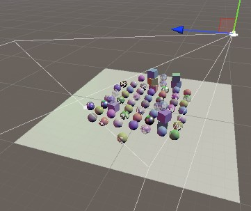

+ 阴影还不会影响最终渲染的图像，但我们已经可以通过 `Frame Debugger` 看到被渲染到阴影图集中的内容。他通常被看作是一个单色纹理，随着距离的增加由白变黑，但在使用 `OpenGL` 时他是红色的，而且是相反向的。

    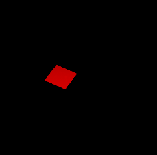

+ 在最大阴影距离设置为 `100` 的情况下，我们最终会发现所有内容都渲染到纹理的一小部分。减少最大距离可以有效地使阴影贴图放大到摄像机前面的部分。

    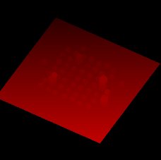 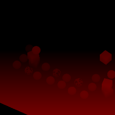

+ 请注意，阴影投影是使用正投影来渲染的，因为我们正在渲染定向光。

> 1.9 多灯光

+ 我们最多可以有四个定向光，所以我们也支持最多四个有阴影的定向灯光。

    ```C#
    const int maxShadowedDirLightCount = 4;
    ```

+ 作为一个快速测试，我使用了四个等效的定向光，只是我将他们的 `Y` 轴旋转调整了 `90°`。

    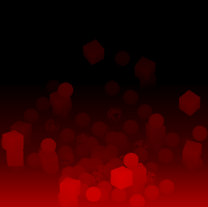

+ 尽管我们最终正确地渲染了所有灯光的阴影投射，但当我们为每个灯光渲染到整个图集时，它们是叠加的。我们必须分割我们的图集，这样我们就可以给每个灯提供他自己的瓦片来渲染。

+ 我们最多支持四个有阴影的灯光，我们将在我们的方形图集中为每个灯光分配一个方形的 `Tile`。因此，如果我们最终得到多个阴影光，我们必须通过将图块大小减半来将图集分成四个图块。在 `Shadows.RenderDirectionalShadows` 中确定分割量和 `Tile` 大小，并将两者都传递给每个灯光的另一个方法。

    ```C#
    void RenderDirectionalShadows() {
        
        ...

        int split = shadowedDirLightCount <= 1 ? 1 : 2;
        int tileSize = atlasSize / split;

        for (int i = 0; i < shadowedDirLightCount; i++) {
            RenderDirectionalShadows(i, split, tileSize);
        }
    }

    void RenderDirectionalShadows(int index, int split, int tileSize) { ... }
    ```

+ 我们可以通过调整渲染视口来渲染到单个 `Tile` 。为此创建一个新的方法，该方法将 `Tile` 索引和分割作为参数。它首先计算 `Tile` 的偏移量，将索引与分割线相乘作为 `X` 偏移量。将索引除以分割线作为 `Y` 偏移量。这些都是整数运算，但我们最终定义了一个 `Rect` ，索引将结果存储为 `Vector2` 。

    ```C#
    void SetTileViewport(int index, int split) {
        Vector2 offset = new Vector2(index % split, index / split);
    }
    ```

+ 然后用一个 `Rect` 在缓冲区上调用 `SetViewPort` ，偏移量按 `Tile` 大小缩放，这应该成为第三个参数，可以是一个浮点数。

    ```C#
    void SetTileViewPort(int index, int split, float tileSize) {
        Vector2 offset = new Vector2(index % split, index / split);
        buffer.SetViewPort(new Rect(
            offset.x * tileSize, offset.y * tileSize, tileSize, tileSize
        ));
    }
    ```

+ 在 `RenderDirectionalShadows` 中调用 `SetTileViewPort` 。

    ```C#
    SetTileViewport(index, split, tileSize);
    buffer.SetViewProjectionMatrices(viewMatrix, projectionMatrix);
    ```

## 2 采样阴影

+ 现在我们正在渲染阴影投射器，但这还不影响最终的图像。为了让阴影显示出来，我们必须在 `CustomLit` 通道中对阴影贴图进行采样，并使用它来确定表面片段是否被阴影覆盖。

> 2.1 阴影矩阵

+ 对于每个片段，我们必须从阴影图集中的适当 `Tile` 中采样深度信息。所以我们必须为一个给定的世界空间找到阴影纹理坐标。我们将通过为每个阴影方向的光线创建一个阴影变换矩阵并将他们发送到 `GPU` 来实现这一目标。在 `Shadows` 中添加一个 `_DirectionalShadowMatrices` 着色器属性标识符和静态矩阵数组来实现这样目标。

    ```C#
    static int
        dirShadowAtlasId = Shader.PropertyToID("_DirectionalShadowAtlas"),
        dirShadowMatricesId = Shader.PropertyToID("_DirectionalShadowMatrices");

    static Matrix4x4[]
        dirShadowMatrices = new Matrix4x4[maxShadowDirectionalLightCount];
    ```

+ 我们可以通过在 `RenderDirectionalShadows` 中乘以灯光的阴影投影矩阵和视图矩阵来创建一个从世界空间到灯光空间的转换矩阵。

    ```C#
    void RenderDirectionalShadows (int index, int split, int tileSize) {
		
        ...

		SetTileViewport(index, split, tileSize);
		dirShadowMatrices[index] = projectionMatrix * viewMatrix;
		buffer.SetViewProjectionMatrices(viewMatrix, projectionMatrix);
		
        ...

	}
    ```

+ 然后，一旦渲染了所有阴影灯，通过在缓冲区上调用 `SetGlobalMatrixArray` 将矩阵发生到 `GPU` 。

    ```C#
    void RenderDirectionalShadows() {

        ...

        buffer.SetGlobalMatrixArray(dirShadowMatricesId, dirShadowMatrices);
        buffer.EndSample(bufferName);
        ExecuteBuffer();
    }
    ```

+ 然而，这忽略了我们正在使用阴影图集的事实。让我们创建一个 `ConvertToAtlasMatrix` 方法，该方法接收光照矩阵， `Tile` 偏移量和 `Split` ，并返回一个从世界空间转换到阴影 `Tile` 空间的矩阵。

    ```C#
    Matrix4x4 ConvertToAtlasMatrix(Matrix4x4 m, Vector2 offset, int split) {
        return m;
    }
    ```

+ 我们已经在 `SetTileViewport` 中计算了 `Tile` 的偏移量，所以让我们返回这个值。

    ```C#
    Vector2 SetTileViewport(int index, int split, float tileSize) {

        ...

        return offset;
    }
    ```

+ 然后调整 `RenderDirectionalShadows` ，使其调用 `ConvertToAtlasMatrix` 。

    ```C#
    //SetTileViewport(index, split, tileSize);
    dirShadowMatrices[index] = ConvertToAtlasMatrix(
        projectionMatrix * viewMatrix,
        SetTileViewport(index, split, tileSize), split
    );
    ```

+ 在 `ConvertToAtlasMatrix` 中，我们应该做的第一件事是在使用了反转的 `Z` 缓冲区时反转 `Z` 了坐标。我们可以通过 `SystemInfo.usesReversedZBuffer` 来检查。

    ```C#
    Matrix4x4 ConvertToAtlasMatrix(Matrix4x4 m. Vector2 offset, int split) {
        if (SystemInfo.usesReversedZBuffer) {
            m.m20 = -m.m20;
            m.m21 = -m.m21;
            m.m22 = -m.m22;
            m.m23 = -m.m23;
        }
        return m;
    }
    ```

+ 其次，裁剪空间被定义在一个立方体内，其坐标从 `-1` 到 `1` ，中心是 `0` 。但纹理坐标和深度则从 `0` 到 `1` 。我们可以通过缩放和偏移 `XYZ` 尺寸的一半来将这种转换烘培到矩阵中。我们可以用矩阵乘法来做到这一点，但是它会导致大量乘法为 `0` 和不必要的加法运算。因此，让我们直接调整矩阵。

    ```C#
    m.m00 = 0.5f * (m.m00 + m.m30);
    m.m01 = 0.5f * (m.m01 + m.m31);
    m.m02 = 0.5f * (m.m02 + m.m32);
    m.m03 = 0.5f * (m.m03 + m.m33);
    m.m10 = 0.5f * (m.m10 + m.m30);
    m.m11 = 0.5f * (m.m11 + m.m31);
    m.m12 = 0.5f * (m.m12 + m.m32);
    m.m13 = 0.5f * (m.m13 + m.m33);
    m.m20 = 0.5f * (m.m20 + m.m30);
    m.m21 = 0.5f * (m.m21 + m.m31);
    m.m22 = 0.5f * (m.m22 + m.m32);
    m.m23 = 0.5f * (m.m23 + m.m33);
    return m;
    ```

+ 最后，我们必须应用 `Tile` 的偏移和缩放。我们可以再次直接这样做，以避免大量不必要的计算。

    ```C#
    float scale = 1f / split;
    m.m00 = (0.5f * (m.m00 + m.m30) + offset.x * m.m30) * scale;
    m.m01 = (0.5f * (m.m01 + m.m31) + offset.x * m.m31) * scale;
    m.m02 = (0.5f * (m.m02 + m.m32) + offset.x * m.m32) * scale;
    m.m03 = (0.5f * (m.m03 + m.m33) + offset.x * m.m33) * scale;
    m.m10 = (0.5f * (m.m10 + m.m30) + offset.y * m.m30) * scale;
    m.m11 = (0.5f * (m.m11 + m.m31) + offset.y * m.m31) * scale;
    m.m12 = (0.5f * (m.m12 + m.m32) + offset.y * m.m32) * scale;
    m.m13 = (0.5f * (m.m13 + m.m33) + offset.y * m.m33) * scale;
    ```

> 2.2 存储每个灯光的阴影数据

+ 为了对一盏灯的阴影进行采样，我们需要知道它在阴影图集中的索引（如果有的话）。这是每盏灯都必须存储的内容，所以让我们让 `ReserveDirectionalShadows` 返回所需的数据。我们将提供两个值：阴影强度和阴影 `Tile` 的偏移量，打包在一个 `Vector2` 中。如果该灯光没有得到阴影，那么结果就是一个零矢量。

    ```C#
    public Vector2 ReserveDirectionalShadows(...) {
        if (...) {
            shadowedDirectionalLights[shadowedDirLightCount] =
                new ShadowedDirectionalLight {
                    visibleLightIndex = visibleLightIndex
                };

            return new Vector2(light.shadowStrength, shadowedDirLightCount++);
        }
        return Vector2.zero;
    }
    ```

+ 让 `Lighting` 通过一个 `_DirectionalLightShadowData` 向量数组将这些数据提供给着色器。

    ```C#
    static int
		dirLightCountId = Shader.PropertyToID("_DirectionalLightCount"),
		dirLightColorsId = Shader.PropertyToID("_DirectionalLightColors"),
		dirLightDirectionsId = Shader.PropertyToID("_DirectionalLightDirections"),
		dirLightShadowDataId =
			Shader.PropertyToID("_DirectionalLightShadowData");

	static Vector4[]
		dirLightColors = new Vector4[maxDirLightCount],
		dirLightDirections = new Vector4[maxDirLightCount],
		dirLightShadowData = new Vector4[maxDirLightCount];

	...

	void SetupLights () {
		
        ...

		buffer.SetGlobalVectorArray(dirLightShadowDataId, dirLightShadowData);
	}

	void SetupDirectionalLight (int index, ref VisibleLight visibleLight) {
		dirLightColors[index] = visibleLight.finalColor;
		dirLightDirections[index] = -visibleLight.localToWorldMatrix.GetColumn(2);
		dirLightShadowData[index] =
			shadows.ReserveDirectionalShadows(visibleLight.light, index);
	}
    ```

+ 并把他也添加到 `Light HLSL` 文件中的 `_CustomLight` 缓冲区。

    ```C
    CBUFFER_START(_CustomLight)
        int _DirectionalLightCount;
        float4 _DirectionalLightColors[MAX_DIRECTIONAL_LIGHT_COUNT];
        float4 _DirectionalLightDirections[MAX_DIRECTIONAL_LIGHT_COUNT];
        float4 _DirectionalLightShadowData[MAX_DIRECTIONAL_LIGHT_COUNT];
    CBUFFER_END
    ```

> 2.3 阴影 HLSL 文件

+ 我们还将创建一个专门的 `Shadows HLSL` 文件用于阴影采样。定义相同的最大阴影方向光数，以及 `_DirectionalShadowAtlas` 纹理，以及 `_CustomShadows` 缓冲区中的 `_DirectionalShadowMatrices` 数组。

    ```C
    #ifndef CUSTOM_SHADOWS_INCLUDED
    #define CUSTOM_SHADOWS_INCLUDED
    
    #define MAX_SHADOWED_DIRECTIONAL_LIGHT_COUNT 4

    TEXTURE2D(_DirectionalShadowAtlas);
    SAMPLER(sampler_DirectionalShadowAtlas);

    CBUFFER_START(_CustomShadows)
        float4x4 _DirectionalShadowMatrices[MAX_SHADOWED_DIRECTIONAL_LIGHT_COUNT];
    CBUFFER_END

    #endif
    ```

+ 由于图集不是一个普通的纹理，为了清楚起见，我们通过 `TEXTURE2D_SHADOW` 宏来定义他，尽管这对我们支持的平台来说并没有什么区别。我们将使用一个特殊的 `SAMPLER_CMP` 宏来定义采样器的状态，因为这确实定义了一种不同的阴影贴图采样方式，因为常规的双线性滤波对深度数据没有意义。

    ```C#
    TEXTURE2D_SHADOW(_DirectionalShadowAtlas);
    SAMPLER_CMP(sampler_DirectionalShadowAtlas);    
    ```

+ 事实上，只有一种合适的方式来对阴影贴图进行采样，因此我们可以定义一个明确的采样器状态，而不是依赖 `Unity` 为我们的渲染纹理推导出来状态。采样器状态可以通过创建一个名称中带有特定文字的采样器来内联定义。我们可以使用 `sampler_linear_clamp_compare` 。让我们也为它定义一个简写的 `SHADOW_SAMPLER` 宏。

    ```C
    TEXTURE2D_SHADOW(_DirectionalShadowAtlas);
    #define SHADOW_SAMPLER sampler_linear_clamp_compare
    SAMPLER_CMP(SHADOW_SAMPLER);
    ```

+ 在 `LitPass` 中， `Light` 之前包括 `Shadows` 。

    ```C
    #include "../ShaderLibrary/Surface.hlsl"
    #include "../ShaderLibrary/Shadows.hlsl"
    #include "../ShaderLibrary/Light.hl
    ```

> 2.4 采样阴影

+ 为了对阴影进行采样，我们需要知道每个灯光的阴影数据，所以让我们在 `Shadows` 中定义一个结构，专门用于定向光。它包含了强度和 `Tile` 偏移量，但 `Shadows` 中的代码并不知道它被存储在哪里。

    ```C
    struct DirectionalShadowData {
        float strength;
        int tileIndex;
    };
    ```

+ 我们还需要知道表面的位置，所以把他添加到 `Surface` 结构中。

    ```C
    struct Surface {
        float3 position;

        ...

    };
    ``` 

+ 并将其添加到 `LitPassFragment` 中。

    ```C
    Surface surface;
    surface.position = input.positionWS;
    surface.normal = normalize(input.normalWS);
    ```

+ 在 `Shadows` 中添加一个 `SampleDirectionalShadowAtlas` 函数，通过 `SAMPLE_TEXTURE2D_SHADOW` 宏对阴影图集进行采样，将图集、阴影采样器和阴影纹理空间中的位置传递给它。

    ```C
    float SampleDirectionalShadowAtlas(float3 positionSTS) {
        return SAMPLE_TEXTURE2D_SHADOW(
            _DirectionalShadowAtlas, SHADOW_SAMPLER, positionSTS
        );
    }
    ```

+ 然后添加一个 `GetDirectionalShadowAttenuation` 函数，给定方向性阴影数据和表面，返回阴影衰减，这个表面应该定义在世界空间。他使用 `Tile` 偏移来检索正确的矩阵，将表面位置转换为阴影 `Tile` 空间，然后对图集进行采样。

    ```C
    float GetDirectionalShadowAttenuation(DirectionalShadowData data, Surface surfaceWS) {
        float3 positionSTS = mul(
            _DirectionalShadowMatrices[data.tileIndex],
            float4(surfaceWS.position, 1.0)
        ).xyz;
        float shadow = SampleDirectionalShadowAtlas(positionSTS);
        return shadow;
    }
    ```

+ 对阴影图集进行采样的结果是一个系数，决定了有多少光线到达表面，仅考虑阴影。这是一个在 `0-1` 范围内的值，被称为衰退因子。如果片段完全被阴影覆盖，那么我们得到的是 `0` ，当完全没有阴影时，我们得到的是 `1` 。介于两者之间的数值表示该片段被部分遮蔽。

+ 除此之外，一束光的阴影强度可以被降低，无论是处于艺术原因还是为了表现半透明表面的阴影。当强度降低到零时，衰减就完全不受阴影的影响，应该是 `1` 。所以最终的衰减是通过 `1` 和 采样衰减之间的线性插值得到的。

    ```C
    return lerp(1.0, shadow, data.strength);
    ```

+ 但是当阴影强度为零时，就根本不需要对阴影进行采样，因为他们没有任何效果，甚至还没有被渲染。在这种情况下，我们有一个没有阴影的光，应该总是返回 `1` 。

    ```C
    float GetDirectionalShadowAttenuation(DirectionalShadowData data, Surface surfaceWS) {
        if (data.strength <= 0.0) {
            return 1.0;
        }

        ...

    }

> 2.5 灯光衰减

+ 我们将在 `Light` 结构中存储光线的衰减。

    ```C
    struct Light {
        float3 color;
        float3 direction;
        float attenuation;
    }
    ```

+ 给 `Light` 添加一个函数，获取方向性阴影数据。

    ```C
    DirectionalShadowData GetDirectionalShadowData(int lightIndex) {
        DirectionalShadowData data;
        data.strength = _DirectionalLightShadowData[lightIndex].x;
        data.tileIndex = _DirectionalLightShadowData[lightIndex].y;
        return data;
    }
    ```

+ 然后给 `GetDirectionalLight` 添加一个世界空间表面参数，让他检索方向阴影数据并使用 `GetDirectionalShadowAttenuation` 来设置灯光的衰减。

    ```C
    Light GetDirectionalLight(int index, Surface surfaceWS) {
        Light light;
        light.color = _DirectionalLightColors[index].rgb;
        light.direction = _DirectionalLightDirections[index].xyz;
        DirectionalShadowData shadowData = GetDirectionalShadowData(index);
        light.attenuation = GetDirectionalShadowAttenuation(shadowData, surfaceWS);
        return light;
    }
    ```

+ 现在 `Lighting` 中的 `GetLighting` 也必须把 `Surface` 传给 `GetDirectionalLight` 。而且现在表面应该是在世界空间中定义的，所以要相应地重命名参数。只有 `BRDF` 不关心光和表面的空间，只要他们匹配就可以了。

    ```C
    float3 GetLighting(Surface surfaceWS, BRDF brdf) {
        float3 color = 0.0;
        for (int i = 0; i < GetDirectionalLightCount(); i++) {
            color += GetLighting(surfaceWS, brdf, GetDirectionalLight(i, surfaceWS));
        }
        return color;
    }
    ```

+ 让阴影发挥作用的最后一步是将衰减计入光照的强度。

    ```C
    float3 IncomingLight(Surface surface, Light light) {
        return saturate(dot(surface.normal, light.direction) * light.attenuation) * light.color;
    }
    ```

    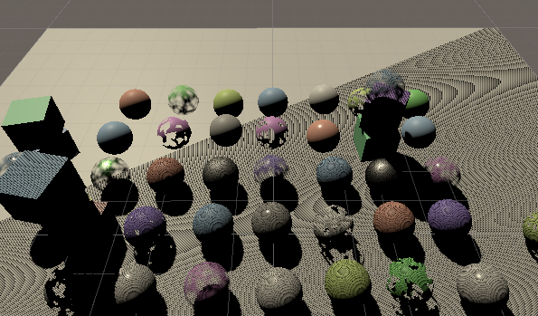

+ 我们终于有了阴影，但它们看起来很糟糕。不应该被遮蔽的表面最终会被形成像素化带的阴影伪影所覆盖。这些是由阴影贴图的有限分辨率导致的自阴影引起的。使用不同的分辨率可以改变伪影模式，但不能消除他们。表面最终会部分遮蔽自己，但我们稍后会处理这个问题。人造物使我们很容易看到阴影贴图所覆盖的区域，所以我们现在要保留他们。

+ 例如，我们可以看到阴影贴图只覆盖了部分可见区域，由最大阴影距离控制。改变最大距离可以增加或缩小区域。阴影贴图是与光线方向一致的，而不是与摄像机一致。一些阴影在最大距离之外是可见的，但也有一些是缺失的，当阴影被采样到地图边缘之外时就会变得很奇怪。如果只有一个有阴影的光时活动的，那么结果就会被限制，否则采样就会跨越 `Tile` 边界，并且一个光最终会使用另一个光的阴影。

    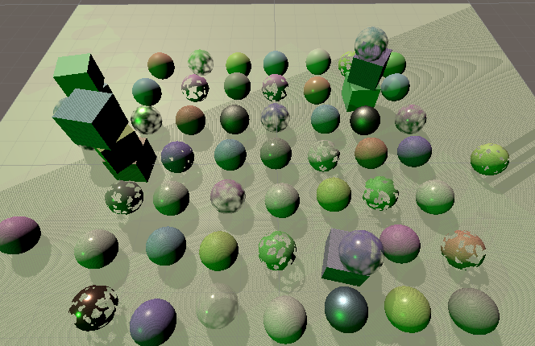

+ 我们以后会正确地切断最大距离的阴影，但现在这些无效的阴影仍然可见。

## 3 级联阴影贴图

+ 因为定向光会影响到最大阴影距离以内的所有内容，所以它们的阴影图最终会覆盖很大的区域。由于阴影贴图使用正交投影，阴影贴图中的每个纹素都有一个固定的世界空间大小。如果这个尺寸太大，那么个别的阴影纹理就会清晰可见，导致阴影边缘参差不齐和可能消失的小阴影。这种情况可以通过增加图集的大小来缓解，但只能达到一定程度。

+ 当使用透视像机时，更远的东西看起来更小。在一定的视觉距离内，一个阴影贴图的纹素将映射到一个显示像素，这意味着阴影的分辨率在理论上是最佳的。在离摄像机较近的地方，我们需要更高的阴影分辨率，而较远的地方，较低的分辨率就足够了。这表面在理想情况下，我们会根据阴影接收器的视距，使用一个可变的阴影图分辨率。

+ 级联阴影图是解决这个问题的一个办法。这个想法是阴影投影者被渲染了不止一次，所以每个光在图集中得到了多个 `Tile` ，被称为级联。第一个级联只覆盖靠近像机的一个小区域，随后的级联则缩小以覆盖越来越大的区域，并具有相同数量的纹素。然后着色器对每个片段的最佳级联进行采样。

> 3.1 设置

+ `Unity` 的阴影代码支持每个定向光最多有四个级联。到目前为止，我们只使用了一个级联来覆盖最大阴影距离的所有内容。为了支持更多，我们将在方向阴影设置中添加级联计数滑块。虽然我们可以对每个方向光使用不同的数量，但对所有有阴影的方向光使用相同的数量是最合理的。

+ 每个级联都覆盖了阴影区域的一部分，直到最大的阴影距离。我们将通过为前三个级联添加比例滑块来配置确切的部分。最后一个级联总是覆盖整个范围，因此不需要滑块。默认情况下将级联计数设置为 `4` ，级联比例为 `0.1` 、 `0.25` 和 `0.5` 。这些比例应该随着级联增加，但我们不会在用户界面中强制执行。

    ```C#
    public struct Directional {
        
        public MapSize atlasSize;

        [Range(1, 4)]
        public int cascadeCount;

        [Range(0f, 1f)]
        public float cascadeRatio1, cascadeRatio2, cascadeRatio3;
    }

    public Directional directional = new Direction {
        atlasSize = MapSize._1024,
        cascadeCount = 4,
        cascadeRatio1 = 0.1f,
        cascadeRatio2 = 0.25f,
        cascadeRatio3 = 0.5f
    }
    ```

    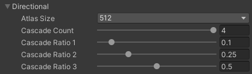

+ `ComputeDirectionalShadowMatricesAndCullingPrimitives` 方法要求我们提供封装在 `Vector3` 中的比率，因此让我们为设置添加一个方便的属性，以这种形式检索它们。

    ```C#
    public Vector3 CascadeRatios =>
        new Vector3(cascadeRatio1, cascadeRatio2, cascadeRatio3);
    ```

> 3.2 渲染级联

+ 每个级联都需要自己的变换矩阵，所以 `Shadows` 的阴影矩阵数组的大小必须乘以每个灯的最大级联数量，也就是四个。

    ```C#
    const int maxShadowedDirLightCount = 4, maxCascades = 4;

    ...

    static Matrix4x4[]
        dirShadowMatrices = new Matrix4x4[maxShadowedDirLightCount * maxCascades];
    ```

+ 在阴影中也要增加数组的大小。

    ```C
    #define MAX_SHADOWED_DIRECTIONAL_LIGHT_COUNT 4
    #define MAX_CASCADE_COUNT 4

    ...

    CBUFFER_START(_CustomShadows)
        float4x4 _DirectionalShadowMatrices[MAX_SHADOWED_DIRECTIONAL_LIGHT_COUNT * MAX_CASCADE_COUNT];
    CBUFFER_END
    ```

+ 完成此操作后， `Unity` 会抱怨着色器的数组大小发生了变化，但他不能使用新大小。这是因为一旦固定的数组被着色器声明，他们的大小就不能在同一时段在 GPU 上改变。我们必须重新启动 `Unity` 来重新初始化他。

+ 完成后，将 `Shadows.ReserveDirectionalShadows` 中返回的 `Tile` 偏移量乘以配置的级联量，因为每个定向光现在将占用多个连续 `Tile`。

    ```C#
    return new Vector2(
        light.shadowStrength, settings.directional.cascadeCount * shadowedDirLightCount++
    );
    ```

+ 同样，在 `RenderDirectionalShadows` 中，使用的 `Tile` 数量会成倍增加，这意味着我们最终可能会有 `16` 块 `Tile` ，需要分成 `4` 份。

    ```C#
    int tiles = shadowedDirLightCount * settings.directional.cascadeCount;
    int split = tiles <= 1 ? 1 : tiles <= 4 ? 2 : 4;
    int tileSize = atlasSize / split;
    ```

+ 现在 `RenderDirectionalShadows` 必须为每个级联绘制阴影。把从 `ComputeDirectionalShadowMatricesAndCullingPrimitives` 到 `DrawShadows` 代码放在每个配置的级联的一个循环中。 `ComputeDirectionalShadowMatricesAndCullingPrimitives` 的第二个参数现在变成了级联索引，然后是级联计数和级联比率。同时调整 `Tile` 索引，使其成为灯光的 `Tile` 偏移量加上级联索引。

    ```C#
    void RenderDirectionalShadows(int index, int split, int tileSize) {
        ShadowedDirectionalLight light = shadowedDirectionalLights[index];
        var shadowSettings = 
            new ShadowDrawingSettings(cullingResults, light.visibleLightIndex);
        int cascadeCount = settings.directional.cascadeCount;
        int tileOffset = index * cascadeCount;
        Vector3 ratios = settings.directional.CascadeRatios;

        for (int = 0; i < cascadeCount; i++) {
            cullingResults.ComputeDirectionalShadowMatricesAndCullingPrimitives(
                light.visibleLightIndex, i, cascadeCount. ratios, tileSize, 0f,
                out Matrix4x4 viewMatrix, out Matrix4x4 projectionMatrix,
                out Matrix4x4 ShadowSplitData splitData
            );
            shadowSettings.splitData = splitData;
            int tileIndex = tileOffset + i;
            dirShadowMatrices[tileIndex] = ConvertToAtlasMatrix(
                projectionMatrix * viewMatrix,
                SetTileViewport(tileIndex, split, tileSize), split
            );
            buffer.SetViewProjectionMatrices(viewMatrix, projectionMatrix);
            ExecuteBuffer();
            context.DrawShadows(ref shadowSettings);
        }
    }
    ```

    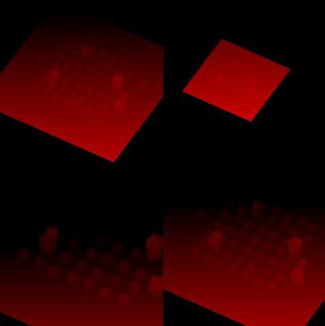 

> 3.3 球型剔除

+ `Unity` 通过为每个级联创建一个剔除球来确定覆盖区域。由于阴影的投影是正交的和方形的，他们最终会与他们的剔除球体紧密结合，但也会覆盖他们周围一些空间。这就是为什么有些影子可以在剔除区域之外看到。另外，光的方向对球体来说并不重要，因此所有方向的光最终都是用相同的剔除球体。

    

+ 这些球体也需要用来确定从哪个级联中采样，所以我们必须将他们发送到 `GPU` 。为级联计数和级联剔除球体数组添加标识符，以及球体数据的静态数组。他们有四个分量的向量定义，包含他们的 `XYZ` 位置加上 `W` 分量中的半径。

    ```C
    static int
        dirShadowAtlasId = Shader.PropertyToID("_DirectionalShadowAtlas"),
		dirShadowMatricesId = Shader.PropertyToID("_DirectionalShadowMatrices"),
		cascadeCountId = Shader.PropertyToID("_CascadeCount"),
		cascadeCullingSpheresId = Shader.PropertyToID("_CascadeCullingSpheres");

    static Vector4[] cascadeCullingSpheres = new Vector4[maxCascades];
    ```

+ 级联的剔除球体是 `ComputeDirectionalShadowMatricesAndCullingPrimitives` 输出的分割数据的一部分。将其分配给 `RenderDirectionalShadows` 循环中的球体数组。但是我们只需要对第一盏灯这样做，因为所有灯的级联都是等价的。

    ```C#
    for (int i = 0; i < cascadeCount; i++) {
        cullingResults.ComputeDirectionalShadowMatricesAndCullingPrimitives(...);
        shadowSettings.splitData = splitData;
        if (index == 0) {
            cascadeCullingSpheres[i] = splitData.cullingSphere;
        }

        ...
  
    }
    ```

+ 我们需要着色器中的球体来检查表面片段是否位于其中，这可以通过比较球体中心的平方距离与其平方半径来完成。所以让我们存储方形半径，这样我们就不必在着色器计算他。

    ```C#
    Vector4 cullingSphere = splitData,cullingSphere;
    cullingSphere.w *= cullingSphere.w;
    cascadeCullingSpheres[i] = cullingSphere;
    ```

+ 渲染级联后将级联计数和球体发送到 `GPU` 。

    ```C#
    void RenderDirectionalShadows() {

        ...

        buffer.SetGlobalInt(cascadeCountId, settings.directional.cascadeCount);
        buffer.SetGlobalVectorArray(
            cascadeCullingSpheresId, cascadeCullingSpheres
        );
        buffer.SetGlobalMatrixArray(dirShadowMatricesId, dirShadowMatrices);
        buffer.EndSample(bufferName);
        ExecuteBuffer();
    }
    ```

> 3.4 采样级联

+ 将级联计数和剔除球体数组添加到阴影。

    ```C
    CBUFFER_START(_CustomShadows)
        int _CascadeCount;
        float4 _CascadeCullingSpheres[MAX_CASCADE_COUNT];
        float4x4 _DirectionalShadowMatrices[MAX_SHADOWED_DIRECTIONAL_LIGHT_COUNT * MAX_CASCADE_COUNT];
    CBUFFER_END
    ```

+ 级联指数是按片段确定的，而不是按光确定的。因此，让我们申明一个包含它的全局 `ShadowData` 结构。稍后我们将向其中添加更多数据。还添加返回世界空间表面的阴影数据，最初级联索引始终设置为 `0` 。

    ```C
    struct ShadowData {
        int cascadeIndex;
    };

    ShadowData GetShadowData(Surface surfaceWS) {
        ShadowData data;
        data.cascadeIndex = 0;
        return data;
    }
    ```

+ 将新数据作为参数添加到 `GetDirectionalShadowData` ，这样它可以将级联索引添加到灯光的阴影 `Tile` 偏移来选择正确的 `Tile` 索引。

    ```C
    DirectionalShadowData GetDirectionalShadowData (int lightIndex, ShadowData shadowData) {
        DirectionalShadowData data;
        data.strength = _DirectionalLightShadowData[lightIndex].x;
        data.tileIndex = _DirectionalLightShadowData[lightIndex].y + shadowData.cascadeIndex;
        return data;
    }
    ```

+ 还将相同的参数添加到 `GetDirectionalLight` ，以便他可以将数据发到 `GetDirectionalShadowData` 。适当地重命名方向阴影数据变量。

    ```C
    Light GetDirectionalLight(int index, Surface surfaceWS, ShadowData shadowData) {
        
        ...

        DirectionalShadowData dirShadowData = GetDirectionalShadowData(index, shadowData);
        light.attenuation = GetDirectionalShadowAttenuation(dirShadowData, surfaceWS);
        return light;
    }
    ```

+ 在 `GetLighting` 中获取阴影数据并将其传递。

    ```C
    float3 GetLighting(Surface surfaceWS, BRDF brdf) {
        ShadowData shadowData = GetShadowData(surfaceWS);
        float3 color = 0.0;
        for(int i = 0; i < GetDirectionalLightCount(); i++) {
            Light light = GetDirectionalLight(i, surfaceWS, shadowData);
            color += GetLighting(surfaceWS, brdf, light);
        }
        return color;
    }
    ```

    

    

+ 要选择正确的级联，我们需要计算两点之间的距离。为此，让我们为 `Common` 添加一个方便的函数。

    ```C
    float DistanceSquared(float3 pA, float3 pB) {
        return dot(pA - pB, pA - pB);
    }
    ```

+ 循环遍历 `GetShadowData` 中的所有级联剔除球体，直到找到包含表面位置的球体。找到循环后跳出循环，然后使用当前循环迭代器作为级联索引。这意味着如果片段位于所有球体之外，我们最终会得到一个无效的索引，但我们现在将忽略它。

    ```C
    int i;
    for(i = 0; i < _CascadeCount; i++) {
        float4 sphere = _CascadeCullingSpheres[i];
        float distanceSqr = DistanceSquared(surfaceWS.position, sphere.xyz);
        if(distanceSqr < sphere.w) {
            break;
        }
    }
    data.cascadeIndex = i;
    ```

    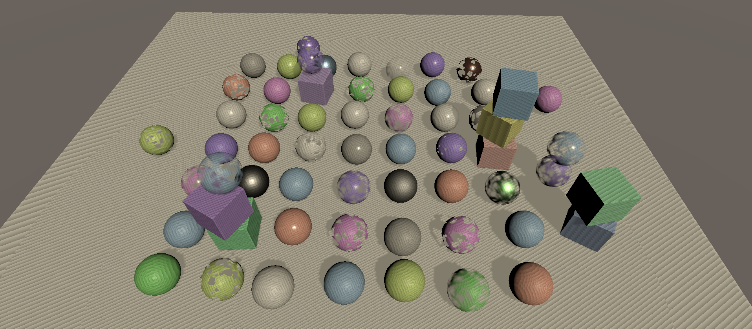

+ 我们现在得到了纹理像素密度分布更好的阴影。由于自阴影伪影，级联之间的弯曲过度边界也是可见的，尽管我们可以通过将阴影衰减替换为级联指数除以 `4` 来使它们更容易被发现。

    ```C
    Light GetDirectionalLight (int index, Surface surfaceWS, ShadowData shadowData) {
        
        ...

        light.attenuation = GetDirectionalShadowAttenuation(dirShadowData, surfaceWS);
        light.attenuation = shadowData.cascadeIndex * 0.25;
        return light;
    }
    ```

    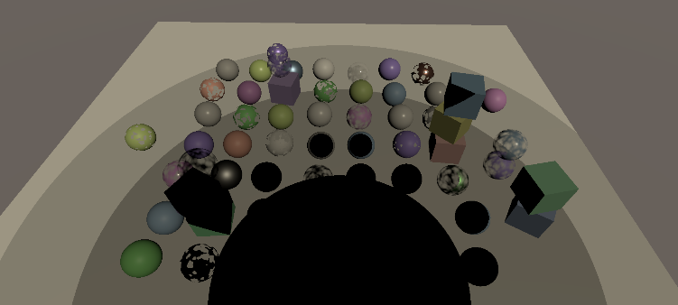

> 3.5 剔除阴影采样

+ 如果我们最终超出了最后一个级联，则很可能没有有效的阴影数据，我们根本不应该对阴影进行采样。执行此操作的一种简单方法是向 `ShadowData` 添加一个强度场，默认将其设置为 `1` ，如果我们最终超出最后一个级联，则将其设置为 `0` 。

    ```C
    struct ShadowData {
        int cascadeIndex;
        float strength;
    };

    ShadowData GetShadowData(Surface surfaceWS) {
        ShadowData data;
        data.strength = 1.0;
        int i;
        for(i = 0; i <_CascadeCount; i++){

            ...

        }

        if(i == _CascadeCount) {
            data.strength = 0.0;
        }

        data.cascadeIndex = i;
        return data;
    }
    ```

+ 然后将全局阴影强度分解为 `GetDirectionalShadowData` 中的方向阴影强度。这会剔除最后一个级联之外的所有阴影。

    ```C
    data.strength = _DirectionalLightShadowData[lightIndex].x * shadowData.strength;
    ```

+ 此外，在 `GetDirectionalLight` 中恢复正确的衰减。

    ```C
	light.attenuation = GetDirectionalShadowAttenuation(dirShadowData, surfaceWS);
	//light.attenuation = shadowData.cascadeIndex * 0.25;
    ```

    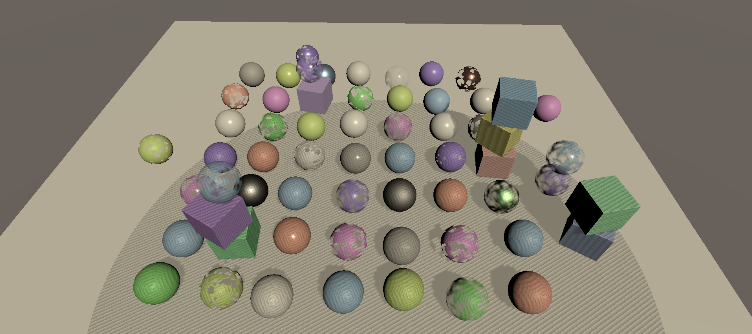

> 3.6 最大距离

+ 对最大阴影距离的一些实验将表明，一些阴影投射器在仍然位于最后一个级联的剔除球体内时突然消失。之所以会发生这种情况，是因为最外面的剔除球体并没有完全在配置的最大距离处结束，而是延伸了一点。这种差异在最大距离较小时最为明显。

+ 我们可以通过在最大距离处停止对阴影进行采样来修复阴影的弹出问题。为了实现这一步，我们必须在 `Shadows` 中将最大距离发送到 `GPU` 。

    ```C#
    static int

        ...

        cascadeCullingSphereId = Shader.PropertyToID("_CascadeCullingSpheres"),
        shadowDistanceId = Shader.PropertyToID("_ShadowDistance");
    
    ...

    void RenderDirectionalShadows() {

        ...

        buffer.SetGlobalFloat(shadowDistanceId, settings.maxDistance);
        buffer.EndSample(bufferName);
        ExecuteBuffer();
    }
    ```

+ 最大距离基于视图空间深度，而不是到相机位置的距离。所以要执行这个剔除，我们需要知道表面的深度。为 `Surface` 添加一个字段。

    ```C
    struct Surface {
        float3 position;
        float3 normal;
        float3 viewDirection;
        float depth;
        
        ...

    };
    ```

+ 深度可以在 `LitPassFragment` 中找到，方法是通过 `TransformWorldToView` 从世界空间转换到视图空间并采用相反的 `Z` 坐标。由于这种转换只是相对于世界空间的旋转和偏移，因此在视图空间和世界空间中的深度是相同的。

    ```C
    surface.viewDirection = normalize(_WorldSpaceCameraPos - input.positionWS);
    surface.depth = -TransformWorldToView(input.positionWS).z;
    ```

+ 现在，不是总是在 `GetShadowData` 中将强度初始化为 `1` ，而是仅在表面深度小于最大距离时才执行此操作，否则将其设置为 `0` 。

    ```C
    CBUFFER_START(_CustomShadows)
        
        ...

        float _ShadowDistance;
    CBUFFER_END

    ...

    float FadedShadowStrength (float distance, float scale, float fade) {
        return saturate((1.0 - distance * scale) * fade);
    }

    ShadowData GetShadowData (Surface surfaceWS) {
        ShadowData data;
        data.strength = surfaceWS.depth < _ShadowDistance ? 1.0 : 0.0;
        
        ...

    }
    ```

    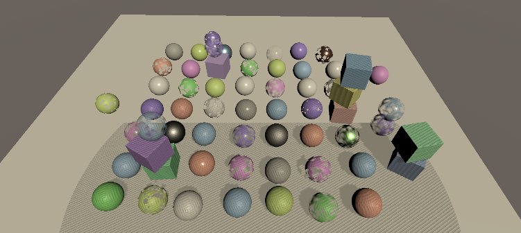

> 3.7 渐变阴影

+ 在最大距离处突然切断阴影会非常明显，所以让我们通过线性淡化它们使过渡更平滑。衰减在最大值之前一段距离开始，直到我们在最大值处达到 `0` 强度。我们可以使用函数 $\cfrac{1-\cfrac{d}{m}}{f}$ 为此将限制在 `0-1` ， 其中 `d` 表示表面深度， `m` 是最大阴影距离， `f` 是渐变范围，表示为最大距离的一部分。

    

+ 为阴影设置添加距离淡入淡出的滑块。由于淡入淡出和最大值都用做除数，它们不应该为 `0` ，所以将它们的最小值设置为 `0.001` 。

    ```C#
    [Min(0.001f)]
	public float maxDistance = 100f;
	
	[Range(0.001f, 1f)]
	public float distanceFade = 0.1f;
    ```

+ 将 `Shadows` 中的阴影距离标识符替换为距离值和淡入淡出值的一个。

    ```C#
    //shadowDistanceId = Shader.PropertyToID("_ShadowDistance");
    shadowDistanceFadeId = Shader.PropertyToID("_ShadowDistanceFade");
    ```

+ 将他们作为向量的 `XY` 分量发送到 `GPU` 时，使用一个除以值，这样我们就可以避免着色器中的除法，因为乘法运算更快。

    ```C#
    //buffer.SetGlobalFloat(shadowDistanceId, settings.maxDistance);
    buffer.SetGlobalVector(
        shadowDistanceFadeId, new Vector4(1f / settings.maxDistance, 1f / settings.distanceFade);
    )
    ```

+ 调整阴影中的 _CustomShadows 缓冲区以匹配。

    ```C#
    //float _ShadowDistance;
	float4 _ShadowDistanceFade;
    ```

+ 现在我们可以使用以下方法计算淡出阴影强度 $(1-ds)f$ ， $\cfrac{1}{m}$ 用于缩放，s 和 $\cfrac{1}{f}$ 用于新的淡入淡出倍增器 $f$ 。为此创建一个 `FadedShadowStrength` 函数并在 `GetShadowData` 中使用它。

    ```C
    float FadedShadowStrength(float distance, float scale, float fade) {
        return saturate((1.0 - distance * scale) * fade);
    }

    ShadOwData GetShadowData(Surface surfaceWS) {
        ShadowData data;
        data.strength = FadedStrength(
            surfaceWS.depth. _ShadowDistanceFade.x, _ShadowDistanceFade.y
        );

        ...

    }
    ```

    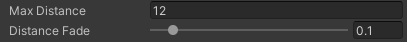
    
    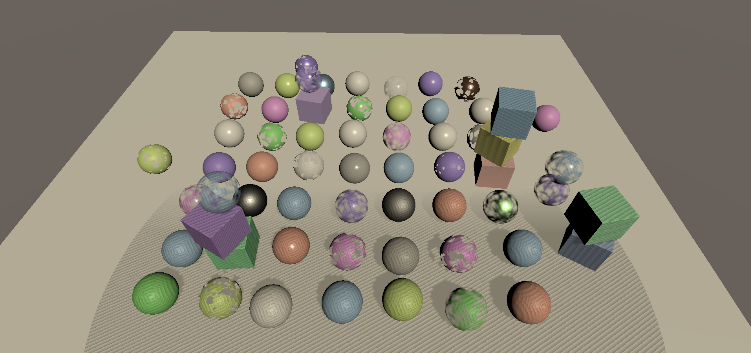

> 3.8 渐变级联

+ 我们也可以使用相同的方法在最后一个级联的边缘淡化阴影而不是切断他们。为此添加级联淡入淡出阴影设置滑块。

    ```C#
    public struct Directional {
        
        ...

        [Range(0.001f, 1f)]
        public float cascadeFade;
    }

    public Directional directional = new Directional {

        ...

        cascadeRatio3 = 0.5f,
        cascadeFade = 0.1f
    }
    ```

+ 唯一的区别是我们正在使用级联的平方距离和半径，而不是线性深度和最大值。这意味着过度变为非线性： $\cfrac{1-\cfrac{d^2}{r^2}}{f}$ 其中 `r` 是剔除球体半径。差别不是很大，但要保持配置的淡入淡出比率相同，我们必须更换 `f` 与 $1-(1-f)^2$ 。然后我们将它存储在阴影距离淡入淡出向量的 `Z` 分量中，再次取反。

    

    ```C#
    float f = 1f - settings.directional.cascadeFade;
    buffer.SetGlobalVector(
        shadowDistanceFadeId, new Vector4(
            1f / settings.maxDistance, 1f / settings.distanceFade, 1f / (1f - f * f);
        )
    );
    ```

+ 要执行级联淡入淡出，请检查我们是否在最后一个级联中，同时仍在 `GetShadowData` 中的循环内。如果是这样，计算级联的淡出阴影强度并将其计入最终强度。

    ```C#
    for(i = 0; i < _CascadeCount; i++) {
        float4 sphere = _CascadeCullingSpheres[i];
        float distanceSqr = DistanceSquared(surfaceWS.position. sphere.xyz);
        if(distanceSqr < sphere.w) {
            if(i == _CascadeCount - 1) {
                data.strength *= FadedShadowStrength(
                    distanceSqr, 1.0 / sphere.w, _ShadowDistanceFade.z
                );
            }
            break;
        }
    }
    ```

    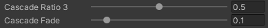
    
    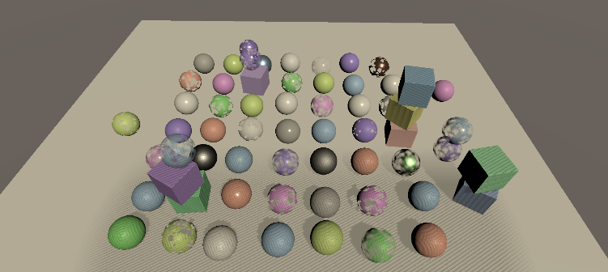

## 4 阴影质量

+ 现在我们有了功能性的级联阴影贴图，让我们专注于提高阴影的质量。我们一直以来观察到的伪影被称为阴影痤疮，这是由于表面不正确的自我阴影引起的，这些表面与光方向并非完全一致。随着表面越来越接近光方向，痤疮变得更糟。

    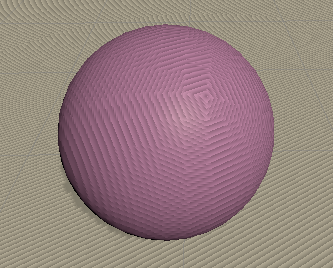

+ 增加图集大小会减小纹理像素的世界空间大小，因此痤疮伪影会变小。然而，伪影的数量也会增加，所以这个问题不能通过简单地增加图集的大小来解决。

> 4.1 深度偏差

+ 有多种方法可以减轻阴影痤疮。最简单的方法是为阴影投射器的深度添加一个恒定的偏差，将他们推离光线，从而不再发生不正确的自阴影。添加这种技术的最快方法是在渲染时应用全局深度偏差，在 `DrawShadows` 之前在缓冲区上调用 `SetGlobalDepthBias` ，然后将其设置回 `0` 。这是在裁剪空间中应用的深度偏差，是一个非常小的值的倍数，具体取决于用于阴影贴图的确切格式。我们可以通过使用一个较大的值来了解它是如何工作的，比如 `50000` 。还有第二个参数是斜率比例偏差，但我们现在将其保持为 `0` 。

    ```C#
    buffer.SetGlobalDepthBias(50000f, 0f);
    ExecuteBuffer();
    context.DrawShadows(ref shadowSettings);
    buffer.SetGlobalDepthBias(0f, 0f);
    ```

    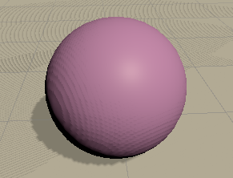

+ 恒定的偏移值很简单，但只能去除大部分正面照明的表面的伪影。去除所有的粉刺需要更大的偏差，比如大一个数量级。

    ```C#
    buffer.SetGlobalDepthBias(500000f, 0f);
    ```

    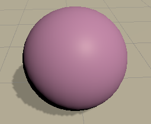

+ 然而，随着深度偏差将阴影投射器推离光线，采样的阴影也沿相同方向移动。大到足以消除大多数粉刺的偏差总是将阴影移到很远的地方，以至于阴影移得太远，从而造成被称为 `Peter-Panning` 的视觉假象。

    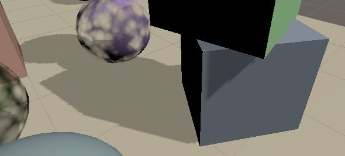 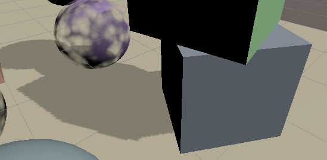

+ 另一种方法是应用斜率比例偏差，这是通过对 `SetGlobalDepthBias` 的第二个参数使用非 `0` 值来完成的。该值用于沿 `X` 和 `Y` 维度缩放绝对裁剪空间深度导数的最大值。它为 `0` ，当光线在两个维度中的至少一个中以 `45°` 角照射时，它为 `1` ，当表面发现和光线方向的点击达到 `0` 时，它接近无穷大。因此，当需要更多时，偏差会自动增加，但没有上限。因此，清除痤疮所需的因子要低得多，例如 `3` 而不是 `500000` 。

    ```C#
    buffer.SetGlobalDepthBias(0f, 3f);
    ```

    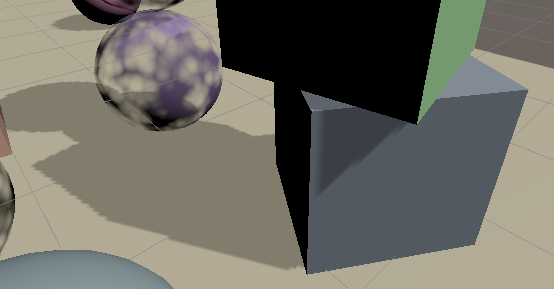

+ 斜率比例偏差有效但不直观。需要进行实验才能达到可以结果的结果，即用粉刺换取 `Peter-Panning` 。所以让我们暂时禁用它并寻找更直观和可预测的方法。

    ```C#
    //buffer.SetGlobalDepthBias(0f, 3f);
    ExecuteBuffer();
    context.DrawShadows(ref shadowSettings);
    //buffer.SetGlobalDepthBias(0f, 0f);
    ```

> 4.2 级联数据

+ 因为痤疮的大小取决与世界空间纹理像素大小，所以在所有情况下都有效的抑制方法必须考虑到这一点。由于每个级联的纹理大小不同，这意味着我们必须向 `GPU` 发送更多的级联数据，为此，将通用级联数据向量数组添加到 `Shadows` 。

    ```C#
    static int
        
        ...

        cascadeCullingSpheresId = Shader.PropertyToID("_CascadeCullingSpheres"),
		cascadeDataId = Shader.PropertyToID("_CascadeData"),
		shadowDistanceFadeId = Shader.PropertyToID("_ShadowDistanceFade");

    static Vector4[]
		cascadeCullingSpheres = new Vector4[maxCascades],
		cascadeData = new Vector4[maxCascades];
    ```

+ 将其与其他所有内容一起发送到 `GPU` 。

    ```C#
    buffer.SetGlobalVectorArray(
        cascadeCullingSpheresId, cascadeCullingSpheres
    );
    buffer.SetGlobalVectorArray(cascadeDataId, cascadeData);
    ```

+ 我们已经可以做的一件事是将平方级联半径的倒数放在这些向量的 `X` 分量中。这样我们就不必在着色器中执行这些划分。在新的 `SetCascadeData` 方法中执行此操作，同时存储剔除球体并在 `RenderDirectionalShadows` 中调用他。将级联索引、剔除球体和切片大小作为浮点数传递给他。

    ```C
    void RenderDirectionalShadows (int index, int split, int tileSize) {
		
        ...
		
		for (int i = 0; i < cascadeCount; i++) {
			
            ...

			if (index == 0) {
				SetCascadeData(i, splitData.cullingSphere, tileSize);
			}
			
            ...

		}
	}

	void SetCascadeData (int index, Vector4 cullingSphere, float tileSize) {
		cascadeData[index].x = 1f / cullingSphere.w;
		cullingSphere.w *= cullingSphere.w;
		cascadeCullingSpheres[index] = cullingSphere;
	}
    ```

+ 将级联数据添加到 `Shadows` 中的 `_CustomShadows` 缓冲区。

    ```C
    CBUFFER_START(_CustomShadows)
        int _CascadeCount;
        float4 _CascadeCullingSpheres[MAX_CASCADE_COUNT];
        float4 _CascadeData[MAX_CASCADE_COUNT];
        
        ...

    CBUFFER_END
    ```

+ 并在 `GetShadowData` 中使用新的预计算逆。

    ```C
    data.strength *= FadedShadowStrength(
        distanceSqr, _CascadeData[i].x, _ShadowDistanceFade.z
    );
    ```

> 4.3 法线偏移

+ 不正确的自阴影发生是因为一个阴影施法者深度纹理覆盖了多个片段，这导致施法者的体积从其表面伸出。因此，如果我们将 `caster` 缩小到足够的程度，这将不在发生。但是，缩小阴影投射器会使阴影变得比应有的更小，并且可能会引入不应该存在的孔。

+ 我们也可以做相反的事情：在采样阴影时膨胀表面。然后我们在离表面稍远的地方进行采样，刚好足够避免不正确的自阴影。这将稍微调整阴影的位置，可能会导致边缘未对齐并添加虚假阴影，但这些伪影往往不如 `Peter-Panning` 明显。

+ 我们可以通过沿其法线稍微移动表面位置来实现这一点，以便对阴影进行采样。如果我们只考虑一个维度，那么等于世界空间纹理大小的偏移量就足够了。我们可以通过将剔除球体的直径除以图块大小来在 `SetCascadeData` 中找到纹理大小。将其存储在级联数据向量的 `Y` 分量中。

    ```C
    float texelSize = 2f * cullingSphere.w / tileSize;
    cullingSphere.w *= cullingSphere.w;
    cascadeCullingSphere[index] = cullingSphere;
    //cascadeData[index].x = 1f / cullingSphere.w;
    cascadeData[index] = new Vector4(
        1f / cullingSphere.w, texelSize
    );
    ```

+ 然而，这并不总是足够的，因为纹理是正方形。在最坏的情况下，我们最终不得不沿正方形的对角线偏移，所以让我们将其缩放 $\sqrt{2}$ 。

    ```C
    texelSize * 1.4142136f
    ```

+ 在着色器侧，将全局阴影数据参数添加到 `GetDirectionalShadowAttenuation` 。将表面法线与偏移相乘以找到法线偏差并将其添加到世界位置，然后再计算阴影图块空间中的位置。

    ```C
    float GetDirectionalShadowAttenuation(
        DirectionalShadowData directional, ShadowData global, Surface surfaceWS
    ) {
        if(directional.strength <= 0.0) {
            return 1.0;
        }
        float3 normalBias = surfaceWS.normal * _CascadeData[global.cascadeIndex].y;
        float3 positionSTS = mul(
            _DirectionalShadowMatrices[directional.tileIndex],
            float4(surfaceWS.position + normalBias, 1.0)
        ).xyz;
        float shadow = SampleDirectionalShadowAtlas(positionSTS);
        return lerp(1.0, shadow, directional.strength);
    }
    ```

+ 在 `GetDirectionalLight` 中将额外的数据传递给他。

    ```C
    light.attenuation = GetDirectionalShadowAttenuation(dirShadowData, shadowData, surfaceWS);
    ```

     

> 4.4 可配置的偏差

+ 正常偏差在不引入明显的新伪影的情况下摆脱了阴影粉刺，但它不能消除所有阴影问题。例如，在墙壁下方的地板上可以看到不应该存在的阴影线。这不是自阴影，而是从墙上伸出的阴影影响到它下面的地板。添加一点斜率比例偏差可以解决这些问题，但没有完美的值。因此，我们将使用现有的 `Bias` 滑块为每个灯光配置。添加一个字段到 `Shadows` 中的 `ShadowedDirectionalLight` 结构。

    ```C#
    struct ShadowedDirectionalLight{
        public int visibleLightIndex;
        public float slopeScaleBias;
    }
    ```

+ 灯光的偏差通过它的 `shadowBias` 属性可用。将其添加到 `ReserveDirectionalShadows` 中的数据中。

    ```C#
    shadowDirectionalLights[shadowedDirLightCount] =
        new shadowDirectionalLight {
            visibleLightIndex = visibleLightIndex,
            splotScaleBias = light.shadowBias
        };
    ```

+ 并使用他来配置 `RenderDirectionalShadows` 中的斜率比例偏差。

    ```C#
    buffer.SetGlobalDepthBias(0f, light.slopeScaleBias);
    ExecuteBuffer();
    context.DrawShadows(ref shadowSettings);
    buffer.SetGlobalDepthBias(0f, 0f);
    ```

+ 让我们也使用灯光现有的 `NormalBias` 滑块来调整我们应用的法线偏差。使 `ReserveDirectionalShadows` 返回一个 `Vector3` 并将灯光的 `shadowNormalBias` 用于新的 `Z` 分量。

    ```C#
    public Vector3 ReserveDirectionalShadows(
        Light light, int visibleLightIndex
    ) {
        if(...) {

            ...

            return new Vector3(
                light.shadowStrength,
                settings.directional.cascadeCount * shadowedDirLightCount++,
                light.shadowNormalBias
            );
        }
        return Vector3.zero;
    }
    ```

+ 将新的法线偏移添加到 `DirectionalShadowData` 中，并在 `Shadows` 中的 `DirectionalShadowAttenuation` 中应用它。

    ```C
    struct DirectionalShadowData {
        float strength;
        int tileIndex;
        float normalBias;
    }

    ...

    float GetDirectionalShadowAttenuation(...) {

        ...

        float3 normalBias = surfaceWS.normal * (directional.normalBias * _CascadeData[global.cascadeIndex].y);

        ...

    }
    ```

+ 并在 `Light` 中的 `GetDirectionalShadowData` 中进行配置。

    ```C
    data.tileIndex = _DirectionalLightShadowData[lightIndex].y + shadowData.cascadeIndex;
	data.normalBias = _DirectionalLightShadowData[lightIndex].z;
    ```

+ 我们现在可以调整每盏灯的两个偏差。斜率比例偏差为 `0` ，正常偏差为 `0` 是一个很好的默认值。如果你增加第一个，你可以减少第二个。但请记住，我们对这些灯光设置的解释与其最初的目的不同。他们曾经是裁剪空间深度偏差和世界空间收缩法线偏差。所以当你创建一个新的灯光时，你会得到沉重的 `Peter-Panning` 平移，直到你调整偏差。

    

     

> 4.5 阴影花纹

+ 另一个可能导致伪影的潜在问题是 `Unity` 应用了 `shadow pancaking` 。这个想法是，当为定向光渲染阴影投射时，近平面尽可能向前移动。这提高了深度精度，但这意味着不在摄像机视野内的阴影投射可能最终会出现在近平面的前面，这会导致它们在不应该被剪切的情况下被剪切。

    

+ 这可以通过在 `ShadowCasterPassVertex` 中将顶点位置限制到近平面来解决，有效地压平位于近平面前面的阴影投射，将它们变成粘在近平面上的薄饼。我们通过取裁剪空间 `Z` 和 `W` 坐标中的最大值来做到这一点，或者在定义 `UNITY_REVERSED_Z` 时取它们的最小值。要为 `W` 坐标使用正确的符号，请将其与 `UNITY_NEAR_CLIP_VALUE` 相乘。

    ```C
    output.positionCS = TransformWorldToHClip(positionWS);

	#if UNITY_REVERSED_Z
		output.positionCS.z =
			min(output.positionCS.z, output.positionCS.w * UNITY_NEAR_CLIP_VALUE);
	#else
		output.positionCS.z =
			max(output.positionCS.z, output.positionCS.w * UNITY_NEAR_CLIP_VALUE);
	#endif
    ```

    

+ 这对于完全位于近平面两侧的阴影投射器非常有效，但穿过平面的阴影投射器会变形，因为它们的一些顶点会受到影响。这对于小三角形来说并不明显，但大三角形最终会变形很多，弯曲他们并经常导致他们沉入表面。

    

+ 可以通过将近平面向后拉一点来缓解这个问题。这就是近平面灯光滑块的用途。为 `ShadowedDirectionalLight` 添加一个用于近平面偏移的字段。

    ```C#
    struct ShadowedDirectionalLight {
        public int visibleLightIndex;
		public float slopeScaleBias;
		public float nearPlaneOffset;
    }
    ```

+ 并将灯光的 `shadowNearPlane` 属性复制到他。

    ```C#
    shadowedDirectionalLights[shadowedDirLightCount] =
        new ShadowedDirectionalLight {
            visibleLightIndex = visibleLightIndex,
            slopeScaleBias = light.shadowBias,
            nearPlaneOffset = light.shadowNearPlane
        };
    ```

+ 我们通过填充 `ComputeDirectionalShadowMatricesAndCullingPrimitives` 的最后一个参数来应用，我们仍然给出了一个固定值零。

    ```C#
    cullingResults.ComputeDirectionalShadowMatricesAndCullingPrimitives(
        light.visibleLightIndex, i, cascadeCount, ratios, tileSize,
        light.nearPlaneOffset, out Matrix4x4 viewMatrix,
        out Matrix4x4 projectionMatrix, out ShadowSplitData splitData
    );
    ```

    

> 4.6 `PCF` 过滤

+ 到目前为止，我们只使用硬阴影，通过对每个片段的阴影贴图进行一次采样。阴影比较采样器使用一种特殊形式的双线性插值，在插值之前执行深度比较。这被称为 `pecentage closer filtering (PCF)` 特别是 `2x2 PCF` 过滤器，因为涉及四个纹素。

+ 但这不是我们过滤阴影贴图的唯一方法。我们还可以使用更大的过滤器，使阴影更柔和，减少锯齿，但也不太准确。让我们添加对 `2x2` 、 `3x3` 、 `5x5` 和 `7x7` 过滤的支持。我们不会使用现有的软阴影模式来控制每个灯光。我们将改为让所有定向灯使用相同的过滤器。为此，将 `FilterMode` 枚举添加到 `ShadowSettings` ，并将过滤器选项添加到 `Directional` ，默认情况下设置为 `2x2` 。

    ```C#
    public enum FilterMode {
        PCF2x2, PCF3x3, PCF5x5, PCF7x7
    }

    ...

    [System.Serializable]
    public struct Directional {

        public MapSize atlasSize;

        public FilterMode filter;

        ...

    }

    public Directional directional = new Directional {
        atlasSize = MapSize._1024,
        filter = FilterMode.PCF2x2,
        
        ...

    }
    ```

    

+ 我们将为新的过滤器模式创建着色器变体。为 `Shadows` 添加一个包含三个关键字的静态数组。

    ```C#
    static string[] directionalFilterKeywords = {
		"_DIRECTIONAL_PCF3",
		"_DIRECTIONAL_PCF5",
		"_DIRECTIONAL_PCF7",
	};
    ```

+ 创建一个启用或禁用适当关键字的 `SetKeywords` 方法。执行缓冲区之前在 `RenderDirectionalShadows` 中调用它。

    ```C#
    void RenderDirectionalShadows() {

        ...

        SetKeywords();
        buffer.EndSample(bufferName);
        ExecuteBuffer();
    }

    void SetKeywords() {
        int enabledIndex = (int)settings.directional.filter - 1;
        for(int i = 0; i < directionalFilterKeywords.Length; i++) {
            if(i == enabledIndex) {
                buffer.EnableShaderKeyword(directionalFilterKeywords[i]);
            }
            else
            {
                buffer.DisableShaderKeyword(directionalFilterKeywords[i]);
            }
        }
    }
    ```

+ 较大的过滤器需要更多的纹理样本。我们需要知道着色器中的图集大小和纹素大小才能做到这一点。为此数据添加着色器标识符。

    ```C#
    cascadeDataId = Shader.PropertyToID("_CascadeData"),
    shadowAtlasSizeId = Shader.PropertyToID("_ShadowAtlasSize"),
    shadowDistanceFadeId = Shader.PropertyToID("_ShadowDistanceFade");
    ```

+ 并将其添加到着色器端的 `_CustomShadow` 中。

    ```C
    CBUFFER_START(_CustomShadows)
	
        ...

        float4 _ShadowAtlasSize;
        float4 _ShadowDistanceFade;
    CBUFFER_END
    ```

+ 将大小存储在其 `X` 分量中，将纹素大小存储在其 `Y` 分量中。

    ```C#
    SetKeywords();
    buffer.SetGlobalVector(
        shadowAtlasSizeId, new Vector4(atlasSize, 1f / atlasSize)
    );
    ```

+ 为三个关键字添加一个 `#pragma multi_compile` 指令到 `Lit` 的 `CustomLit` 传递，加上和下划线用于匹配 `2×2` 过滤器的无关键字选项。

    ```C#
    #pragma shader_feature _PREMULTIPLY_ALPHA
    #pragma multi_compile _ _DIRECTIONAL_PCF3 _DIRECTIONAL_PCF5 _DIRECTIONAL_PCF7
    #pragma multi_compile_instancing
    ```

+ 我们将使用 `Core RP Library` 的 `Shadow/ShadowSamplingTent HLSL` 文件中定义的函数，因此将其包含在 `Shadows` 的顶部。如果定义了 `3x3` 关键字，我们总共需要四个过滤样本，我们将使用 `SampleShadow_ComputeSamples_Tent_3x3` 函数进行设置。我们只需要抽取四个样本，因为每个样本都使用双线性 `2x2` 滤波器。那些在各个方向上偏移了半个 `texel` 的正方形覆盖了 `3×3` 个 `texel` 的 `tent` 滤波器，中间的权重比边缘的更强。

    ```C
    #include "Packages/com.unity.render-pipelines.core/ShaderLibrary/Shadow/ShadowSamplingTent.hlsl"

    #if defined(_DIRECTIONAL_PCF3)
        #define DIRECTIONAL_FILTER_SAMPLES 4
        #define DIRECTIONAL_FILTER_SETUP SampleShadow_ComputeSamples_Tent_3x3
    #endif

    #define MAX_SHADOWED_DIRECTIONAL_LIGHT_COUNT 4
    #define MAX_CASCADE_COUNT 4
    ```

+ 处于同样的原因，我们可以为 `5x5` 滤波器提供 `9` 个样本，为 `7x7` 滤波器提供 `16` 个样本，再加上适当命名的函数。

    ```C
    #if defined(_DIRECTIONAL_PCF3)
        #define DIRECTIONAL_FILTER_SAMPLES 4
        #define DIRECTIONAL_FILTER_SETUP SampleShadow_ComputeSamples_Tent_3x3
    #elif defined(_DIRECTIONAL_PCF5)
        #define DIRECTIONAL_FILTER_SAMPLES 9
        #define DIRECTIONAL_FILTER_SETUP SampleShadow_ComputeSamples_Tent_5x5
    #elif defined(_DIRECTIONAL_PCF7)
        #define DIRECTIONAL_FILTER_SAMPLES 16
        #define DIRECTIONAL_FILTER_SETUP SampleShadow_ComputeSamples_Tent_7x7
    #endif
    ```

+ 为阴影平铺空间位置创建一个新的 `FilterDirectionalShadow` 函数。当 `DIRECTIONAL_FILTER_SETUP` 被定义时，它需要进行多次采样，否则只需要调用一次 `SampleDirectionalShadowAtlas` 就足够了。

    ```C
    float FilterDirectionalShadow(float3 positionSTS) {
        #if defined(DIRECTIONAL_FILTER_SETUP)
            float shadow = 0;
            return shadow;
        #else
            return SampleDirectionalShadowAtlas(positionSTS);
        #endif
    }
    ```

+ 过滤器设置函数有四个参数。首先是 `float4` 中的大小，前两个分量中的 `X` 和 `Y` 纹素大小以及 `Z` 和 `W` 中的总纹理大小。然后是原始样本位置，然后是每个样本的权重和位置的输出参数。它们被定义为 `float` 和 `float2` 数组。之后，我们可以遍历所有样本，通过权重对它们进行累积。

    ```C
    #if defined(DIRECTIONAL_FILTER_SETUP)
        float weights[DIRECTIONAL_FILTER_SAMPLES];
        float2 positions[DIRECTIONAL_FILTER_SAMPLES];
        float4 size = _ShadowAtlasSize.yyxx;
        DIRECTIONAL_FILTER_SETUP(size, positionSTS.xy, weights, positions);
        float shadow = 0;
        for(int i = 0; i < DIRECTIONAL_FILTER_SAMPLES; i++) {
            shadow += weights[i] * SampleDirectionalShadowAtlas(float3(positions[i].xy, positionSTS.z));
        }
        return shadow;
    #else
    ```

+ 在 `GetDirectionalShadowAttenuation` 中调用这个新函数，而不是直接转到 `SampleDirectionalShadowAtlas` 。

    ```C
    float shadow = FilterDirectionalShadow(positionSTS);
    return lerp(1.0, shadow, directional.strength);
    ```

     

     

+ 增加滤镜大小会使阴影更平滑，但也会导致粉刺再次出现。我们必须增加正常偏差以匹配过滤器大小。我们可以通过将 `texel` 大小乘以 `1` 加上 `SetCascadeData` 中的过滤器模式来自动执行此操作。

    ```C
    void SetCascadeData(int index, Vector4 cullingSphere, float tileSize) {
        float texelSize = 2f * cullingSphere.w / tileSize;
        float filterSize = texelSize * ((float)settings.directional.filter + 1f);

        ...

            1f / cullingSphere.w,
            filterSize * 1.4142136f
        );
    }
    ```

+ 除此之外，增加样本区域还意味着我们最终可以在级联的剔除范围之外进行采样。我们可以通过在平方之前将球的半径减小过滤器大小来避免这种情况。

    ```C
    cullingSphere.w -= filterSize;
    cullingSphere.w *= cullingSphere.w;
    ```

     

+ 这再次解决了阴影粉刺问题，但增加的过滤尺寸加剧了应用正常偏差的不利影响，并使我们之前看到的墙阴影问题也变得更糟。需要一些斜率尺度偏差或更大的图集大小来减轻这些伪影。

> 4.7 混合级联

+ 较柔和的阴影看起来更好，但他们也使级联的间的突然过渡更加明显。

    

+ 我们可以通过在我们混合两者的级联之间添加一个过渡区域来使过渡不那么明显（尽管没有完全隐藏）。我们已经有一个级联淡入淡出因子可以用于此目的。

+ 首先，将级联混合值添加到 `Shadows` 中的 `ShadowData` ，我们将使用它在向量级联之间进行插值。

    ```C
    struct ShadowData {
        int cascadeIndex;
        float cascadeBlend;
        float strength;
    }
    ```

+ 最初在 `GetShadowData` 中将 `blend` 设置为 `1` ，表示所选级联处于满强度状态。然后总是在循环中找到级联时计算淡入淡出因子。如果我们像以前一样在最后一个级联因素中将其纳入强度，否则将其用于混合。

    ```C
    data.cascadeBlend = 1.0;
	data.strength = FadedShadowStrength(
		surfaceWS.depth, _ShadowDistanceFade.x, _ShadowDistanceFade.y
	);
	int i;
	for (i = 0; i < _CascadeCount; i++) {
		float4 sphere = _CascadeCullingSpheres[i];
		float distanceSqr = DistanceSquared(surfaceWS.position, sphere.xyz);
		if (distanceSqr < sphere.w) {
			float fade = FadedShadowStrength(
				distanceSqr, _CascadeData[i].x, _ShadowDistanceFade.z
			);
			if (i == _CascadeCount - 1) {
				data.strength *= fade;
			}
			else {
				data.cascadeBlend = fade;
			}
			break;
		}
	}
    ```

+ 现在在 `GetDirectionalShadowAttenuation` 中检查在检索到第一个阴影值后级联混合是否小于一个。如果是这样，我们就处于过渡区，还必须从下一个级联中采样并在两个值之间进行插值。

    ```C
    float shadow = FilterDirectionalShadow(positionsSTS);
    if(global.cascadeBlend < 1.0) {
        normalBias = surfaceWS.normal *
            (directional.normalBias * _CascadeData[global.cascadeIndex + 1].y);
        positionSTS = mul(
            _DirectionalShadowMatrices[directional.tileIndex + 1],
            float4(surfaceWS.position + normalBias, 1.0)
        ).xyz;
        shadow = lerp(
            FilterDirectionalShadow(positionSTS), shadow, global.cascadeBlend
        );
    }
    return lerp(1.0, shadow, directional.strength);
    ```

    

+ 请注意，级联衰减率适用于每个级联的整个半径，而不仅仅是其可见部分。因此，请确保该比率不会一致延申到较低的级联。一般来说，这不是问题，因为您希望过渡区域保持较小。

> 4.8 过渡抖动

+ 尽管级联间的混合看起来更好，但它也使我们必须在混合区域中对阴影贴图进行采样的次数增加了一倍。另一种方式是始终根据抖动模式从一个级联中采样。这看起来不太好，但便宜很多，尤其是在使用大过滤器时。

+ 向 `Directional` 添加级联混合模式选项，支持硬、软或抖动方法。

    ```C#
        public enum CascadeBlendMode {
            Hard, Soft, Dither
        }

        public CascadeBlendMode cascadeBlend;
    }

    public Directional directional = new Directional {

        ...

        cascadeFade = 0.1f,
        cascadeBlend = Directional.CascadeBlendMode.Hard
    }
    ```

    

+ 为阴影添加一个静态数组，用于软阴影和抖动级联混合关键字。

    ```C#
    static string[] cascadeBlendKeywords = {
        "_CASCADE_BLEND_SOFT",
        "_CASCADE_BLEND_DITHER",
    }
    ```

+ 调整 `SetKeywords` 使其适用于任意关键字数组和索引，然后还设置级联混合关键字。

    ```C#
    void RenderDirectionalShadows() {
        
        ...

        SetKeywords(
            directionalFilterKeywords, (int)settings.directional.filter - 1
        );
        SetKeywords(
            cascadeBlendKeywords, (int)settings.directional.cascadeBlend - 1
        );
        buffer.SetGlobalVector(
            shadowAtlasSizeId, new Vector4(atlasSize, 1f / atlasSize)
        );
        buffer.EndSample(bufferName);
        ExecuteBuffer();
    }

    void SetKeywords(string[] keywords, int enabledIndex) {
        //int enabledIndex = (int)settings.directional.filter - 1;
        for(int i = 0; i < keywords.Length; i++) {
            if(i == enabledIndex) {
                buffer.EnableShaderKeyword(keywords[i]);
            }
            else
            {
                buffer.DisableShaderKeyword(keywords[i]);
            }
        }
    }
    ```

+ 在 `CustomLit` 通道上添加所需的多编译方向。

    ```C#
    #pragma multi_compile _ _CASCADE_BLEND_SOFT _CASCADE_BLEND_DITHER
    #pragma multi_compile_instancing
    ```

+ 要执行抖动，我们需要一个抖动浮点值，我们可以将其添加到 `Surface` 。

    ```C
    struct Surface {
        
        ...

        float dither;
    };
    ```

+ 有多种方法可以在 `LitPassFragment` 中生存抖动值。最简单的方法是使用 `Core RP` 库中的 `InterleavedGradientNoise` 函数，该函数在给定屏幕空间 `XY` 位置的情况下生产旋转的平铺抖动图案。在片段函数中等于裁剪空间的 `XY` 位置。他还需要用于为其设置动画的第二个参数，我们不需要并且可以将其保留为 `0` 。

    ```C
    surface.smoothness = UNITY_ACCESS_INSTANCED_PROP(UnityPerMaterial, _Smoothness);
	surface.dither = InterleavedGradientNoise(input.positionCS.xy, 0);
    ```

+ 在 `GetShadowData` 中设置级联索引之前，在不适用软混合时将级联回合设置为零。这样，整个分支将从这些着色器变体中消除。

    ```C
    if(i == _CascadeCount) {
        data.strength = 0.0;
    }
    #if !defined(_CASCADE_BLEND_SOFT)
        data.cascadeBlend = 1.0;
    #endif
    data.cascadeIndex = i;
    ```

+ 并且当使用抖动混合时，如果我们不在最后一个级联中，如果混合值小于抖动值，则跳转到下一个级联。

    ```C
    if(i == _CascadeCount) {
        data.strength = 0.0;
    }
    #if defined(_CASCADE_BLEND_DITHER)
        else if(data.cascadeBlend < surfaceWS.dither) {
            i += 1;
        }
    #endif
    #if !defined(_CASCADE_BLEND_SOFT)
        data.cascadeBlend = 1.0;
    #endif
    ```

    

+ 抖动混合的可接受程度取决于我们渲染帧的分辨率。如果使用涂抹最终结果的后期效果，那么他可能非常有效，例如结合实践抗锯齿和动画抖动模式。

    

> 4.9 剔除偏差

+ 使用级联阴影贴图的一个缺点是我们最终会为每个灯光多次渲染相同的阴影投射器。如果可以保证他们的结果总是被较小的级联覆盖，那么尝试从较大的级联中剔除一些阴影投射器时有意义的。 `Unity` 通过将拆分数据的 `shadowCascadeBlendCullingFactor` 设置为 `1` 来实现这一点。在将其应用于阴影设置之前，请在 `RenderDirectionalShadows` 中执行此操作。

    ```C
    splitData.shadowCascadeBlendCullingFactor = 1f;
    shadowSettings.splitData = splitData;
    ```

     

+ 该值是一个调节用于执行剔除的前一个级联的半径的因素。 `Unity` 在剔除时是相当保守的，但我们应该通过级联淡入淡出比率来降低它，并额外增加一点以确保过渡区域中的阴影投射器永远不会被剔除。所以让我们用 `0.8` 减去渐变范围，最小值为 `0` 。如果您看到级联转换周围的阴影中出现孔洞，则必须进一步减少它。

    ```C#
    float cullingFactor =
        Mathf.Max(0f, 0.8f - settings.directional.cascadeFade);

    for(int i = 0; i < cascadeCount; i++) {

        ...

        splitData.shadowCascadeBlendCullingFactor = cullingFactor;

        ...

    }
    ```

## 5 透明度

+ 裁剪、淡入淡出和透明材质都可以像不透明材质一样接受阴影，但目前只有裁剪材质本身会投射正确的阴影。透明对象的行为就像它们是实体阴影投射器一样。

    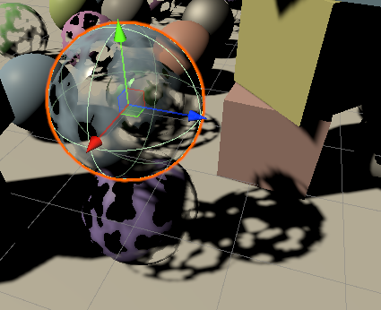 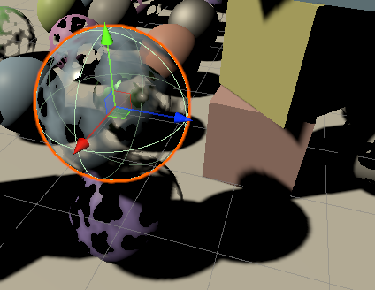

> 5.1 阴影模式

+ 有几种方法可以修改阴影投射器。由于它涉及写入深度缓冲区，我们的阴影是二进制的，无论是否存在，但这仍然给了我们一些灵活性。它们可以打开并完全固定、剪切、抖动或完全关闭。我们可以独立于其它材质属性来做到这一点，以支持最大的灵活性。因此，让我们为其添加一个单独的 _Shadows 着色器属性。我们可以使用 `KeywordEnum` 属性为其创建关键字下拉菜单，默认情况下启用阴影。

    ```C#
    [KeywordEnum(On, Clip, Dither, Off)]_Shadows("Shadows", Float) = 0
    ```

    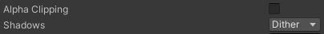

+ 为这些模式添加着色器功能，替换现有的 `_CLIPPING` 功能。我们需要三个变体，对 `on` 和 `off` 使用 `no` 关键字、 `_SHADOWS_CLIP` 和 `_SHADOWS_DITHER` 。

    ```C#
    //#pragma shader_feature _CLIPPING
    #pragma shader_feature _ _SHADOWS_CLIP _SHADOWS_DITHER
    ```

+ 在 `CustomShaderGUI` 中为阴影创建一个 `setter` 属性。

    ```C#
    enum ShadowMode {
		On, Clip, Dither, Off
	}

	ShadowMode Shadows {
		set {
			if (SetProperty("_Shadows", (float)value)) {
				SetKeyword("_SHADOWS_CLIP", value == ShadowMode.Clip);
				SetKeyword("_SHADOWS_DITHER", value == ShadowMode.Dither);
			}
		}
	}
    ```

+ 然后在预设方法中适当地设置阴影。这将是不透明的，对剪辑将启用剪辑，让我们对淡入淡出和透明使用抖动。

> 5.2 裁剪阴影

+ 在 `ShadowCasterPassFragment` 中，将 `_CLIPPING` 的检查替换为 `_SHADOWS_CLIP` 的检查。

    ```C
    #if defined(_SHADOWS_CLIP)
		clip(base.a - UNITY_ACCESS_INSTANCED_PROP(UnityPerMaterial, _Cutoff));
	#endif
    ```

+ 现在可以使用透明材质提供裁剪阴影，这可能适用于具有大部分完全不透明或透明但需要 `Alpha` 混合的部分的表面。

    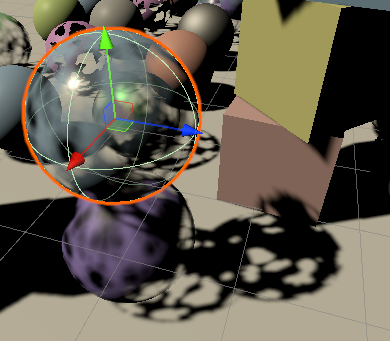

+ 请注意，裁剪阴影不如实体阴影那样稳定，因为当试图移动时阴影矩阵会发生变化，这会导致阴影贴图的纹理突然从裁剪过渡到不裁剪。

> 5.3 抖动阴影

+ 抖动阴影的工作原理和裁剪阴影一样，只是标准不同。在这种情况下，我们从表面 `alpha` 中减去一个抖动值，并以此为基础进行裁剪。我们可以再次使用 `InterleavedGradientNoise` 函数。

    ```C
    #if defined(_SHADOWS_CLIP)
		clip(base.a - UNITY_ACCESS_INSTANCED_PROP(UnityPerMaterial, _Cutoff));
	#elif defined(_SHADOWS_DITHER)
		float dither = InterleavedGradientNoise(input.positionCS.xy, 0);
		clip(base.a - dither);
	#endif
    ```

    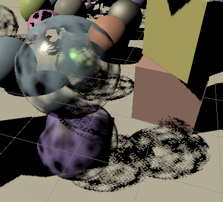

+ 抖动可用于近似半透明投射，但这是一种相当粗糙的方法。硬抖动阴影看起来很糟糕，但在使用较大的 `PCF` 滤镜时可能看起来可以接受。

    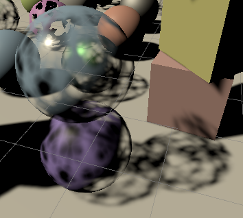

+ 因为抖动模式在每个纹素上是固定的，所以重叠的半透明投射器不会投射组合的较暗阴影。效果与最不透明的阴影投射器一样强烈。此外，由于生成的图案很嘈杂，当阴影矩阵发生变化时，它会受到更多时间伪影的影响，这会使阴影看起来颤抖。只要物体不移动，这中方法对于具有固定投影的其它灯光类型效果更好。对半透明对象，使用裁剪阴影或根本不使用阴影通常更实用。

> 5.4 没有阴影

+ 通过调整一个物体的 `MeshRenderer` 组件的 `Cast Shadows` 设置来关闭每个物体的阴影投射。但是，如果你想为所有使用相同材质的物体关闭阴影。这并不实际，所以我们也支持为每种材质关闭阴影。我们通过禁用材质的 `ShadowCaster` 来做到这一点。

+ 为 `CustomShaderGUI` 添加一个 `SetShadowCasterPass` 方法，首先检查 `_Shadows` 着色器属性是否存在。如果存在，还要通过其 `hasMixedValue` 属性，检查所有被选中的材质是否被设置为相同的模式。如果没有模式或者使混合模式，那么就放弃。否则，通过调用 `SetShaderPassEnabled` ，对所有材质启用或禁用 `ShadowCaster` ，并将通道名称和启用状态作为参数。

    ```C#
    void SetShadowCasterPass() {
        MaterialProperty shadows = FindProperty("_Shadows",  properties, false);
        if(shadows == null || shadow.hasMixedValue) {
            return;
        }
        bool enabled = shadows.floatValue < (float)ShadowMode.Off;
        foreach(Material m in materials) {
            m.SetShaderPassEnabled("ShadowCaster", enabled);
        }
    }
    ```

+ 确保正确设置通道的最简单方法是在通过 `GUI` 更改材质使始终调用 `SetShadowCasterPass` 。我们可以通过在 `OnGUI` 的开头调用 `EditorGUI.BeginChangeCheck` 来做到这一点。后一种方法返回自我们开始检查以来是否发生了变化。如果使这样，请设置阴影施法者通道。

    ```C#
    public override void OnGUI (
		MaterialEditor materialEditor, MaterialProperty[] properties
	) {
		EditorGUI.BeginChangeCheck();
		
        ...

		if (EditorGUI.EndChangeCheck()) {
			SetShadowCasterPass();
		}
	}
    ```

    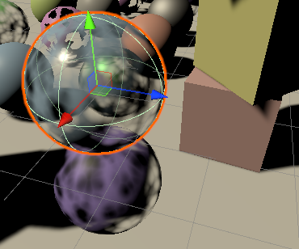

> 5.5 不受光的阴影投射

+ 虽然未照明的材质不受照明的影响，但您可能希望它们投射阴影。我门们可以简单地将 `ShadowCaster pass` 从 `Lit` 复制到 `Unlit` 着色器来支持这一点。

    

> 5.6 接受阴影

+ 最后，我们还可以让光照表面忽略阴影，这可能对全息图之类的东西有用，或者仅用于艺术目的。为此，将 `_RECEIVE_SHADOWS` 关键字切换属性添加到 `Lit` 。

    ```C#
    [Toggle(_RECEIVE_SHADOWS)]_ReceiveShadows("Receive Shadows", Float) = 1
    ```

+ 加上 `CustomLit` 通道中随附的着色器功能。

    ```C#
    #pragma shader_feature _RECEIVE_SHADOWS
    ```

    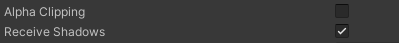

+ 我们所要做的就是在定义关键字时在 `GetDirectionalShadowAttenuation` 中强制阴影衰减为 `1` 。

    ```C
    float GetDirectionalShadowAttenuation(...) {
        #if !defined(_RECEIVE_SHADOWS)
            return 1.0;
        #endif

        ...

    }
    ```

    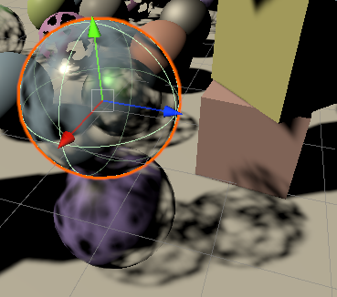